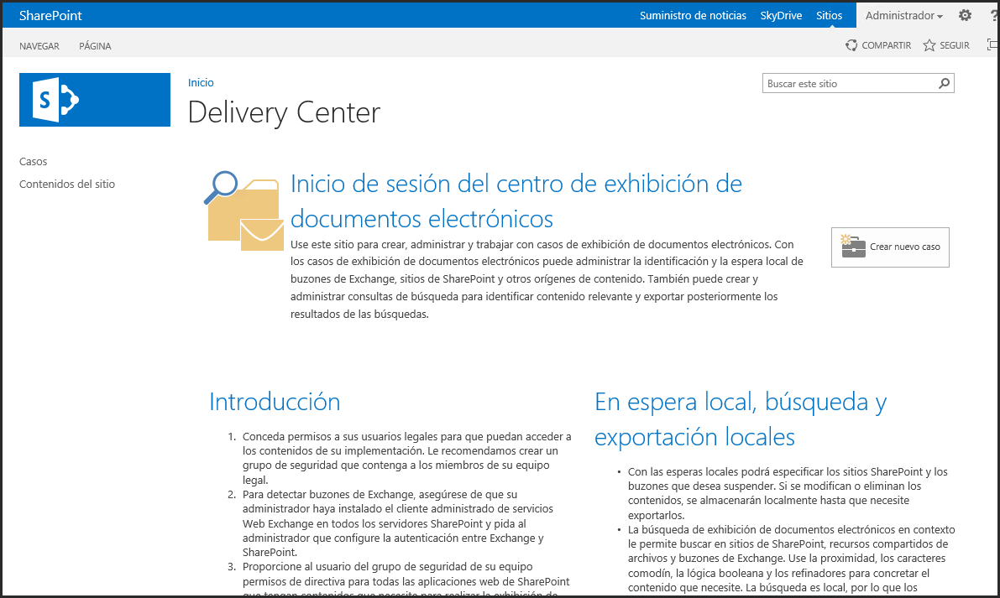
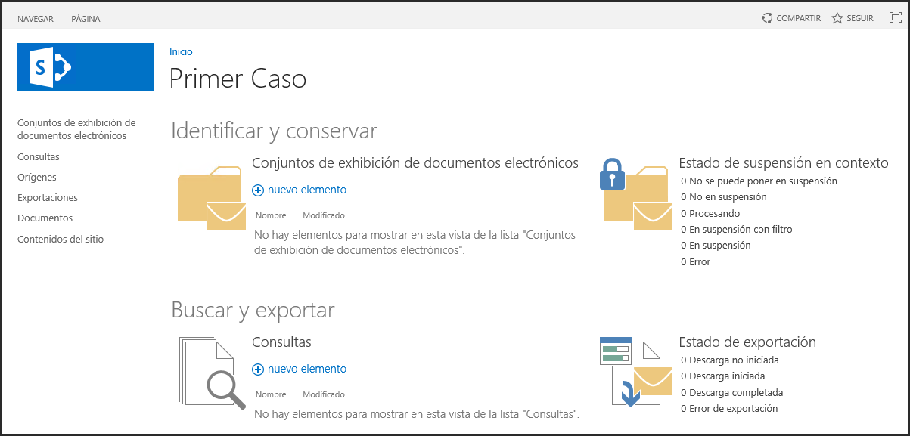
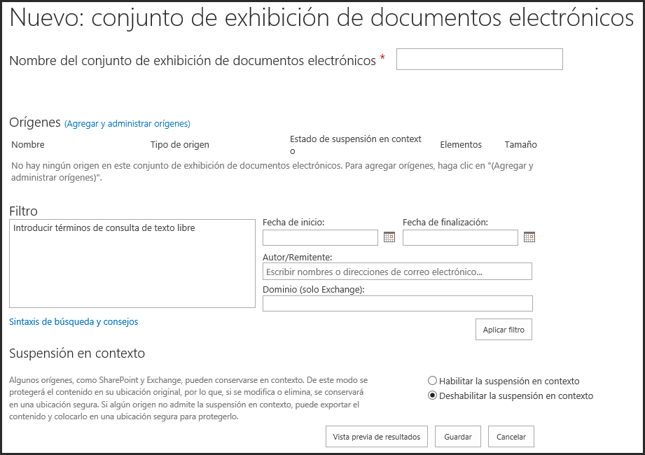
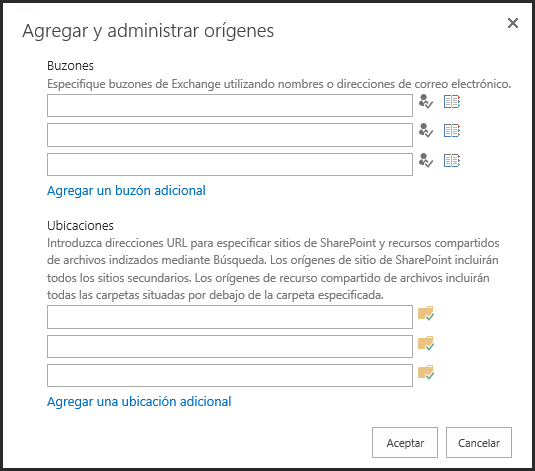
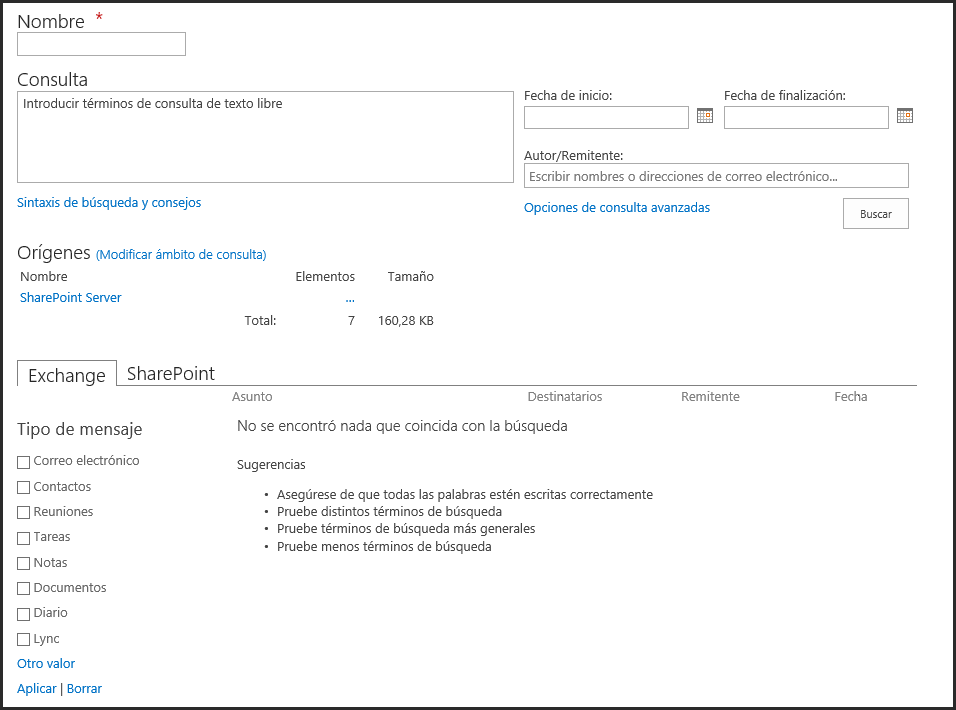

<properties
pageTitle="El Centro de Exhibición de Documentos Electrónicos de SharePoint Server 2013"
description="El Centro de Exhibición de Documentos Electrónicos de SharePoint Server 2013"
services="servers"
documentationCenter=""
authors="andygonusa"
manager=""
editor="andygonusa"/>

<tags
ms.service="servers"
ms.workload="CM"
ms.tgt_pltfrm="na"
ms.devlang="na"
ms.topic="how-to-article"
ms.date="05/12/2016"
ms.author="andygonusa"/>


#El Centro de Exhibición de Documentos Electrónicos de SharePoint Server 2013

Por **Gustavo Velez**

Introducción
------------

Compañías de todos los tamaños, desde multinacionales hasta

PYMES, necesitan preservar información en sus sistemas de informática
como "Registros" en una forma segura y confiable, no solamente como una
tarea rutinaria dentro de la empresa, sino también con propósitos
legales. La infraestructura de Manejo de Registros de SharePoint Server
2013 contiene diferentes componentes para realizar este trabajo: El
Centro de Registros, Registros Locales, Auditoria y el nuevo Centro de
Exhibición de Documentos Electrónicos ("Discovery Center" en la versión
inglesa de SharePoint). Estos componentes están diseñados para asegurar
y proteger la integridad del contenido, registrar cambios y
autorizaciones, hacer que determinada información sea solamente
accesible a personal autorizado y, probablemente su misión más
importante, asegurar que información no sea eliminada o alterada. Con la
infraestructura de Manejo de Registros de SharePoint es posible bloquear
el acceso a la información contenida en Bibliotecas en cualquier
momento, como y cuando sea necesario hacerlo. Note que toda la
funcionalidad de Manejo de Registros es un componente de SharePoint
Server y no está presente en SharePoint Foundation (SharePoint 365
también dispone de él).

Las posibilidades de Manejo de Registros de SharePoint han crecido desde
2007, cuando el "Centro de Registros" fue introducido. En la versión
2010 apareció la posibilidad de utilizar Registros Locales como una
extensión de la funcionalidad de SharePoint 2007, y en SharePoint 2013
se introdujo un nuevo concepto: el "Centro de Exhibición de Documentos
Electrónicos". Cada uno de estos componentes tiene su propia región de
aplicación:

- El Centro de Registros es un deposito centralizado a donde se puede
enviar información (documentos) desde su sitio de trabajo y mantenerlos
aislados, seguros y con reducidas posibilidades de acceso. Los datos no
pueden ser tocados por usuarios "normales", convirtiéndose de hecho en
evidencia que puede ser aceptada en procesos legales

- Los Registros Locales permiten también bloquear información, pero en
lugar de mover los documentos físicamente desde su sitio de trabajo
(Bibliotecas de SharePoint) a otro sitio aislado (el Centro de
Registros), los bloquea en su domicilio operacional, manteniéndolos
visibles y accesibles a los usuarios, aunque bloqueándolos de tal forma
que su contenido e historia no se puede modificar ni eliminar

- El Discovery Center permite encontrar información relativa a un tema
específico a lo largo y ancho de la granja de SharePoint, y promoverla
toda a Registro Local en una sola operación

Un problema normal en el concepto inicial tanto del Centro de Registros
como en los Registros Locales es la dificultad para encontrar toda la
información relacionada con un tema específico. Por ejemplo, compañías
generan reportes financieros mensuales para la administración de
impuestos de un país. Si en algún momento hay un conflicto legal entre
la compañía y los inspectores de impuestos, un juez puede exigir que la
compañía presente no solo los reportes mensuales, sino también toda la
información relativa (facturas de compra y venta, contratos, etc.) y que
garantice que no han sido alterados o modificados de ninguna manera. En
este caso, el departamento financiero de la empresa necesita encontrar
todos los documentos que probablemente están dispersos en diferentes
Aplicaciones Web, Colecciones de Sitios, Sitios y Bibliotecas en la
granja de SharePoint y bloquearlos para que no se puedan alterar. El
nuevo Discovery Center puede encargarse de resolver el problema,
encontrando todos los documentos necesarios en la granja de SharePoint y
elevarlos a Registros en cualquier momento, (es decir, "congelar" su
estado actual) pero permitiendo que se pueda continuar con el trabajo.
Fuera de esto, permite al mismo tiempo crear informes sobre cual
documentación se ha recogido e, inclusive, descargar una copia de todos
los archivos relacionados.

Creación y Configuración del Centro de Exhibición de Documentos Electrónicos
----------------------------------------------------------------------------

Internamente, el Discovery Center es una plantilla de Colecciones de
Sitios de SharePoint, de tal forma que es posible crear tantos Centros
como se considere necesario. Una Colección de Sitios creada con esta
plantilla dispone de las Listas y plantillas de Listas necesarias para
trabajar con el Centro, junto con los mecanismos de ruteo de la
información hacia las Listas y el sistema de autorización que garantiza
la integridad y protección de los datos. El diseño del Discovery Center,
lo mismo que el del Centro de Registros y cualquier sistema de Manejo de
Registros en general, es muy importante y debe ser realizado de forma
consecuente desde el principio.

Para crear un Discovery Center:

1. Desde la Administración Central de SharePoint, seleccione una
    Aplicación Web o cree una nueva si es necesario

2.  En la Aplicación Web cree una Colección de Sitios utilizando la
    plantilla "Centro de exhibición de documentos electrónicos" (pestaña
    "Empresa" en la sección de "Seleccione una plantilla")

3.  Después de su creación, vaya a la página principal de la nueva
    Colección de Sitios


<!-- -->

Figura 1. Página principal del Centro de Exhibición de Documentos
    Electrónicos

<!-- -->

{

El centro se puede crear también utilizando PowerShell o
programáticamente (el identificador de la plantilla es "EDISC\#0").

La plantilla del Discovery Center contiene solamente una página con
instrucciones generales y un botón para crear Casos. Un "Caso" es la
parte funcional principal del Centro, conteniendo toda la información
concerniente a un tema específico. Fuera de esto, como indican las
instrucciones en la "Introduccion" en la página principal, la página de
nivel superior de la Colección de Sitios define la configuración de
seguridad de forma similar a como funciona cualquier otra Colección de
Sitios, aunque teniendo en cuenta que la información contenida en el
Centro necesita requisitos de seguridad específicos: probablemente solo
una parte restringida de los empleados del grupo legal de la empresa
requerirán acceso a un determinado Caso.

Casos en el Discovery Center
----------------------------

Como se ha indicado, un "Caso" es una definición de cualquier tipo de
información íntimamente relacionada a un tema. En el ejemplo indicado
anteriormente, sería posible definir un Discovery Center para "Reportes
Financieros" conteniendo Casos separados para cada mes en el año fiscal.

Un Caso es, hablando en términos de SharePoint, un Sitio en la Colección
de Sitios. El Discovery Center permite la creación de tantos Casos
(Sitios) como sea necesario, y presenta una plantilla para la creación
de Casos: "Caso de exhibición de documentos electrónicos". Es posible
crear un nuevo Caso usando el botón presente en la página principal o
siguiendo la forma tradicional de SharePoint (Contenido del sitio -
Subsitio nuevo - "Caso de exhibición de documentos electrónicos" en la
pestaña de "Empresa"). Por supuesto es posible crearlo también
programáticamente o por medio de PowerShell, utilizando la plantilla con
identificador "EDISC\#1". De igual forma que en la creación de un Sitio
nuevo, es necesario definir el Título y Descripción (opcional), el
sufijo para el URL del sitio y si se heredan los permisos de la
Colección de Sitios.

Figura 2 muestra la página principal de un Caso. La plantilla crea un
Sitio con seis Listas Personalizadas: Custodias, Conjuntos de exhibición
de documentos electrónicos, Consultas, Documentos, Exportaciones y
Origines, cada uno de ellas para conservar las configuraciones
realizadas con el asistente mostrado en la página principal del Caso.

Figura 2. Página principal de un Caso

<!-- -->



Un Caso tiene dos partes principales: una para conservar ("congelar" la
información, mostrado en la sección de "Identificar y conservar") y otra
para exportarla (sección "Buscar y exportar").

Identificar y Conservar Casos
-----------------------------

Esta sección permite la creación de "Conjuntos de exhibición", la
colección de información relacionada sobre un tema que deberá ser
congelada y mantenida como Registro. La configuración de un Conjunto de
exhibición incluye asignarle un nombre, indicar la fuente de la
información que debe ser encontrada, un filtro para seleccionar la
información requerida de las fuentes y la posibilidad de indicar si se
debe usar el Registro Local de SharePoint.

Figura 3. Página de configuración para crear un nuevo Conjunto

<!-- -->



La sección de "Origines" define los sitios en donde el Caso puede
encontrar la información. Hay dos sitios principales como depósitos de
información: Buzones de Exchange y Sitios de SharePoint. Para
especificar Buzones es necesario solamente la dirección de email (es
posible configurar múltiples buzones): si se configuran correctamente,
Exchange y SharePoint se pueden comunicar para permitir el acceso a
emails, notas, tareas y calendarios conservados en Exchange. Para
SharePoint, es suficiente indicar el URL de un Sitio o del Sitio de
nivel superior de una Colección de Sitios (también es posible configurar
múltiples Sitios). Tenga en cuenta que el sistema de Discovery Center
funciona en base al Motor de Búsqueda de SharePoint, por lo que este
tiene que estar activado y configurado de forma apropiada, y que la
información tiene que estar indexada para poder establecer los origines.

Figura 4. Configuración de los origines de la información para un
    Conjunto

<!-- -->


    

El "Filtro" refina la información en los origines usando una combinación
de Palabras Clave, fechas de inicio/finalización, autor y dominio (para
información contenida en Exchange). El Motor de Búsqueda de SharePoint
es utilizado para encontrar la información por medio de consultas. El
Filtro utiliza la misma sintaxis utilizada en las consultas del Motor de
Búsqueda y puede incluir diferentes palabras (separadas por espacios),
frases (entre comillas), booleanos y términos que usan Palabras Claves y
propiedades.

Finalmente, la sección de "Suspensión en contexto" permite seleccionar
si la información encontrada en los Origines utilizando los Filtros debe
ser conservada como Registro Local utilizando la funcionalidad por
defecto de SharePoint Server. Cualquier documento promovido a Registro
será conservado en su lugar actual físicamente, permitiendo que los
usuarios continúen trabajando con él, pero si alguno de los documentos
se altera o elimina, una réplica del documento original es copiada a una
Biblioteca especial creada automáticamente en el mismo Sitio llamada
"Biblioteca de suspensiones de conservación" usando el nombre del
archivo original seguido de un identificador en forma de GUID.

El botón de "Vista previa de resultados" permite ejecutar la consulta
contra los Origines configurados y muestra una vista previa de la
información que será preservada en el Conjunto.

La página principal del Caso contiene también una sector de "Estado de
suspensión en contexto" en la sección de "Identificar y conservar" que
muestra algunas estadísticas sobre la información mantenida en todos los
Conjuntos. Después de configurar un Conjunto, es posible ver que el
estado aparece como "Procesando" por algún tiempo pues el Discovery
Center funciona basado en un SharePoint Job que ejecuta cada hora por
defecto (el Job "Procesamiento de la suspensión en contexto de la
exhibición de documentos electrónicos" se encarga del trabajo, y puede
ser forzado a ejecutar de inmediato o cambiar la frecuencia con la que
funciona). Luego de que el Job finaliza el procesamiento, el estado pasa
a "En suspensión con filtro" o la etapa que sea más indicada.

Buscar y Exportar Casos
-----------------------

La segunda sección de un Caso permite encontrar toda la información
relativa a un tema y copiarla a un sitio físico local.

Figura 5. Página de configuración para crear una nueva consulta de
    exportación

<!-- -->



La configuración de una consulta se inicia asignándole un nombre y
definiendo la consulta a utilizar. En una forma similar a como se
describió para un Conjunto, el Motor de Búsqueda de SharePoint se
encarga de encontrar la información, de tal forma que la consulta puede
ser muy similar a la utilizada en cualquier consulta normal de búsqueda.

Si un Conjunto ya ha sido definido, la consulta tomara su configuración
principal del Origen indicado, aunque es posible definir una diferente
y/o distintos filtros.

Las pestañas de "Exchange" y "SharePoint" al pie de la página permiten
definir los tipos de información requeridos. Para Exchange, es posible
seleccionar Emails, Contactos, Reuniones, Tareas, Notas, Documentos,
Diarios y Lync y para SharePoint Páginas o Documentos. Lync se puede
configurar de tal forma que las conversaciones realizadas sean
conservadas en el depósito de Exchange, haciéndolas indexables a través
del Motor de Búsqueda de SharePoint.

El botón de "Exportar" abre una ventana de configuración para
seleccionar si es necesario remover duplicados, remover la protección
creada por el sistema de Manejo de Protección de Derechos de Autor o
incluir las versiones de los documentos encontrados. La página muestra
también información adicional sobre el número y tamaño de los elementos
a exportar. Utilizando el botón de "Aceptar" se inicia el proceso para
exportar y descargar toda la información encontrada o solamente un
reporte (permitiendo descargar la información posteriormente). Después
de seleccionar la ruta local para los archivos de exportación,
SharePoint crea una estructura de árbol en el sistema de archivos que
refleja la taxonomía de los Sitios en donde se encontraron los datos,
más un directorio para guardar los reportes sobre los archivos
exportados y si ha ocurrido algún error.

Programación usando el Modelo de Objetos de Servidor de SharePoint
------------------------------------------------------------------

El Modelo de Objetos de Servidor de SharePoint permite manipular
programáticamente los componentes del Discovery Center a través del
namespace Microsoft.Office.Server.Discovery, que contiene todos los
métodos y propiedades necesarios para trabajar con el sistema. La
siguiente rutina de ejemplo para una aplicación de consola de Windows
crea un Conjunto de Exhibición de Documentos y configura sus propiedades
dentro de un Caso en el Discovery Center. El código necesita referencias
a los ensamblados Microsoft.SharePoint y Microsoft.Office.Policy y
directivas a "using Microsoft.SharePoint" y "using
Microsoft.Office.Server.Discovery".

```C#
static void CrearConjuntoDiscovery ()
{
    string OriginSite = "http(s)://[servidor]";
    Guid OriginSiteGuid = Guid.Empty;
    Guid OriginWebGuid = Guid.Empty;
    string OriginWebTitle = string.Empty;

    using (SPSite myOriginSite = new SPSite(OriginSite))
    {
        OriginSiteGuid = myOriginSite.ID;
        using (SPWeb myOriginWeb = myOriginSite.OpenWeb())
        {
            OriginWebTitle = myOriginWeb.Title;
            OriginWebGuid = myOriginWeb.ID;
        }
    }

    using (SPSite mySite = new SPSite(OriginSite + "/sites/[ColeccionDeSitiosDiscovery]/"))
    {

        using (SPWeb myWeb = mySite.OpenWeb("[SitioCaso]"))
        {
            Case myCase = new Case(myWeb);
            Source mySource = myCase.CreateLocation();
            mySource.FederationId = new
            Guid("8413CD39-2156-4E00-B54D-11EFD9ABDB89");
            mySource.Name = OriginWebTitle;
            mySource.SiteId = OriginSiteGuid;
            mySource.WebId = OriginWebGuid;
            mySource.DisplayId = OriginSite;
            mySource.ContainerId = OriginSite;
            mySource.Update();
            SourceGroup mySourceGroup = myCase.CreateSourceGroup();
            mySourceGroup.Name = "Discovery Set ServerObjectModel";
            mySourceGroup.Preserve = true;
            mySourceGroup.Query = "[Discovery Query]";
            mySourceGroup.Update();
            SourceGroupCollection mySourceGroups = myCase.SourceGroups;
            mySourceGroup = mySourceGroups[0];
            mySourceGroup.AddSource(mySource);
            mySourceGroup.Update();
        }
    }
}
```

Reemplace las cadenas "\[Servidor\]", "\[ColeccionDeSitiosDiscovery\]" y
"\[SitioCaso\]" con los valores apropiados del URL del servidor, el
nombre de la Colección de Sitios utilizada para el Discovery Center y el
nombre dado al Caso a utilizar.

Para crear el Conjunto es necesario tener alguna información inicial que
es guardada en las variables al inicio del programa: un objeto con la
Colección de Sitios, el GUID del Sitio y el título del Sitio de nivel
superior. En este ejemplo, el Origen será el mismo que el URL indicado
para el servidor.

La segunda declaración "using" es el lugar en donde el Conjunto es
creado. El proceso inicia creando un objeto "SPWeb" con la información
sobre el Caso, permitiendo crear un nuevo objeto del tipo "Case". Dentro
del Caso existe un objeto "Source" que contiene toda la información
sobre el origen. La propiedad "FederationId" del origen está relacionada
con el identificador utilizado por el Motor de Búsqueda para encontrar
la información disponible en la fuente y es un valor fijo.

El objeto "Case" contiene también la colección "SurceGroupCollection"
con objetos del tipo "SourceGroup" para conservar la información del
Conjunto. En el ejemplo, el nombre y la consulta son definidas y la
propiedad "Preserve" es configurada en "Enable In-Place Hold" para
congelar la información. Finalmente, el nuevo Conjunto y su objeto
"Source" son agregados a la colección y la información es serializada a
la Base de Datos de SharePoint.

Programación con el Modelo de Objetos de Cliente de SharePoint
--------------------------------------------------------------

En una forma muy similar a la utilizada por el Modelo de Objetos de
Servidor, el Modelo de Objetos de Cliente provee todos los métodos y
propiedades necesarios para trabajar programáticamente con el Discovery
Center utilizando el ensamblado
Microsoft.Office.Server.Client.Diescovery.

La siguiente rutina de ejemplo para una aplicación de consola de Windows
retorna una exportación específica para un Caso en el Centro de
Detección usando el Modelo de Objetos de Cliente Manejado. El código
necesita referencias a los ensamblados Microsoft.SharePoint.Client,
Microsoft.SharePoint.Client.Runtime y Microsoft.Office.Policy.Client y
directivas a "using Microsoft.SharePoint.Client" y "using
Microsoft.SharePoint.Client.Discovery".

```C#

static void ExportarDiscovery()
{
    ClientContext myContext = new
    ClientContext("http://[servidor]/sites/[DiscoveryCenter]");
    Site mySite = myContext.Site;
    Web myWeb = mySite.OpenWeb("testcase01");
    Case myCase = new Case(myContext, myWeb);
    myContext.Load(mySite);
    myContext.Load(myWeb);
    myContext.Load(myCase,
    oneCase => oneCase.Exports.Where(oneExport => oneExport.Name == "[NombreExportacion]"));
    myContext.ExecuteQuery();
    Console.WriteLine("EstimatedItems - " +
    myCase.Exports[0].EstimatedItems.ToString());
    Console.WriteLine("EstimatedSize - " +
    myCase.Exports[0].EstimatedSize.ToString());
}
```
La estructura del código siga las líneas tradicionales para el Modelo de
Objetos de Cliente de SharePoint. Inicialmente se crea el contexto a ser
utilizado, en este caso por medio del URL de la Colección de Sitios en
donde reside el Discovery Center. Objetos conteniendo el Sitio y el Web
son necesarios para obtener un puntero al Caso, utilizando el URL
relativo del Sitio del Caso. Los objetos son retornados desde el
servidor utilizando una expresión Lambda que devuelve solamente una de
las Exportaciones identificándola por medio de su nombre. El método
"ExecuteQuery" es utilizado para enviar la información requerida al
servidor y retornar el número de elementos, su tamaño estimado y la
descarga misma.

Conclusión
----------

Desde 2007, en cada versión de SharePoint se han mejorado las
capacidades de Manejo de Registros. En el principio solamente era
posible elevar información a Registro moviendo todo el documento a un
sitio separado y aislado, pero SharePoint 2010 agrego la posibilidad de
declarar y establecer registros localmente. El elemento que faltaba era
una manera para encontrar información relacionada que estuviera
distribuida a lo largo del Portal: SharePoint 2013 ofrece una solución
elegante por medio de su nuevo "Centro de Exhibición de Documentos
Electrónicos" (Discovery Center).

El Discovery Center permite encontrar información en cualquier parte de
SharePoint (y Exchange) usando su Motor de Búsqueda y permite declarar
la información encontrada como Registro inmediatamente sin entorpecer el
funcionamiento normal del sistema. Como segunda posibilidad, el
Discovery Center permite exportar una copia de todos los documentos
encontrados.

Ambos Modelos de Objetos de SharePoint, el de Servidor y el de Cliente,
disponen de todos los instrumentos requeridos para manipular
programáticamente el Discovery Center, permitiendo configurarlo,
consultarlo y ejecutar sus propiedades local o remotamente.

Sobre el autor
--------------

Gustavo Velez es Microsoft MVP SharePoint y trabaja como Group Manager
para Avanade (<http://www.avanade.com>), una multinacional especializada
en integración de sistemas basados en tecnologías de Microsoft. En sus
muchos años de experiencia desarrollando y diseñando aplicaciones
Windows y Office, especialmente de SharePoint, Gustavo ha dado
seminarios y entrenamientos en SharePoint y dando consultorías privadas
y sus artículos se pueden encontrar en varios magazines en Ingles,
holandés, alemán y español. Es webmaster de <http://www.gavd.net>, el
sitio Web de referencia sobre información de SharePoint en Español.
Gustavo ha creado videos de entrenamientos online para Microsoft MSDN
sobre SharePoint 2007 y SharePoint 2010 y es autor de seis libros en
inglés y español sobre SharePoint.
