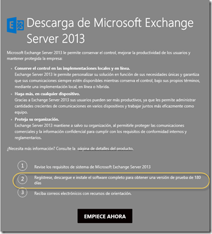
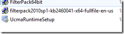
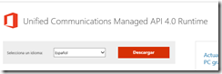
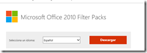
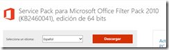
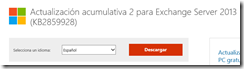
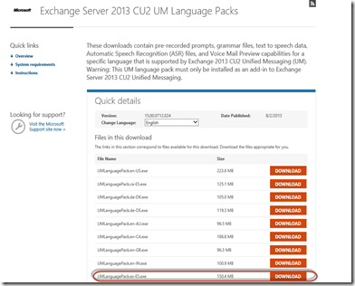

#Paso a Paso - Integrando Microsoft Exchange 2013 y Microsoft Lync 2013

**Peter Diaz**

Profesional en el área de IT con más de 10 años de experiencia en
proyectos y consultorías de Seguridad Informática, Infraestructura y
Comunicaciones Unificadas. MVP/MCT/MCITP Lync/MAP 2012/MCC MCP ID:
3095363 MVP ID: 4039848

**LinkedIn**: <http://www.linkedin.com/pub/peter-diaz/8/61b/a72>

**Microsoft MVP **

Hola a todos en esta oportunidad tratare de orientarles e indicarlos en
sencillos pasos como integrar nuestro Microsoft Exchange 2013 con
Microsoft Lync 2013 para todo integrar Unified Messaging y Outlook Voice
Access.

Antes que nada debemos de cumplir algunos requisitos previos a la
integración que les describo a continuación:

Tareas previas 
---------------

*1- Instalar Microsoft Exchange Server 2013*, puede ser descargado de
vuestra suscripción MSDN y/o TechNet o también en el sitio oficial de
Microsoft con un límite de prueba de 180 días:

Referencia:[*http://technet.microsoft.com/es-es/evalcenter/hh973395.aspx*](http://technet.microsoft.com/es-es/evalcenter/hh973395.aspx)

 

Nota: El nivel del dominio y del forest del directorio activo debe de
ser Windows Server 2003 nativo como mínimo.

2- *Seguir las instrucciones de instalación de Microsoft Exchange 2013*,
para ello debemos de seguir las instrucciones que encontraremos en el
sitio oficial de Microsoft recordando que antes de instalar el producto
debemos de preparar nuestro servidor base (Windows Server 2012) con los
siguientes prerrequisitos, antes de empezar la instalación:

Referencia:[*http://technet.microsoft.com/en-us/library/ff805042(v=exchg.150).aspx*](http://technet.microsoft.com/en-us/library/ff805042(v=exchg.150).aspx)

Para preparar el servidor Windows Server 2012 desde una consola
PowerShell ejecutar:

Install-WindowsFeature RSAT-ADDS

Para instalar los roles de Mailbox y Client Access combinados debemos de
ejecutar el siguiente comando PowerShell:

Install-WindowsFeature AS-HTTP-Activation, Desktop-Experience,
NET-Framework-45-Features, RPC-over-HTTP-proxy, RSAT-Clustering,
RSAT-Clustering-CmdInterface, RSAT-Clustering-Mgmt,
RSAT-Clustering-PowerShell, Web-Mgmt-Console, WAS-Process-Model,
Web-Asp-Net45, Web-Basic-Auth, Web-Client-Auth, Web-Digest-Auth,
Web-Dir-Browsing, Web-Dyn-Compression, Web-Http-Errors,
Web-Http-Logging, Web-Http-Redirect, Web-Http-Tracing, Web-ISAPI-Ext,
Web-ISAPI-Filter, Web-Lgcy-Mgmt-Console, Web-Metabase, Web-Mgmt-Console,
Web-Mgmt-Service, Web-Net-Ext45, Web-Request-Monitor, Web-Server,
Web-Stat-Compression, Web-Static-Content, Web-Windows-Auth, Web-WMI,
Windows-Identity-Foundation

Una vez preparado el servidor nos pedirá reiniciarlo.

-*Instalar los filters Pack y el UCMARuntime,* ahora toca instalar los
siguientes componentes:

Referencia:[*http://www.microsoft.com/es-es/download/details.aspx?id=34992*](http://www.microsoft.com/es-es/download/details.aspx?id=34992)

Referencia:[*http://www.microsoft.com/es-es/download/details.aspx?id=17062*](http://www.microsoft.com/es-es/download/details.aspx?id=17062)

Referencia:[*http://www.microsoft.com/es-es/download/details.aspx?id=26604*](http://www.microsoft.com/es-es/download/details.aspx?id=26604)

Nota: Importante luego de instalar estos componentes instalar todos los
updates más recientes al servidor antes de instalar el Microsoft
Exchange.

*3. Ahora procedemos a la instalación de nuestro Servidor Microsoft
Exchange 2013*, para preparar el Schema y el Directorio Activo:

Desde una consola PowerShell de Windows Server 2012 con privilegios
administrativos ejecutar los siguientes comandos:

X:\\Setup.exe /PrepareSchema /IAcceptExchangeServerLicenseTerms

X:\\Setup.exe /PrepareAD /OrganizationName:callware
/IAcceptExchangeServerLicenseTerms

 

**Nota: X:\\ es la unidad que identifica donde está montado nuestro ISO
de Exchange 2013.**

**Seguir la instalación del servidor luego de realizar la preparación
del Schema y el Directorio Activo a través de interfaz gráfica:**

Referencia:[*http://technet.microsoft.com/en-us/library/bb124778(v=exchg.150).aspx*](http://technet.microsoft.com/en-us/library/bb124778(v=exchg.150).aspx)

**Nota: Importante introducir el product key de nuestro Exchange a
través del siguiente comando Exchange Managment Shell:**

**Set-ExchangeServer ExServer01 -ProductKey
XXXXX-XXXXX-XXXXX-XXXXX-XXXXX**

Referencia:
[*http://technet.microsoft.com/en-us/library/bb124397(v=exchg.150).aspx*](http://technet.microsoft.com/en-us/library/bb124397(v=exchg.150).aspx)

**Es importante luego reiniciar el servidor.**

4.-*Luego de instalar el servidor de Exchange 2013,* debemos de instalar
el Exchange 2013 Cummulative Update 2 (CU2) y el Lenguage Pack en idioma
Español.

Para descargar el CU2 de Microsoft Exchange debemos ir al siguiente
enlace y seguir las instrucciones indicadas en el documento:

Referencia:[*http://www.microsoft.com/en-us/download/details.aspx?id=39609*](http://www.microsoft.com/en-us/download/details.aspx?id=39609)

Paquete de Idiomas para Exchange 2013, debe de ser ejecutado luego de
instalar el CU2 de Exchange 2013.

Referencia:
[*http://www.microsoft.com/en-pk/download/details.aspx?id=39713*](http://www.microsoft.com/en-pk/download/details.aspx?id=39713)

Nombre: UMLanguagePack.es-ES.exe 150.4 MB

