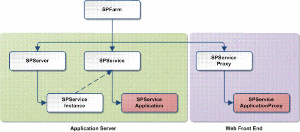
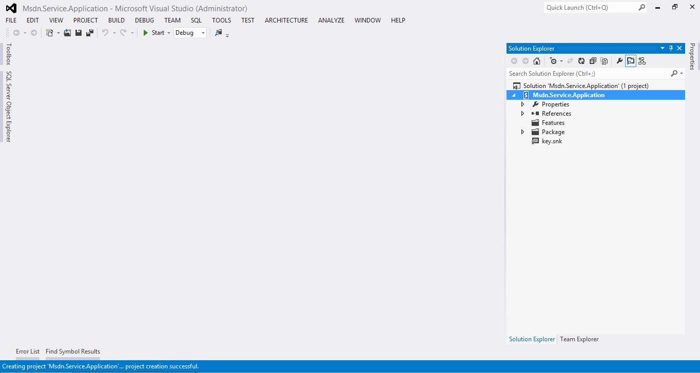
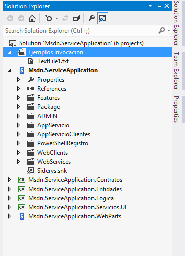
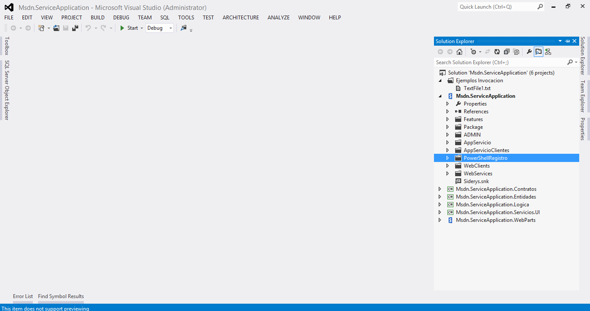
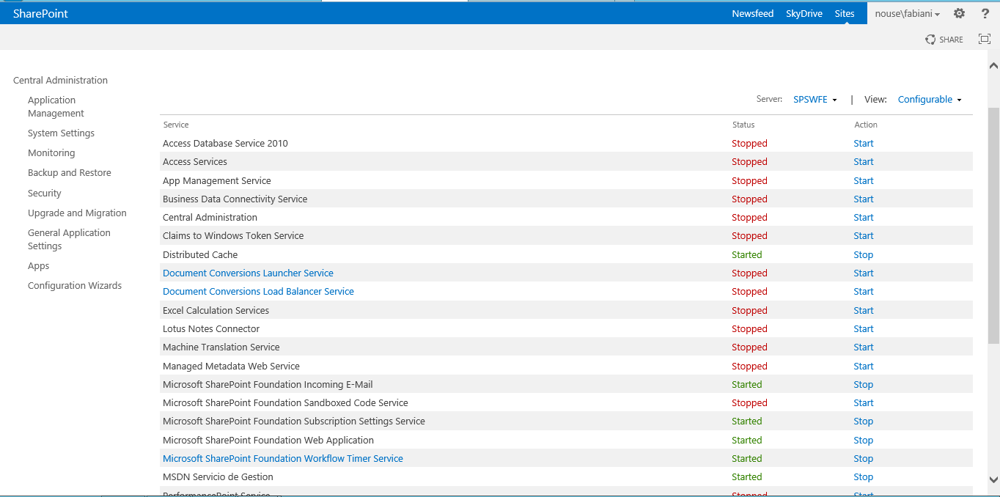
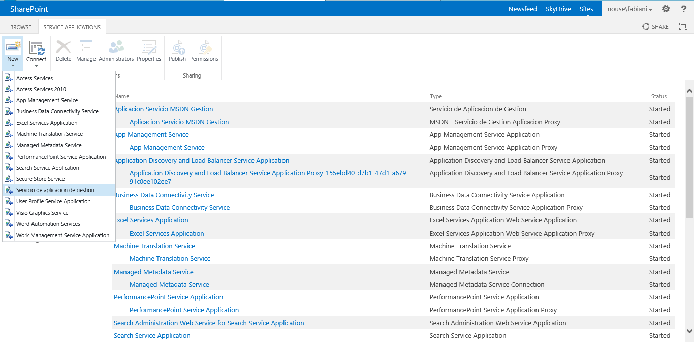
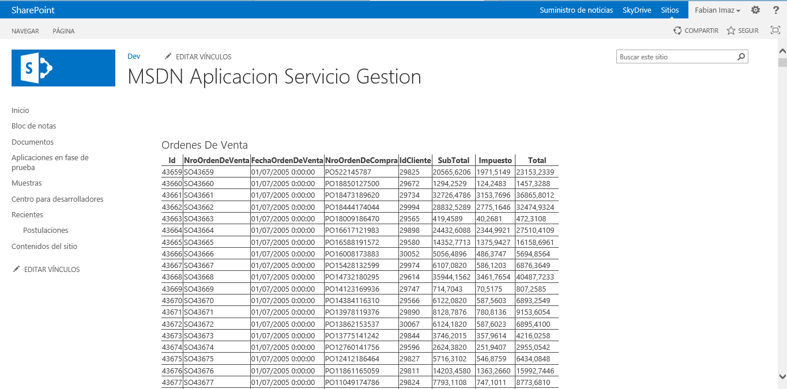

#Servicios de SharePoint 2013 - III: Programando un Servicio propio

Gustavo Velez

-   MVP de SharePoint.

-   Sitio web: <http://www.gavd.net>

-   Email: <gustavo@gavd.net>

Juan Carlos González Martín, MVP de SharePoint

-   Co-fundador del Grupo de usuarios de SharePoint de España (SUGES, www.suges.es) y del Grupo de usuarios de Cloud Computing de España (CLOUDES)

-   Twitter: @jcgm1978.

-   Blogs: <http://geeks.ms/blogs/ciin> & <http://jcgonzalezmartin.wordpress.com/>

Fabian Imaz, MVP de SharePoint

-   Director de la carrera SharePoint 2010 en Microsoft Virtual Academy, http://www.mslatam.com/latam/technet/mva2/Home.aspx, y cuenta con un sitio en CodePlex con varios desarrollos (http://siderys.codeplex.com).

-   Twitter: @fabianimaz

-   Blog: http://blog.siderys.com

Introducción 
-------------

Esta serie de artículos discute la funcionalidad de Servicios en
Microsoft SharePoint 2013. En el tercer número se habla de la capacidad
de crear un servicio personalizado, instalarlo en SharePoint y consumir
el mismo desde las diferentes Aplicaciones Web.

La arquitectura de servicios de SharePoint 2013 permite construir nuevas
aplicaciones de servicio con el fin de incorporar nuevas funcionalidades
a la plataforma. Estas nuevas funcionalidades pueden ser muy diversas
logrando así que SharePoint se transforme en una plataforma base dentro
de nuestra organización y brindándole a los usuarios un única
herramienta para trabajar. Muchas organizaciones cuenta con sistemas de
gestión, facturación, de recursos humanos, de manejo de stock, monitoreo
y mucho más, donde los usuarios para poder realizar sus tareas día tras
días necesitan ingresar a todos estos sistemas y muchas veces realizar
la consolidación de datos requiere la implementación de otras
herramientas o muchas horas de trabajo. La realidad de estas
organizaciones sería diferente si en vez de implementar estas distintas
plataformas, que incluso muchas veces están en tecnologías diferentes,
decidieran implementar servicios y aplicaciones de servicios en
SharePoint 2013.

Elementos que componen una aplicación de servicio
-------------------------------------------------

Cada aplicación de servicio se compone de una serie de bloques
necesarios para ejecutar los mismos dentro de la granja de SharePoint 2013. A continuación se detallan los elementos mínimos que son
necesarios en una aplicación de servicio personalizada:

- **Servicio:** Este elemento es el servicio en sí mismo, es el componente
que estará ejecutándose una vez instalado, pudiendo ser un servicio de
Windows o un servicio de WCF. Puede estar hospedado en uno o varios
servidores de la granja. Si bien no es necesario la utilización de WCF
como FrameWork de comunicación, es ideal para poder implementar una
seguridad robusta dada todas las ventajas que esta tecnología provee.

- **Instancia del Servicio:** Representa una instancia del servicio
corriendo en uno de los servidores de la granja. Podemos tener múltiples
instancias corriendo en varios servidores de la granja de SharePoint
2013 y gracias a la arquitectura provista por las aplicaciones de
servicio, las instancias se ejecutan en entornos escalables y
balanceados que permiten su correcto funcionamiento.

- **Aplicación de Servicio:** Representa lógicamente al servicio dentro de
la granja de SharePoint, encapsulando el servicio físico que hemos
instalado en la granja sin importar en cuantos servidores hemos activado
el mismo, todos los componentes de SharePoint utilizarán está
abstracción cuando deban interactuar con el servicio.

- **Base de datos del Servicio:** En algunos servicios se necesita tener
una estructura de almacenamiento como una base de datos para su correcto
funcionamiento. Esta base de datos será creada o al momento de activar
el servicio en la granja de SharePoint o bien al crear la aplicación de
servicio dentro de SharePoint.

- **Proxy del Servicio de Aplicación:** Al crear una aplicación de
servicio en SharePoint se crea también un Proxy, una estructura de
comunicación que es expuesta por la granja a través de un servicio de
WCF para que todos los componentes web (Elementos webs, Flujos, Eventos,
aplicaciones personalizadas, etc) puedan consumir las operaciones del
servicios desde la capa de presentación o servidor web.

Cada vez que se instala SharePoint 2013 este instala y configura una
serie servicios de aplicación que serán utilizados para poder consumir
correctamente todos los servicios de que se configuren y además provee
una serié páginas para poder administrar los mismos:

- **Descubrimiento de Aplicaciones y Balanceador de carga**: Esta
aplicación de servicio es utilizada para hacer un correcto
descubrimiento de todas las aplicaciones de servicio configuradas en la
granja de SharePoint y manejar todas las peticiones que se realizan
entre las distintas instancias instaladas.

- **Identificadores de Seguridad (Security Token):** Este servicio provee
todo el mecanismo de autenticación entre las diferentes aplicaciones y
capas de la granja de SharePoint.

- **Manejo de seguridad y acceso:** Los servicios de aplicación cuentan
con niveles de seguridad que permiten establecer quienes serán los
administradores de los mismos, por defecto los usuarios que son
Administradores de la granja pueden acceder a todas las aplicaciones de
servicio creadas, pero en un ambiente mixto se puede tener la
administración de cada una de las aplicaciones de servicio
descentralizada y de esta forma, asignar a un usuario o grupo de
usuarios por ejemplo la administración de una aplicación de servicio en
particular.

- **Páginas de administración:** Todas las aplicaciones de servicio
cuentan con una serié de páginas necesarias para poder administrar las
mismas, cambiarlas o editar sus propiedades. Dependiendo de cada
aplicación de servicio estás páginas podrán variar según los parámetros
y opciones de cada aplicación.

El modelo de objetos
--------------------

En SharePoint 2013 contamos con un Framework de clases para que los
desarrolladores puedan construir sus propios servicios de aplicaciones e
instalarlos. Todas las aplicaciones de servicios provistas por
SharePoint fueron creadas basadas en este Framework el cual podemos ver
en la figura 1.

Figura 1. - Relación entre las clases del Framework del servicio de
    aplicación

Fuente [**MSDN**](http://msdn.microsoft.com/en-us/library/cc768564.aspx)

    

A continuación se describen brevemente cada una de las clases
involucradas en el Framework provisto para la construcción de servicios
de aplicaciones.

- SPFarm: Esta clase representa la granja de SharePoint 2010 dentro del
modelo de objetos y es la clase más alta en la jerarquía de clases
provista, brindando acceso a la topología de servidores dentro de la
granja o los servicios configurados en la misma por ejemplo.

- SPServer: A través de esta clase se obtiene acceso al servidor físico
dentro de la granja pudiendo habilitar por ejemplo servicios que deberán
correr en el mismo.

- SPService: A través de esta clase se puede tener acceso al servicio
instalado en la granja de SharePoint. Para acceder a todos los servicios
disponibles debemos obtener la colección SPServiceCollection de
servicios a través de la propiedad Services del objeto SPFarm.

- SPServiceInstance: Esta clase representa la instancia del servicio
corriendo en un servidor de la granja. Puesto que se puede tener
configurado varias instancias del mismo servicio en distintos servidores
de la granja a través de la propiedad Instances de la clase SPservice
podemos tener todas las instancias de dicho servicio que fueron
configuradas.

- SPServiceApplication: Esta clase representa a la aplicación de servicio
que se puede crear en SharePoint 2013 para exponer las funcionalidades
del servicio que tenemos configurado en la granja. Cada aplicación de
servicio creada corre de forma aislada de otra aplicación de servicio
del mismo tipo, manteniendo sus propias bases de datos y su
configuración de seguridad, permitiendo así tener por ejemplo varias
aplicaciones de servicios de búsqueda donde los elementos que se están
rastreando no serán compartidos entre sí.

- SPServiceProxy: Esta es la clase base cliente que se utiliza para
exponer un servicio de aplicación como hacia las aplicaciones web de
SharePoint que tengan asociado dicho servicio.

- SPServiceApplicationProxy: Esta clase expone todas las interfaces
públicas que provee un servicio de aplicación para que cualquier
aplicación web (Front End) de SharePoint pueda consumir. Cualquier
elemento web, evento, workflow o artefacto que es hospedado en una
aplicación web de SharePoint y necesita consumir un servicio de
aplicación configurado en SharePoint deberá consumirlo a través de la
clase cliente creada automáticamente cuando se creó el servicio de
aplicación.

Programando un Servicio Propio
------------------------------

En este caso se va a implementar un servicio dentro de SharePoint 2013
que brinde la posibilidad de extender la plataforma de manera que los
usuarios puedan manejar el sistema de gestión de la organización
directamente desde SharePoint 2013. Este servicio permitirá a los
usuarios manejar “las órdenes de ventas” del sistema de gestión a través
de SharePoint. Antes de comenzar, instale en su servidor de base de
datos (BD) la BD “AdventureWorks2012” que puede descargarse desde sitio
de CodePlex.

El primer paso para crear una nueva aplicación de servicio pasa por
crear un proyecto en blanco de SharePoint 2013 en nuestro Visual Studio
2013.

Figura 2. - Proyecto en blanco de SharePoint 2013

<!-- -->

    

Una decisión importante que se debe tomar es el lugar donde se
implementará la lógica del servicio que se está construyendo. En el
ejemplo, se va a construir un servicio que exponga operaciones de la
lógica de negocios del sistema de gestión organizacional a través de WCF
lo que implica definir los contratos y tipos de entidades que estás
operaciones. Podemos desarrollar todas nuestras clases en un mismo
ensamblado que será el servicio que se está implementando, pero esto
implica que cada vez que se realice un cambio en la lógica del negocio
es necesario recompilar completamente el servicio e implementarlo de
nuevo, por lo que es recomendable implementar la lógica de negocios en
ensamblados diferentes. Por lo tanto, se añadirán 5 proyectos más en
Visual Studio 2012 de la siguiente manera:

- Proyecto de Biblioteca de Clases para definir todas las entidades que
vamos a estar usando.

- Proyecto de Biblioteca de Clases para definir los contratos

- Proyecto de Biblioteca de Clases para implementar las operaciones de
negocio.

- Proyecto de Biblioteca de Clases donde implementaremos los servicios que
se le brindaran a la capa de presentación, UI, para que encapsule las
llamadas al servicio en SharePoint.

- Proyecto de SharePoint donde crearemos todos los componentes web que
serán utilizados por los usuarios finales en un portal de SharePoint
2010.

Una vez definidos todos los proyectos, nuestra solución debería quedar
como se muestra en la siguiente imagen.

Figura 3. - Proyectos para la implementación de la aplicación de
    servicio

<!-- -->

    

Antes de ponernos a implementar el servicio y las operaciones que estará
exponiendo, para ser utilizado desde SharePoint se deben crear algunas
carpetas necesarias dentro del proyecto del servicio y mapearlas con
carpetas del directorio de instalación de SharePoint 2013. A
continuación se presenta la lista de carpetas que se necesitan:

- **Admin** – Contiene todas las páginas necesarias para manejar la
aplicación de servicio desde la administración central de SharePoint,
creación, propiedades y manejo del servicio. La ruta física de esta
carpeta se encuentra en {SharePointRoot}\\Template\\ADMIN.

- **PowerShellRegistro** - Contiene los archivos de configuración para
registrar los comandos PowerShell necesarios para poder crear la
aplicación de servicio por línea de comandos. La ruta física de esta
carpeta se encuentra en
{SharePointRoot}\\CONFIG\\POWERSHELL\\Registration.

- **SQL** – En esta carpeta se ubican los archivos necesarios para crear
la base de datos de la aplicación de servicio en el caso que así lo
necesitara. Dependiendo del tipo de servicio que se esté desarrollando
podrá tener una base de datos propia donde almacenar la información que
este deba persistir. En este ejemplo no es necesario que el servicio
disponga de una base de datos ya que se usará la base datos externa de
nuestro sistema de gestión. La ruta física de esta carpeta se encuentra
en {SharePointRoot}\\Template\\SQL.

**WebServices** – En esta carpeta se almacenara los archivos necesarios
para exponer las operaciones de los servicios a través de WCF.
Básicamente para el servicio de ejemplo que se va a construir, esta
carpeta contiene el archivo .svc y el web.config del servicio con la
definiciones de cómo serán expuestas las operaciones. La ruta física de
esta carpeta se encuentra en {SharePointRoot}\\WebServices.

**WebClients** – En esta carpeta se almacenan los archivos necesarios
para que los clientes puedan consumir los servicios expuestos por WCF.
Contiene un archivo de configuración que define como y donde se
expusieron las operaciones que el servicio expone. La ruta física de
esta carpeta se encuentra en {SharePointRoot}\\WebClients.

En la Figura 4 se ver como quedo armado toda la solución en Visual
Studio 2012 para poder empezar a codificar la aplicación de servicio.

Figura 4. - Capetas mapeadas al directorio de instalación de
    SharePoint

<!-- -->

    

Una vez que todos los componentes necesarios fueron creados, vamos a
comenzar a implementar todas las clases necesarias para poder crear la
aplicación de servicio. La primera clase que se va a implementar es la
clase del servicio, que en este caso particular clase heredar de la
clase abstracta SPIisWebService que hereda a su vez de SPService
(***Nota:*** Recuerde que esta clase en el diagrama de clases de la
Figura 1, es la clase base del FrameWork provisto por SharePoint).
También se implementara la interfaz IServiceAdministration la cual
obliga a implementar los métodos administrativos para la creación de los
componentes necesarios para crear el servicio de aplicación.

Listado 1. - Clase ServicioGestion

<!-- -->

    namespace Msdn.ServiceApplication
    {
        [Guid("A14F914A-7701-4fa8-83B6-975D37AEC410")]
        public class ServicioGestion : SPIisWebService, IServiceAdministration
        {
            public ServicioGestion() : base()
            { }

            public ServicioGestion(SPFarm pGranja) : base(pGranja)
            { this.Name = "MSDN Servicio de Gestion";}

            public SPServiceApplication CreateApplication(string name, Type serviceApplicationType, SPServiceProvisioningContext provisioningContext)
            {

                if (provisioningContext == null)
                    throw new ArgumentNullException("provisioningContext");
                if (serviceApplicationType != typeof(ServicioGestionAplicacion))
                    throw new NotSupportedException("Tipo de servicio de aplicacion invalido, se esperaba AplicacionServicioGestion");

                ServicioGestionAplicacion lapplication = (ServicioGestionAplicacion)this.Farm.GetObject(name, this.Id, serviceApplicationType);

                if (lapplication == null)
                {
                    lapplication = ServicioGestionAplicacion.Create(name, this, provisioningContext.IisWebServiceApplicationPool);
                }
                return lapplication;

            }

            public SPServiceApplicationProxy CreateProxy(string pNombre, SPServiceApplication pAplicacionServicio, SPServiceProvisioningContext pContexto)
            {
                if (pAplicacionServicio == null)
                    throw new ArgumentNullException("serviceApplication");

                if (pAplicacionServicio.GetType() != typeof(ServicioGestionAplicacion))
                    throw new NotSupportedException("Tipo de aplicación de servicio invalido");

                ServicioGestionProxy lServicioProxy = (ServicioGestionProxy)base.Farm.GetObject(string.Empty, base.Farm.Id, typeof(ServicioGestionProxy));

                if (lServicioProxy == null)
                {
                    lServicioProxy = new ServicioGestionProxy(base.Farm);
                    lServicioProxy.Update(true);
                }

                ServicioGestionAplicacionProxy lAplicacionProxy = lServicioProxy.ApplicationProxies.GetValue<ServicioGestionAplicacionProxy>(pNombre);

                if (lAplicacionProxy == null)
                {
                    lAplicacionProxy = new ServicioGestionAplicacionProxy(pNombre, lServicioProxy, ((ServicioGestionAplicacion)pAplicacionServicio).Uri);
                }

                lAplicacionProxy.Update(true);
                return lAplicacionProxy;
            }

            public SPPersistedTypeDescription GetApplicationTypeDescription(Type serviceApplicationType)
            {
                if (serviceApplicationType != typeof(ServicioGestionAplicacion))
                    throw new NotSupportedException("Tipo de aplicación de servicio invalido, se esperaba AplicacionServicioGestion");

                return new SPPersistedTypeDescription("Servicio de aplicacion de gestion", "Servicio para el manejo del sistema de gestion");

            }

            public Type\[\] GetApplicationTypes()
            {
                return (new Type\[\] { typeof(ServicioGestionAplicacion) });
            }

            public override SPAdministrationLink GetCreateApplicationLink(Type serviceApplicationType)
            {
                return new
                SPAdministrationLink("/\_admin/ServicioGestion/ServicioGestionCreateApp.aspx");
            }

            SPCreateApplicationOptions GetCreateApplicationOptions(Type serviceApplicationType)
            {
                return SPCreateApplicationOptions.None;
            }

        }

    }

El próximo paso consiste en crear la clase que representa la instancia
del servicio, esta clase deberá heredar de la clase abstracta
SPIisWebServiceInstance, como se puede ver en la Listado 2.

Listado 2. - Clase InstanciaServicioGestion

<!-- -->

    namespace Msdn.ServiceApplication
    {
        [Guid("14BCA048-41C0-4d64-AE05-52D8656404F2")]
        public class ServicioGestionInstancia : SPIisWebServiceInstance
        {
            public ServicioGestionInstancia() : base()
            { }

            internal ServicioGestionInstancia(SPServer pServidor, ServicioGestion pServicio) : base(pServidor, pServicio)
            {
            }

            internal ServicioGestionInstancia(string pNombre, SPServer
            pServidor, ServicioGestion pServicio) : base(pServidor, pServicio)
            {
                this.Name = pNombre;
            }

            public override string DisplayName
            {
                get { return "MSDN Servicio de Gestion"; }
            }

            public override string TypeName
            {
                get { return "MSDN Servicio de Gestion"; }
            }
        }
    }

A continuación hay que crear la clase que representara la aplicación de
servicio en SharePoint 2013 la cual deberá heredar de la clase abstracta
SPIisWebServiceApplication. Esta clase expone las operaciones que serán
consumidas desde el cliente o incluso desde algún otro servicio
desarrollado y hospedado en SharePoint 2013.

Listado 3. - Clase ServicioGestionAplicacion

<!-- -->

    namespace Msdn.ServiceApplication
    {
        [IisWebServiceApplicationBackupBehavior,
        Guid("E1B9DA13-DB64-4e4f-B296-D51FA01711AE")]

        public class ServicioGestionAplicacion : SPIisWebServiceApplication,
        ICliente, IOrdenesDeVenta, IProducto
        {
        [Persisted]

        private string mCadenaConexion = "Data Source=yoda;Initial Catalog=AdventureWorks2008R2;Integrated Security=True";

        internal string CadenaConexion
        {
            get { return mCadenaConexion; }
            set { mCadenaConexion = value; }
        }

        public ServicioGestionAplicacion()
        { }

        internal ServicioGestionAplicacion(string pNombre, ServicioGestion pServicio, SPIisWebServiceApplicationPool pApplicationPool) : base(pNombre, pServicio, pApplicationPool)
        {
        }

        public static ServicioGestionAplicacion Create(string pNombre, ServicioGestion pServicio, SPIisWebServiceApplicationPool pPoolDeAplicaciones)
        {
            if (pNombre == null)

            throw new ArgumentNullException("Nombbre");

            if (pServicio == null)

            throw new ArgumentNullException("Servicio");

            if (pPoolDeAplicaciones == null)

            throw new ArgumentNullException("Pool de aplicaciones");

            ServicioGestionAplicacion lAplicacionServicioGestion = new
            ServicioGestionAplicacion(pNombre, pServicio, pPoolDeAplicaciones);

            lAplicacionServicioGestion.Update();
        
        lAplicacionServicioGestion.AddServiceEndpoint("http", SPIisWebServiceBindingType.Http);
           lAplicacionServicioGestion.AddServiceEndpoint("https", SPIisWebServiceBindingType.Https, "secure");

            lAplicacionServicioGestion.Update();

            //creo la instancia para el sistema de gestion.

            return lAplicacionServicioGestion;
        }

        protected override string DefaultEndpointName
        {
            get { return ("http"); }
        }

        public override string TypeName
        {
            get { return ("Servicio de Aplicacion de Gestion"); }
        }

        protected override string InstallPath
        {
            get { return SPUtility.GetGenericSetupPath(@"WebServices\ServicioGestion"); }
        }

        protected override string VirtualPath
        {
            get
            {
            return "SevicioGestion.svc";
            }
        }

        public override Guid ApplicationClassId
        {
            get { return (new Guid("F624D941-757A-4619-B635-0C9D8F8BD6A5")); }
        }

        public override Version ApplicationVersion
        {
            get { return (new Version("1.0.0.0")); }
        }

        public override void Provision()
        {
            base.Status = SPObjectStatus.Provisioning;
            this.Update();
            //this.Provision();
            this.Status = SPObjectStatus.Online;
            this.Update();
        }

        public override void Unprovision(bool deleteData)
        {
            base.Status = SPObjectStatus.Unprovisioning;
            this.Update();
            base.Unprovision(deleteData);
            base.Status = SPObjectStatus.Disabled;
            this.Update();
        }

        public override SPAdministrationLink ManageLink
        {
            get
            {
            return new
            SPAdministrationLink("/_admin/ServicioGestion/ServicioGestionManejarApp.aspx?id=" +
            this.Id.ToString());
            }
        }

        public override SPAdministrationLink PropertiesLink
        {
            get
            {
            return new SPAdministrationLink("/_admin/ServicioGestion/ServicioGestionPropiedadesApp.aspx?id=" + this.Id.ToString());
            }
        }

        protected override SPNamedCentralAdministrationRights[] AdministrationAccessRights
        {
            get
            {
            return base.AdministrationAccessRights;
            }
        }

        protected override SPNamedIisWebServiceApplicationRights[] AccessRights
        {
            get
            {
                return new SPNamedIisWebServiceApplicationRights[]
                {
                    SPNamedIisWebServiceApplicationRights.FullControl, new SPNamedIisWebServiceApplicationRights("Request", ServicioGestionDerechoAcceso.Request), SPNamedIisWebServiceApplicationRights.Read,
                };
            }
        }

        #region Operaciones Gestion

        public List<Cliente> ObtenerTodosLosClientes()
        {
            LogicaClientes lLogica = new LogicaClientes(mCadenaConexion);
            return lLogica.ObtenerTodosLosClientes();
        }

        public Cliente ObtenerClientePorId(int pIdCliente)
        {
            LogicaClientes lLogica = new LogicaClientes(mCadenaConexion);
            return lLogica.ObtenerClientePorId(pIdCliente);
        }

        public List<OrdenDeVenta> ObtenerTodasLasOrdenesDeVenta()
        {
            Logica.LogicaOrdenesDeVenta lLogicaOrdenesDeVenta = new Logica.LogicaOrdenesDeVenta(mCadenaConexion);
            return lLogicaOrdenesDeVenta.ObtenerTodasLasOrdenesDeVenta();
        }

        public List<OrdenDeVenta> ObtenerOrdenesDeVentaPorIdCliente(int pIdCliente)
        {
            Logica.LogicaOrdenesDeVenta lLogicaOrdenesDeVenta = new
            Logica.LogicaOrdenesDeVenta(mCadenaConexion);
            return lLogicaOrdenesDeVenta.ObtenerOrdenesDeVentaPorIdCliente(pIdCliente);
        }

        public void IngresarOrdenDeVenta(OrdenDeVenta pOrdenDeVenta)
        {
        }

        public void ElimindarOrdenDeVenta(OrdenDeVenta pOrdenDeVenta)
        {
        }

        public List&lt;Producto&gt; ObtenerTodosLosProductos()
        {
            LogicaProductos lLogica = new LogicaProductos(mCadenaConexion);
            return lLogica.ObtenerTodosLosProductos();
        }

        #endregion

        }

    }

Una vez creada las clases que representan los componentes del lado del
servidor, deberemos crear todos los componentes que expondrán los
servicios a través de un proxy. Como se está creando un servicio que
expone operaciones de negocios implementadas en WCF, sé tiene que
exponer primero el servicio a través del IIS, para lo cual se va a crear
una clase de servicio .SVC el cual expondrá todas las operaciones. Pero
estas operaciones estarán implementadas en la clase
“ServicioGestionAplicacion” por lo cual deberemos declarar en el archivo
que define el servicio que clase implementa las operaciones y cuál será
la clase de creación del mismo, en la sección 4 se puede ver la
definición del mismo. Además se deberá realizar las configuraciones de
WCF para establecer como estará expuesto el servicio en nuestro servidor
y la configuración para los clientes de como deberán consumir los
mismos.

Listado 4. - SevicioGestion.svc

<!-- -->

    <%@ServiceHost language=c# Debug="true"
    Service="Msdn.ServiceApplication.ServicioGestionAplicacion,
    Msdn.ServiceApplication, Version=1.0.0.0, Culture=neutral,
    PublicKeyToken=711eed342842acee"

    Factory="Msdn.ServiceApplication.ServicioGestionApplicationHostFactory,
    Msdn.ServiceApplication, Version=1.0.0.0, Culture=neutral,
    PublicKeyToken=711eed342842acee"
    %>

Lo próximo que se debe crear son las clases del tipo proxy, clases que
expondrán el servicio a los clientes web y que estos podrán consumir
llamando a las operaciones que estos expondrán. En la sección 5 se puede
ver el proxy de la aplicación de servicio. Esta última será la clase que
se asociará en las aplicaciones web que se ha creado y que realizara la
interconexión con los clientes web. Esta clase será la que se utilizará
desde una WebPart para poder consumir las operaciones.

Listado 5. – Clase ServicioGestionAplicacionProxy.cs

<!-- -->

    namespace Msdn.ServiceApplication.AppServicioClientes
    {
        [Guid("2C009794-837C-4401-B3C9-E002C100E9A7")]
        [IisWebServiceApplicationProxyBackupBehavior]
        public class ServicioGestionAplicacionProxy : SPIisWebServiceApplicationProxy, IOrdenesDeVenta
        {
            private ChannelFactory<IOrdenesDeVenta> mChannelFactoryOrdenes;

            private object mChannelFactoryLock = new object();

            private String mEndpointConfigurationName;

            [Persisted]

            private SPServiceLoadBalancer mBalancer;

            [System.ComponentModel.EditorBrowsable(System.ComponentModel.EditorBrowsableState.Never)]

            public ServicioGestionAplicacionProxy() : base()
            {
            }

            public ServicioGestionAplicacionProxy(string pNombre, SPIisWebServiceProxy pServicioProxy, Uri pServicioEndPointUri) : base(pNombre, pServicioProxy, pServicioEndPointUri)
            {
                mBalancer = new SPRoundRobinServiceLoadBalancer(pServicioEndPointUri);
            }

            public override string TypeName
            {
                get { return ("MSDN - Servicio de Gestion Aplicacion Proxy"); }
            }

            public override void Provision()
            {
                mBalancer.Provision();
                base.Provision();
                this.Update();
            }

            internal Configuration Configuration
            {
                get
                {
                    return OpenClientConfiguration(SPUtility.GetGenericSetupPath(@"WebClients\\ServicioGestion"));
                }
            }   

            internal SPServiceLoadBalancer LoadBalancer
            {
                get
                {
                    return mBalancer;
                }
            }

            public override void Unprovision(bool deleteData)
            {
                mBalancer.Unprovision();
                base.Unprovision(deleteData);
                this.Update();
            }

            public
            List<Entidades.OrdenDeVenta> ObtenerTodasLasOrdenesDeVenta()
            {
                List<OrdenDeVenta> lRetorno = null;
                ExecuteOnChannel("ObtenerTodasLasOrdenesDeVenta", lChannel =>
                lRetorno = lChannel.ObtenerTodasLasOrdenesDeVenta());
                return lRetorno;
            }

            public List<Entidades.OrdenDeVenta>
            ObtenerOrdenesDeVentaPorIdCliente(int pIdCliente)
            {
                throw new NotImplementedException();
            }

            public void
            IngresarOrdenDeVenta(Entidades.OrdenDeVenta pOrdenDeVenta)
            {
                throw new NotImplementedException();
            }

            public void
            ElimindarOrdenDeVenta(Entidades.OrdenDeVenta pOrdenDeVenta)
            {
                throw new NotImplementedException();
            }
        }
    }

Construido el servicio en una solución de SharePoint el próximo paso
será instalarla en el servidor para que se despliegue en el mismo todos
los componentes desarrollados y así poder empezar a usar el servicio de
gestión. En la imagen figura 5 se puede ver el servicio disponible en la
lista de servicios de cada servidor de SharePoint y donde se debe
activar en el servidor que se desee tener el mismo corriendo ya que por
defecto se instala deshabilitado.

Figura 5. - Servicio de gestión instalado

<!-- -->

    

Una vez iniciado el mismo se puede crear la aplicación de servicio en
SharePoint para poder asociarla a la aplicación o aplicaciones web donde
se desea usar, en la figura 6 se puede ver la aplicación de servicio
creada con su correspondiente proxy, vale la pena destacar que si al
crear la aplicación de servicio se deja la opción marcada que asocie
esta aplicación al grupo por defecto de aplicaciones todas las
aplicaciones web que tengan configurado la opción por defecto tendrán
asociada dicha aplicación.

Figura 6. - Servicio de aplicación creado e iniciado

<!-- -->

    

Una vez el servicio esta iniciado y configurado se está en condiciones
de poder consumir el mismo desde una WebPart en una aplicación web de
SharePoint. En la sección 6 podemos ver cómo podemos obtener el proxy de
nuestra aplicación de servicio usando el tipo.

Listado 6. - Obtención del servicio de aplicación por el tipo

<!-- -->

    ServicioGestionAplicacionProxy lServicioGestion = (ServicioGestionAplicacionProxy)SPContext.Current.Site.WebApplication.ServiceApplicationProxyGroup.Proxies.OfType&lt;ServicioGestionAplicacionProxy&gt;().FirstOrDefault();
    lServicioGestion.ObtenerTodasLasOrdenesDeVenta();

Pero también se puede usar una expresión para obtener una referencia del
proxy de aplicación por una de las propiedades que este objeto tiene, se
debe recordar que una aplicación web puede tener uno o más servicios
asociados, incluso del mismo tipo de servicio y deberemos poder tener
acceso al servicio que nosotros deseamos utilizar, en la sección 7 se
puede ver el código para obtener el servicio usando una expresión para
la propiedad nombre.

Listado 7. - Obtención del servicio de aplicación mediante una expresión Linq

<!-- -->

    IEnumerable&lt;ServicioGestionAplicacionProxy&gt; lServicioGestionEx = SPContext.Current.Site.WebApplication.ServiceApplicationProxyGroup.Proxies.OfType&lt;ServicioGestionAplicacionProxy&gt;().Where(x=> x.Name.Contains("MSDN Aplicacion Sistema Gestion"));

Hasta ahora se ha visto cómo se puede obtener el servicio a través de la
aplicación web donde se está ejecutando el código, pero se puede obtener
el servicio a través de la clase “SPServiceContext” del modelo de
objeto, como se puede ver en la Sección 8.

Listado 8. - Obtención del servicio de aplicación a través de la
    case SPServiceContext

<!-- -->

    ServicioGestionAplicacionProxy lServicioGestion = (ServicioGestionAplicacionProxy)SPServiceContext.Current.GetDefaultProxy(typeof(ServicioGestionAplicacionProxy));
    lServicioGestion.ObtenerTodasLasOrdenesDeVenta();

Una forma que se tiene de invocar una operación es también llamando al
método Invoke que expone la clase “ServicioGestionAplicacionProxy”
creada, esto dependerá de la visibilidad con la que se creó el método.
En este caso se ha creado dicho método público para poder consumirlo
desde afuera del proyecto. Lo que se debe hacer es crear una clase
cliente que encapsule la llamada a los servicios y que desde los
componentes web que se han desarrollado, se brindé una forma sencilla de
llamar a las operaciones expuestas por la aplicación de servicio. En la
sección 9, se puede ver la definición de la clase cliente creada para el
encapsulamiento de las llamadas.

Listado 9. - Clase cliente para encapsular las llamadas a las operaciones

<!-- -->

    namespace Msdn.ServiceApplication.Servicios.UI
    {
        public class ServicioGestionOrdenesDeVentaCliente: IOrdenesDeVenta
        {
            private SPServiceContext mServiceContext;

            public
            ServicioGestionOrdenesDeVentaCliente(SPServiceContext pServiceContext)
            {
                if (pServiceContext == null)
                    throw new ArgumentNullException("El contexto del servicio es nulo.");
                this.mServiceContext = pServiceContext;
            }

            public List<OrdenDeVenta>ObtenerTodasLasOrdenesDeVenta()
            {
                List<OrdenDeVenta> lResultado = null;
               ServicioGestionAplicacionProxy.Invoke(mServiceContext, proxy => lResultado = proxy.ObtenerTodasLasOrdenesDeVenta());

                return lResultado;
            }

            public List<Entidades.OrdenDeVenta> ObtenerOrdenesDeVentaPorIdCliente(int pIdCliente)
            {
                List<OrdenDeVenta> lResultado = null;
                ServicioGestionAplicacionProxy.Invoke(mServiceContext, proxy =>
                lResultado = proxy.ObtenerOrdenesDeVentaPorIdCliente(pIdCliente));

                return lResultado;
            }

            public void
            IngresarOrdenDeVenta(Entidades.OrdenDeVenta pOrdenDeVenta)
            {
                ServicioGestionAplicacionProxy.Invoke(mServiceContext, proxy => proxy.IngresarOrdenDeVenta(pOrdenDeVenta));

            }

            public void
            ElimindarOrdenDeVenta(Entidades.OrdenDeVenta pOrdenDeVenta)

            {
                ServicioGestionAplicacionProxy.Invoke(mServiceContext, proxy => proxy.ElimindarOrdenDeVenta(pOrdenDeVenta));
            }

        }

    }

Por último en la sección 10 se puede cómo se debe consumir la clase
cliente creada pasándole en el constructor una referencia de la
instancia de la clase “SPServiceContext”. Esta clase cliente deberá
tener las operaciones expuesta para que puedan ser invocadas, lo que
permite poder tener un nivel más de control y validación de los datos
antes de enviarlos a que sean ejecutados dentro de los procesos de
negocio, de esta forma logramos crear una capa de servicios para la UI.

Listado 10. - Consumiendo servicio expuesto por una clase cliente

<!-- -->

    ServicioGestionOrdenesDeVentaCliente lClinte = new ServicioGestionOrdenesDeVentaCliente(SPServiceContext.Current);

    lResultado = lClinte.ObtenerTodasLasOrdenesDeVenta();

Una vez construido el servicio y expuestas las operaciones de negocio,
se construyeron los componentes web que consumirán los servicios
correspondientes, en este ejemplo se han construido 3 WebParts para
listar los datos desde la base de datos. En la siguiente imagen se puede
ver la ejecución de la Webpart “Ordenes de Venta” que lista todas las
ventas desde la base de datos.

Figura 7. - Componente web que lista las órdenes de venta

<!-- -->

    

