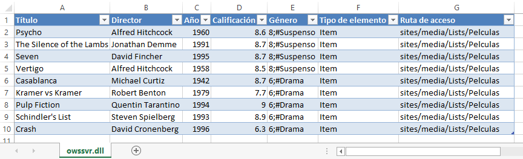
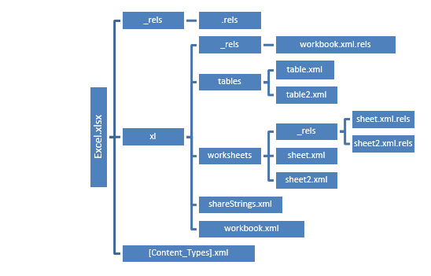
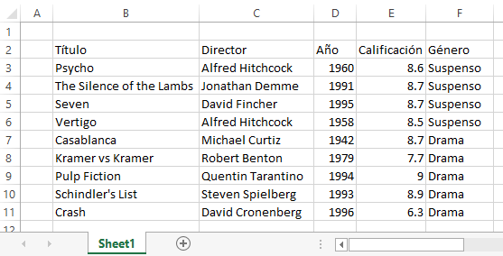
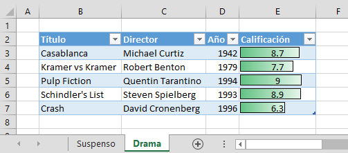

<properties
pageTitle="SharePoint 2010 y Open XML SDK. Creación de informes personalizados"
description="SharePoint 2010 y Open XML SDK. Creación de informes personalizados"
services="servers"
documentationCenter=""
authors="andygonusa"
manager=""
editor="andygonusa"/>

<tags
ms.service="servers"
ms.workload="Sharepoint"
ms.tgt_pltfrm="na"
ms.devlang="na"
ms.topic="how-to-article"
ms.date="05/12/2016"
ms.author="andygonusa"/>

#SharePoint 2010 y Open XML SDK. Creación de informes personalizados

 
<http://www.dnmplus.net>

Karel Trueba, Lester Sánchez, Miguel Katrib

Karel y Lester son instructores en el Dpto. de Programación y
desarrolladores del grupo WEBOO de la Universidad de la Habana. Miguel
es Dr. y profesor de Programación y director del grupo WEBOO.

Entradilla
----------

Para sacar provecho del volumen creciente de información y del
conocimiento subyacente, las empresas e instituciones suelen recurrir a
la generación de informes personalizados. Pero los sistemas disponibles
para facilitar la creación de estos informes requieren generalmente de
habilidades avanzadas para codificar o diseñar el informe, tarea que por
tanto suele ser delegada a un programador y no al usuario más directo,
que es quien está más cerca del momento y del formato en que desearía
ver los datos. Share Point es una aplicación que ha ganado relevancia
por su capacidad para gestionar información empresarial, y que se
distingue por su versatilidad y capacidad de integración con otros
productos. El presente trabajo propone una solución para generar
informes Excel personalizados a partir de información almacenada en
SharePoint 2010.

SharePoint 2010 ofrece la funcionalidad de exportar datos hacia Excel a
partir de información almacenada en sus listas, pero esta funcionalidad
trae algunas limitaciones. El hecho de que SharePoint impone el diseño
con el que se va a mostrar la información dentro del libro de Excel
limita la posibilidad de poder personalizar un informe con antelación a
la generación del mismo. En la figura 1 se muestra la vista de una lista
de SharePoint a partir de la cual se desea generar un informe. El
informe generado exportando los datos a Excel usando la funcionalidad
predeterminada de SharePoint se muestra en la figura 2.

Figura 1. Lista de SharePoint

<!-- -->

    

<!-- -->

Figura 2. Informe generado por defecto

<!-- -->

    

Como se muestra en la figura 2, el informe tiene un diseño
preestablecido, el cual no se puede modificar antes de la creación del
mismo y se aplica a todas las listas por igual. En primer lugar, la
selección de los campos de la lista que se van a mostrar solo pueden
controlarse a través del mecanismo de vistas de la lista de SharePoint
en el sitio al que pertenece. Se añaden además columnas como **Tipo de
elemento** y **Ruta de acceso**, que puede no sean necesarias para el
informe que realmente se desea. Otros campos, como los de tipo
**Lookup**, no se muestran correctamente, e incluyen como prefijo el
identificador interno (ver el campo **Género** en la figura 2).

Obtención de los datos de SharePoint
------------------------------------

El primer paso para conformar un informe es obtener los datos que
finalmente quedarán plasmados en el mismo; en este caso particular, el
repositorio es una lista de SharePoint. El segmento de código que
permite obtener estos datos se muestra en el listado 1; en él se
vinculan los datos de la lista de SharePoint con la clase
**ExcelReport** encargada de generar el informe. Después de tener la
instancia de la lista **Películas**, se obtiene un **DataTable** con la
información almacenada en dicha lista, recurriendo al método
**GetDataTable** de la colección **Items** de la lista. En el segundo
bucle se obtiene el valor de visualización del campo **Género** de la
lista, ya que éste es un campo de tipo **Lookup** y lo que se quiere
mostrar en el informe no es su valor interno, sino su valor legible.
Finalmente, guardamos el informe generado en la biblioteca de documentos
compartidos del sitio, y con ello ya tenemos nuestro informe
personalizado.

Listado 1. Obtención de los datos de una lista de SharePoint

<!-- -->

    SPWeb currentWeb = SPContext.Current.Web;
    SPList currentList = (SPList)currentWeb.Lists["Películas"];
    DataTable data = currentList.Items.GetDataTable();
    foreach (DataColumn item in data.Columns)
        item.ColumnName = currentList.Fields.GetFieldByInternalName(item.ColumnName).Title;
    int index = 0;
    DataColumn column = data.Columns["Género"];
    SPField field = currentList.Fields["Género"];
    
    foreach (SPListItem item in currentList.Items)
    data.Rows[index++][column] =
    field.GetFieldValueAsText(item["Género"]);

    ExcelReport excelReport = new DNMDemo.ExcelReport();
    Stream report = excelReport.GenerateReport(data);

    SPFolder libraryFolder = currentWeb.GetFolder("Documentos
    compartidos");
    SPFileCollection collFiles = libraryFolder.Files;

    string documentUrl = libraryFolder.Url + "/ExcelReport.xlsx";
    SPFile fileNew = collFiles.Add(documentUrl, report, true);
    SPListItem listItem = fileNew.Item;
    listItem.Update();

Creación del documento-informe
------------------------------

Para trabajar con los documentos Office se dispone de la herramienta
**Open XML SDK** en su versión 2.0[^1], la cual facilita la manipulación
de paquetes Open XML y de los elementos del esquema subyacente \[1, 2\].
Las clases del SDK nos ofrecen funcionalidades comunes que normalmente
los desarrolladores ejecutan en los paquetes Open XML, con las que
pueden realizar operaciones complejas sin la necesidad de interactuar
directamente con el XML subyacente. Una de las principales ventajas del
SDK es no requerir de una instalación de MS Office para la manipulación
de los documentos. Se pueden usar los tipos de Open XML SDK en cualquier
lenguaje con implementación sobre .NET. Open XML SDK evita la
complicación de trabajar con documentos de *Open Packaging Conventions*
(OPC), que es la segunda de las cinco partes que componen el estándar
ECMA-376 \[3\], donde los esquemas XML para OPC se declaran como *XML
Schema Definitions* (XSD). El paquete puede tener múltiples partes con
relaciones entre ellas, y las relaciones entre partes controlan la
categoría del documento.

Es una gran ventaja el hecho de que un archivo Open XML no está en
binario, sino que, como puede comprobarse utilizando un visor de
archivos ZIP), es un archivo ZIP de una carpeta de documentos compuesta
de varios archivos XML (figura 3); éstos últimos, por tanto, pueden ser
accedidos de manera directa e independiente.

Figura 3. Estructura del paquete compactado de un documento Excel
    2013

<!-- -->

    

En el SDK de Open XML, la clase **SpreadsheetDocument** representa un
paquete de documentos de Excel. Para crear un documento de Excel
cualquiera utilizando el SDK, hay que crear una instancia de la clase
**SpreadsheetDocument** (ver \[4\]), como se muestra en el listado 2.
Como mínimo, el documento debe tener una parte libro (**WorkbookPart**)
que sirve como un contenedor para el documento, y al menos una parte
hoja de cálculo. El texto se representa en el paquete como XML
utilizando el marcado **SpreadsheetML** (éste es el marcado definido por
ECMA para los paquetes Excel, que define la estructura del XML que
representa las partes del paquete y que tiene correspondencia con las
clases de la API que ofrece el SDK). El método **Create** del tipo
**SpreadsheetDocument** requiere dos parámetros: el primer parámetro es
el flujo donde se va a almacenar el documento, mientras que el segundo
parámetro es un valor del tipo enumerado **SpreadsheetDocumentType**,
mediante el que se representa el tipo de documento (por ejemplo,
complementos, plantillas, libros y plantillas o libros habilitados para
macros). Excel optimiza el texto almacenado en las hojas del libro a
través del uso de una tabla global que contiene en cada elemento de la
misma una cadena cuyo valor puede estar compartido en varias de las
celdas del libro. En el valor de cada celda se guarda el índice del
elemento en dicha tabla, que se almacena en una nueva parte del paquete
de tipo **SharedStringTablePart**. A continuación, se crea un objeto
**Sheets** que va a almacenar cada una de las hojas del libro
(**Sheet**) y se realiza la llamada al método **GenerateWorksheetPart**,
encargado de generar la hoja con la información del informe.

Listado 2. Código para creación de un informe

    public Stream GenerateReport(DataTable data)
    {
    var docStream = new MemoryStream();
    using (SpreadsheetDocument spreadsheetDocument = SpreadsheetDocument.Create(docStream, SpreadsheetDocumentType.Workbook))
        {
        WorkbookPart workbookpart = spreadsheetDocument.AddWorkbookPart();
        workbookpart.Workbook = new Workbook();
        
        SharedStringTablePart shareStringPart = workbookpart.AddNewPart<SharedStringTablePart>();
        shareStringPart.SharedStringTable = new SharedStringTable {Count = new UInt32Value(0U)};

        workbookPart.Workbook.AppendChild(new Sheets());
        GenerateWorksheetPart(workbookpart, data , "Sheet1", 1);
        workbookpart.Workbook.Save();
        return docStream;
        }
    }

El método **GenerateWorksheetPart** que se muestra en el listado 3 es el
encargado de generar una parte dentro del paquete que maneje toda la
información correspondiente a una hoja. Un libro de Excel debe tener al
menos un elemento **WorksheetPart**. Además, es necesario crear un
objeto **Sheet**, que se almacena en el conjunto **Sheets** dentro de la
parte principal del documento (**WorkbookPart**). Este objeto **Sheet**
es el encargado de vincular dentro del paquete la nueva parte que
representa a la hoja con el núcleo del documento; o sea, cuando se crea
una nueva parte **WorksheetPart**, se añade un nuevo fichero XML al
paquete. Para vincular éste al elemento principal del paquete se crea un
nuevo objeto **Sheet** que integra al elemento **WorkbookPart** con la
nueva hoja. El vínculo se crea a través del identificador del elemento
**WorksheetPart** que se almacena en la propiedad **Id** del elemento
**Sheet**, creando de esta forma una relación entre ellos dentro del
paquete.

Uno de los aspectos que se debe tener claro al trabajar con el SDK es
que éste está estrechamente vinculado con la estructura del documento de
Office. El mismo concepto de relación visto anteriormente se basa en la
propia estructura del documento, en la que se tiene un paquete con un
conjunto de partes vinculadas entre ellas a través del uso de relaciones
entre las mismas.

Listado 3. Generación de un WorksheetPart

<!-- -->

    private void GenerateWorksheetPart(WorkbookPart workbookpart, DataTable data, string sheetName, uint sheetId)
    {
    WorksheetPart worksheetPart =
    workbookpart.AddNewPart<WorksheetPart>();
    SheetData sheetData = new SheetData();
    worksheetPart.Worksheet = new Worksheet(sheetData);

    Sheets sheets = workbookpart.Workbook.GetFirstChild<Sheets>();

    sheets.AppendChild(new Sheet
    {
        Id = workbookPart.GetIdOfPart(worksheetPart),
        SheetId = sheetId,
        Name = sheetName
    });

    InsertSheetData(sheetData, data, workbookpart.SharedStringTablePart.SharedStringTable);

    }

El listado 4 muestra la implementación del método **InsertSheetData**
que va a insertar toda la información del informe (pasada a través de un
**DataTable**) dentro de un elemento **SheetData**. Este elemento está
almacenado dentro del **WorksheetPart** que identifica a la hoja dentro
del paquete, como se mostró en el listado 3. Dentro de este elemento
**SheetData** van a estar todas las filas de la hoja (representadas por
el tipo **Row**), que se crean en el método **AddSheetRow** que se
muestra en el listado 4.

Listado 4. Código para crear e insertar filas

<!-- -->

    private void InsertSheetData(SheetData sheetData, DataTable data, SharedStringTable sharedStringTable)
    {
    uint rowIndex = 2;
    AddSheetRow(sheetData, sharedStringTable, rowIndex++, data.Columns);
    foreach (DataRow row in data.Rows)
        AddSheetRow(sheetData, sharedStringTable, rowIndex++, row.ItemArray);
    }

    private void AddSheetRow(SheetData sheetData, SharedStringTable sharedStringTable, uint rowIndex, IEnumerable cellValues)
    {
        Row excelRow = new Row{RowIndex = rowIndex};
        int columnIndex = 1;

        foreach (var cellValue in cellValues)
        {
            Cell cell = GenerateCell(sharedStringTable, columnIndex++, rowIndex, cellValue);
            excelRow.AppendChild(cell);
        }

        sheetData.AppendChild(excelRow);
    }

El tipo **Row** (filas en una hoja de Excel) contiene un conjunto de
celdas (**Cell**), y el método **GenerateCell** del listado 5 es el
encargado de generar una celda a partir de su ubicación (fila y columna)
dentro de la hoja y el valor a almacenar en la misma. La propiedad
**CellReference** del tipo **Cell** es la que almacena la ubicación de
la celda, y es un **string** de la forma **ColumnaFila** (por ejemplo,
**D5** quiere decir fila 5 de la columna D). Note que en el listado 5 se
realiza una llamada al método **GetColumnLetter**, cuyo objetivo es
realizar el mapeo *índice de columna = letra que le corresponde en la
columna de Excel*. El valor de la celda se almacena en la propiedad
**Text**, del tipo **CellValue**. Para los tipos numéricos, el valor de
la celda es directamente el valor del número en cuestión. No pasa así
con los elementos de tipo **string**, que como se explicó anteriormente
se deben almacenar en una tabla global y la celda solo contiene la
referencia al índice del elemento en la tabla; se asume que todo lo que
no es numérico es de tipo **string**. Cuando queremos definir el
elemento de la celda como una cadena compartida, se define el tipo de
dato de la celda (**DataType**) como **SharedString**, como se muestra
en el listado. Se debe tener mucho cuidado con esto: si no se especifica
el tipo del valor de la celda se mostrará el valor almacenado en la
misma, en este caso, el índice en la tabla **SharedStringTable**, y
Excel lo manejará como un número.

Listado 5. Generación de un tipo Cell

<!-- -->

    private Cell GenerateCell(SharedStringTable sharedStringTable, int columnIndex, uint rowIndex, object cellValue)
        {
        Cell cell = new Cell {CellReference = string.Concat(GetColumnLetter(columnIndex), rowIndex),
        CellValue = new CellValue() };

        if (cellValue is int || cellValue is double)
            cell.CellValue.Text = cellValue.ToString();
        else
        {
            cell.DataType = new
            EnumValue<CellValues>(CellValues.SharedString);
            int index = -1;

            SharedStringItem item = sharedStringTable.Elements<SharedStringItem>().FirstOrDefault(x => { index++; return x.Text.InnerText.Equals(cellValue);});

            if (item == null)
            {
                index = (int)sharedStringTable.Count.Value++;
                sharedStringTable.AppendChild(
                new SharedStringItem(new Text(cellValue.ToString())));
            }
            cell.CellValue.Text = index.ToString();
        }
        return cell;
    }

Hasta el momento, con el código visto se puede generar un libro de Excel
con una única hoja de nombre **Sheet1** donde los datos comienzan en la
fila 2. Como encabezado, la hoja va a contener una fila para cada
elemento de la lista de SharePoint vista anteriormente, en donde cada
columna representa una propiedad distinta de la misma. La figura 4
muestra el documento creado a partir de los datos de la lista en la
figura 1, sin agregar estilos y formatos a los datos.

Figura 4. Informe generado, sin estilos

<!-- -->

    

Adición de estilos al libro
---------------------------

A continuación se verá cómo añadir algo de estilo a la información de la
hoja. Para ello, se debe encapsular la información dentro de un formato
de tabla; el listado 6 muestra la implementación del método
**CreateTableFormat** que se utiliza para hacer esto. Para crear un
formato de tabla, se debe crear un **TableDefinitionPart** dentro de la
parte que representa a la hoja donde estará la tabla, y luego vincular
esta nueva parte a un tipo **TablePart** a partir de la propiedad **Id**
de éste y el identificador del **TableDefinitionPart**. Al nombrar la
tabla y definir la referencia al conjunto de celdas que abarcará la
misma, se define el conjunto de columnas que forman parte del
encabezado. Por último, creamos el estilo de la tabla, definiendo un
nuevo tipo **TableStyleInfo**, en donde la propiedad **Name** será el
nombre del estilo para la tabla; este valor puede cambiarse a
conveniencia según el estilo que se desee. Finalmente, se añaden todos
los elementos de la nueva definición de tabla y se guardan los cambios,
con lo que tendremos una definición de tabla que abarca el rango de
celdas, en este caso con la información de las películas, un encabezado
definido y un estilo dado.

Listado 6. Código para crear e insertar un formato de tabla

<!-- -->

    private void CreateTableFormat(WorksheetPart worksheetPart, DataTable data, uint sheetId)
    {
    var tableDefPart = worksheetPart.AddNewPart<TableDefinitionPart>();

    worksheetPart.Worksheet.AppendChild(new TableParts(new TablePart { Id = worksheetPart.GetIdOfPart(tableDefPart) }));

    string name = string.Format("Table{0}", sheetId);
    tableDefPart.Table = new Table { Id = sheetId, Name = name, DisplayName = name };

    string reference = string.Format("B2:{0}{1}", GetColumnName(data.Columns.Count), data.Rows.Count + 2);
    tableDefPart.Table.Reference = reference;

    AutoFilter autoFilter = new AutoFilter {Reference = reference};

    TableColumns tableColumns = new TableColumns { Count = (uint)data.Columns.Count };
    int id = 1;

    foreach (DataColumn column in data.Columns)
    {
        var tableColumn = new TableColumn { Id = (uint)id++, Name = column.ColumnName };
        tableColumns.AppendChild(tableColumn);
    }

    var tableStyleInfo = new TableStyleInfo{ Name = "TableStyleMedium2", ShowRowStripes = true };

    tableDefPart.Table.Append(autoFilter, tableColumns, tableStyleInfo);
    tableDefPart.Table.Save();

    }

El método **CreateConditionalFormatting** del listado 7 define un
formato condicional para la columna **Calificación** dependiendo del
valor de la celda. El formato condicional que se aplicará será de tipo
**Barra de datos**, y los valores, como se puede apreciar en los tipos
**ConditionalFormatValueObject**, varían entre los valores numéricos 0 y 10. Este ejemplo muestra el alcance que tiene el SDK, al brindar la
posibilidad de construir un documento con cualquiera de las
funcionalidades que ofrece la suite de Office; pero también muestra lo
complicado que puede llegar a ser este proceso, dada la necesidad de
conocer la estructura XML del documento subyacente para poder insertar
cualquier parte al paquete sin dañar el mismo. Cabe destacar en el
listado 7 cómo el tipo de formato condicional se añade en la propiedad
**Type** del tipo **ConditionalFormattingRule**, donde se definen las
reglas del formato condicional que se desea. Al terminar de definir el
formato condicional, se almacena éste como un elemento del tipo
**Worksheet** en la hoja correspondiente, o sea, en la parte del paquete
que le corresponde (**worksheetPart**).

Otro aspecto interesante a destacar es la posición en la que se inserta
el elemento **ConditionalFormatting** dentro del tipo **Worksheet**.
Note que se inserta después del elemento **SheetData**, o sea, en una
posición específica. Esto está relacionado con lo que se trató
anteriormente en la explicación de que la API que brinda el SDK está
estrechamente vinculada con la estructura del documento, y por esto,
además de tener que conocer cómo se construyen los objetos dentro del
paquete, es necesario saber la posición en la que se ubican sus
elementos dentro de cada parte (fichero XML) del paquete. Si el código
del listado 7 se modifica para insertar el formato condicional en
cualquier otro lugar que no sea justo después del elemento
**SheetData**, el documento creado quedaría corrupto y se perdería la
información.

Listado 7. Código para crear e insertar un formato condicional

<!-- -->

    private void CreateConditionalFormatting(WorksheetPart worksheetPart, int rowCount, string columnLetter)
    {
        var reference = string.Format("{0}3:{0}{1}", columnLetter, rowCount + 2);
        var conditionalFormatting = new ConditionalFormatting { SequenceOfReferences = new ListValue<StringValue> { InnerText = reference }};

        var conditionalFormattingRule = new ConditionalFormattingRule {

            Type = ConditionalFormatValues.DataBar, Priority = 1 };

        var dataBar = new DataBar(
            new ConditionalFormatValueObject {
                Type = ConditionalFormatValueObjectValues.Number, Val = "0" },
            new ConditionalFormatValueObject {
                Type = ConditionalFormatValueObjectValues.Number, Val = "10" },
            new Color { Rgb = "FF63C384" });

        conditionalFormattingRule.AppendChild(dataBar);

        conditionalFormatting.AppendChild(conditionalFormattingRule);
        worksheetPart.Worksheet.InsertAfter(conditionalFormatting, worksheetPart.Worksheet.GetFirstChild<SheetData>());
    }

Para hacer uso de estos métodos, y así obtener un informe con un formato
personalizado y condicionado a los valores de la columna
**Calificiación**, se deben añadir las siguientes líneas de código al
final del método **GenerateWorksheetPart** del listado 3:

CreateTableFormat(worksheetPart, data, sheetId);

CreateConditionalFormatting(worksheetPart, data.Rows.Count, "E");

Agrupamiento por hojas
----------------------

Para terminar el trabajo con Excel, vamos a agrupar por hojas la
información, en este ejemplo, dependiendo de la propiedad **Género** de
una película, de modo que en cada hoja de Excel estén solo aquellas
películas del mismo género. Para ello y gracias al diseño realizado para
generar el documento, lo único que habría que cambiar del código es
sustituir la llamada al método **GenerateWorksheetPart** del listado 2
por el código que se presenta en el listado 8. El resultado del informe
generado se muestra en la figura 5, con las nuevas características
añadidas al informe, en comparación con el de la figura 4. La
información aparece encapsulada en un formato de tabla para Excel; la
columna **E** muestra un formato condicional para los valores de
**Calificación** de la película, y además éstas se encuentran agrupadas
por hoja según su género.

Listado 8. Código para hacer agrupamiento por hojas en el informe

<!-- -->

    var groups = data.AsEnumerable().GroupBy(x => x.Field<string>("Género"));
        uint sheetId = 1;
        foreach (var item in groups)
        {
            var table = item.CopyToDataTable();
            string sheetName =
            (table.Rows[0][table.Columns["Género"]]).ToString();
            table.Columns.Remove("Género");
            GenerateWorksheetPart(workbookpart, table, sheetName, sheetId++);
        }

<!-- -->

Figura 5. Informe generado con estilos

<!-- -->

    

Si se compara el resultado que se muestra en la figura 5 con el informe
inicial (figura 2) generado con la herramienta de SharePoint por
defecto, puede apreciarse la personalización que se le ha dado al mismo.
La ventaja de disponer de la opción de informe *by default* es poder
conectar el informe desde Excel con la lista que contiene los datos del
mismo en SharePoint, brindando la posibilidad de actualizar la
información de Excel cuando se actualice la información en la lista.
Aunque realmente esta actualización puede lograrse igualmente con el SDK
trabajando con la API, los elementos claves dentro del paquete para
lograr vincular los datos del libro con la lista de SharePoint, y de
esta forma poder actualizar estos datos, son las partes
**QueryTablePart** y **ConnectionsPart**.

Conclusiones
------------

En cualquier sistema de información, sea empresarial, institucional o
hasta personal, es conveniente disponer de la generación de informes
especializados. En esta entrega se ha partido de la herramienta que
ofrece la plataforma de SharePoint para la generación de informes en
Excel a partir de información almacenada en una lista del sitio. Con la
idea de suplir las carencias que podría tener SharePoint, se ha
ilustrado cómo se puede implementar un informe personalizado. Basándonos
en la API que ofrece Open XML SDK, se han mostrado las funcionalidades
que éste ofrece para interactuar con los documentos sin necesidad de
trabajar directamente sobre el XML subyacente.

La idea de poder definir a priori la estructura, formato y estilos del
documento a crear, mejoran el acabado del informe generado, ya que se
tiene un total control sobre éste. Ello permite, además, poder procesar
los datos del repositorio antes de generar el documento, en este caso de
SharePoint, pero aplicable también para otros escenarios. De esta forma,
al tener control sobre los datos y sobre el documento a crear, se puede
crear un informe más acorde con las necesidades que se tienen, y con una
presentación mucho más agradable y orientada al escenario particular.

Con lo que se ha mostrado hasta aquí no se satisface el deseo de que
usuarios sin conocimientos de programación puedan diseñar y generar
informes por su cuenta. Lo que se sugiere es definir una plantilla (en
Excel por el momento) en donde el usuario defina el estilo, la ubicación
de cada elemento y el formato del mismo, utilizando el propio editor del
documento y sin requerir conocimientos de programación. Haciendo uso del
Open XML SDK, el desarrollador sería entonces el encargado de hacer el
enlace entre el repositorio (lista de SharePoint) y la plantilla para
generar el reporte. Para facilitar este proceso, estamos desarrollando
una aplicación de nombre **ShareReport**, la cual será puesta
próximamente a disposición de los lectores de **dNM**.

Referencias
-----------

  \[1\]   **Microsoft**. Open XML SDK 2.5 for Microsoft Office. Disponible en: **http://www.microsoft.com/en-us/download/details.aspx?id=30425**.
  ------- ----------------------------------------------------------------------------------------------------------------------------------------------------------------------------------
  \[2\]   **Microsoft**. “Acerca del SDK de Open XML para Microsoft Office”. Disponible en: **http://msdn.microsoft.com/es-es/library/bb456487.aspx**.
  
  \[3\]   **ECMA International**. Standard ECMA-376. Disponible en: **http://www.ecma-international.org/publications/standards/Ecma-376.htm**.
  
  \[4\]   **Microsoft**. “How to: Create a spreadsheet document by providing a file name (Open XML SDK)”. Disponible en: **http://msdn.microsoft.com/en-us/library/office/ff478153.aspx**.

[^1]: Como se anuncia la sección de Actualidad de este mismo ejemplar,
    Microsoft acaba de poner a disposición pública la versión 2.5,
    compatible hacia atrás con la versión 2.0.
