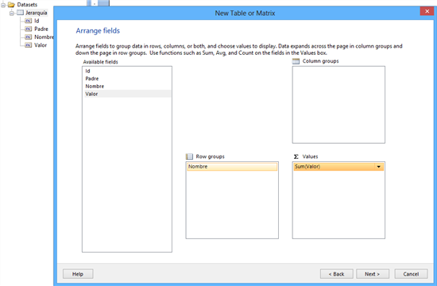

<properties
	pageTitle="Cómo crear un reporte flexible usando Jerarquías (Recursivo)"
	description="Cómo crear un reporte flexible usando Jerarquías (Recursivo)"
	services="servers"
	documentationCenter=""
	authors="andygonusa"
	manager=""
	editor="andygonusa"/>

<tags
	ms.service="servers"
	ms.workload="SQL"
	ms.tgt_pltfrm="na"
	ms.devlang="na"
	ms.topic="how-to-article"
	ms.date="05/16/2016"
	ms.author="andygonusa"/>

#Cómo crear un reporte flexible usando Jerarquías (Recursivo)

Por **FREDDY LEANDRO ANGARITA C.**
**SqlServer MVP** 
[Perfil MVP](https://mvp.support.microsoft.com/es-es/mvp/Freddy%20Leandro%20Angarita%20Castellanos-4028407) / <freddy_angarita@hotmail.com> / <http://geeks.ms/blogs/fangarita/default.aspx>

Saludos

Dentro del desarrollo de un reporte se presentan varios retos, uno de
los más recurrentes es crear un reporte flexible, que se acomode a los
cambios en los datos sin necesidad de modificar el reporte, en el
presente artículo presento una característica muy interesante de
Reporting Services

Consideremos primero la siguiente Jerarquía:

 

Basado en el esquema anterior generemos una tabla de ejemplo

select 1 as Id, null as Padre, 'Sede Central' as Nombre, 0 as Valor
union all

select 2 as Id, 1 as Padre, 'Estado' as Nombre, 0 as Valor union all

select 3 as Id, 2 as Padre, 'Ciudad1' as Nombre, 0 as Valor union all

select 4 as Id, 2 as Padre, 'Ciudad2' as Nombre, 0 as Valor union all

select 5 as Id, 3 as Padre, 'Sede Centro' as Nombre, 11 as Valor union
all

select 6 as Id, 3 as Padre, 'Sede Sur' as Nombre, 12 as Valor union all

select 7 as Id, 4 as Padre, 'Sede Norte' as Nombre, 15 as Valor union
all

select 8 as Id, 4 as Padre, 'Sede Occidente' as Nombre , 10 as Valor

 

Creando el Reporte

1\) Se agrega un DataSet con los datos de ejemplo

2\) En la parte de presentación, para el presente ejemplo, se
selecciona siguiente

3\) Para el presente ejemplo seleccionamos el estilo por defecto 

4\) Una vez finalizado el asistente para la creación de una tabla,
editamos el grupo del reporte (recordemos que tenemos un solo grupo para
el reporte que se está creando), Se debe agrupar por la columna Id dado
que esta presenta un valor único y es parte de la llave para poder
lograr recursividad en el reporte

 5) En la misma ventana, se selecciona Avanzado (Advanced) y se estable
como Padre Recursivo (Recursive Parent) al campo *Padre* el cual
contiene la información sobre cuál de los nodos es el padre en la
Jerarquía

6\) Si se ejecuta el reporte no se obtiene un resultado muy interesante
hasta el momento

7\) Pero si se usa la función Level() se podrá detectar el nivel de la
jerarquía de la fila actual lo que es útil para generar una indentación
que ayude a la comprensión de los datos

En la propiedad Padding=&gt;Left del campo Nombre se agrega el siguiente
código

    =CStr(2 + (Level()\*20)) + "pt"

Lo que crea una indentación como la presentada en la imagen

8\) Si se desea agregar un esquema de colores al reporte para seguir
algún tipo de convención se puede usar una paleta de colores, como la
del siguiente ejemplo

Para lograr aplicar la paleta seleccionada se agrega código al reporte:

El resultado Final:

Claro, un diseñador gráfico logrará un mejor resultado con la paleta de
colores pero para este caso es netamente ilustrativo

El archivo del reporte de ejemplo se puede encontrar en: [\[Sample\]
Cómo crear un reporte flexible usando Jerarquías
(Recursivo)](http://geeks.ms/blogs/fangarita/archive/2012/12/11/sample-c-243-mo-crear-un-reporte-flexible-usando-jerarqu-237-as-recursivo.aspx)

 

**FREDY LEANDRO ANGARITA CASTELLANOS\
SQL Server MVP**
