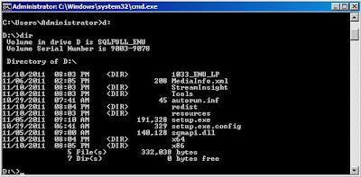
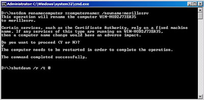
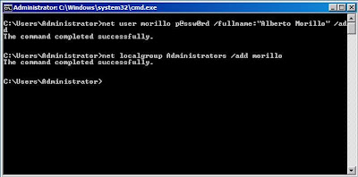
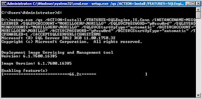
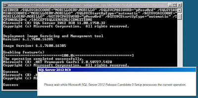
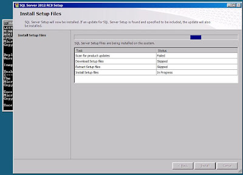
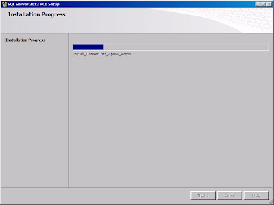
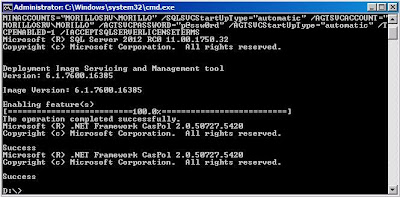
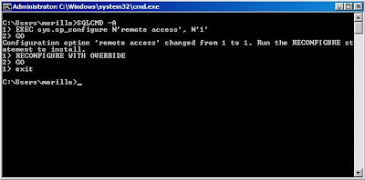
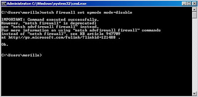

#Cómo instalar SQL Server 2012 en Windows Server Core

  Alberto Morillo Rodriguez, MCITP - Database Administrator 2008, MCTS   Mayo 2012
  ---------------------------------------------------------------------- -----------
  [Blog](http://albertomorillosqlserver.blogspot.com/)

    Aplica a: SQL Server 2012, SQL Server Denali, Windows Server 2008 R2 Enterprise Core with SP1.

Introducción
------------
Windows Server 2008 Server Core no soporta .NET Framework 3.5 el cual es
un requerimiento de SQL Server 2008, y esta es la razón por la SQL
Server 2008 no puede ser instalado en Windows Server Core.

En tanto, Windows Server 2008 R2 Server Core sí soporta .NET Framework
3.5 pero instalar SQL Server 2008 no es soportado por Microsoft para esa
versión de Windows Server. No obstante, existen artículos que proveen
instrucciones de cómo hacer esta instalación, como **este** artículo.

A partir de SQL Server 2012, instalar SQL Server en Windows Server Core
es ya un procedimiento soportado. Es posible instalarlo en Windows
Server 2008 R2 SP1 o posterior.

Si desea conocer todos los pre-requisitos antes de instalar, conocer
cuáles funcionalidades serían soportados en Windows Server Core, y
conocer todos los escenarios soportados, por favor visite este enlace.

Pasos para instalar SQL Server 2012 en Windows Server 2008 R2 Server Core SP1.
-------

Existen dos métodos para realizar esta instalación: instalar desde la
línea de comando e instalar usando un archivo de configuración. El
siguiente procedimiento explica cómo instalar desde la línea de comando
de Windows Server Core:

*Instalar Windows Server Core*. Nosotros instalamos Windows Server 2008
R2 Enterprise Core en una nueva máquina virtual de Hyper-V. Luego
añadimos la media de instalación de SQL Server 2012 en el drive D de la
máquina virtual.

    

*Renombrar el computador*. Para hacer las cosas más fácil al momento de
instalar desde la línea de comando, vamos a renombrar el computador como
se muestra a continuación, y luego reiniciaremos el computador.

Crear una cuenta de Windows para iniciar los servicios de SQL Server.
También añadimos la cuenta al grupo de administradores locales
(Administrators) del computador.

*Instalar SQL Server desde la línea de comando*. Para mayor información
sobre los parámetros disponibles, haga clic
[aquí](http://msdn.microsoft.com/en-us/library/ms144259(v=sql.110).aspx).

En este procedimiento elegimos instalar el motor de base de datos
(SQLEngine), Integration Services (IS) y los componentes de
conectividad.

La cuenta de Windows recién creada iniciará los servicios de SQL Server
Service y SQL Server Agent, y estos iniciarán de forma automática.
También adicionamos esta cuenta como miembro del rol sysadmin en la
instancia.

El protocolo TCP fue habilitado.

Instalación en progreso.

Instalación en progreso. El programa de instalación instala los archivos
de instalación.

    

La instalación terminó exitosamente.

*Habilitar conexiones remotas*. Nos autenticamos como el usuario de
Windows recién creado y habilitamos.

*Finalmente, configuremos el Windows Firewall o deshabilitemos el
mismo*. Windows Firewall es habilitado por omisión en Windows Vista (y
posteriores) y en Windows 2008 (y posteriores). Nosotros elegimos
deshabilitarlo.

