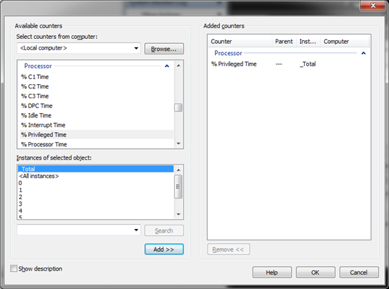

#Contadores de Rendimiento para diagnóstico y afinación de SQL Server

Por **FREDDY LEANDRO ANGARITA C.**
**SqlServer MVP** 
[Perfil MVP](https://mvp.support.microsoft.com/es-es/mvp/Freddy%20Leandro%20Angarita%20Castellanos-4028407) / <freddy_angarita@hotmail.com> / <http://geeks.ms/blogs/fangarita/default.aspx>

A continuación presento alguno de los contadores de rendimiento,
pertenecientes a la instrumentación de SQL Server que ayudan al proceso
de diagnóstico y optimización de SQL Server

En el gráfico se presenta el grupo de contadores de rendimiento, luego
al abrirlo se presenta cada contador independiente y luego en la parte
de abajo (si aplica) que es lo q se quiere medir

Procesador 
-----------

|Processor      |          |   Esperado|
|------------------|-----------------|-----------|
|  %User Time     |    SQL Server se ejecuta en modo de Usuario. El modo privilegiado es usado por el Sistema operativo para acceder a los componentes de hardware. Este componente debería presentar un valor mayor de 70%, si el valor es menor que esto se deben revisar los indicadores %privileged time y %processor time para verificar si existe algún tipo de problema con el procesador  | &gt;70%|
| %Privileged Time  | El sistema operativo mueve los hilos al modo de acceso privilegiado para acceder servicios de Hardware. Este contador debe tener un valor menor a 20%.  |  &lt;20%|
|%Processor Time  |  Presenta el porcentaje de tiempo usado por la CPU en un periodo de tiempo. Idealmente debe ser menor que 70%.  |  &lt;70%|
|Interrupts/Sec   |  Es el promedio de incidentes por segundo, al cual el procesador recibió y procesó interrupciones de Hardware   |      |

|  System      |        |      Esperado|
|--------------|----------|--------|
| Processor Queue Length  | Es el número de hilos que esperaran a ser procesados. Este contador por valor general divido por el número de núcleos disponibles. Debería ser menor que 2 |  &lt;2|

Disco
-----

| Physical Disk |   | Esperado|
|--------------|--------|----------|
|Current Queue Length |  Un tamaño sostenido de una cola de disco presenta un posible problema con el subsistema de I/O.      |       0|
| Average Queue Length  | Si el promedio de longitud de la cola es mayor que 2 indica que existe un problema potencial con el subsistea de IO, esto también puede deberse a un indicador disk sec/read y disk sec/write alto.    |                     &lt;=2|
|Disk Sec/Read  Disk Sec/Writes |      Ninguno de estos contadores debería tener un valor superior a 15ms en condiciones normales. Valores continuos sobre 20ms puede indicar un problema en el disco o sobrecarga del sistema o alto fraccionamiento del disco.   Bajo estas condiciones se pueden considerar las siguientes alternativas:  Mover los archivos de base de datos a discos adicionales.  Crear grupos de archivos en diferentes discos y pasar algunas tablas a cada uno de esos discos  (pueden tener diferente RAID) lo cual puede influir notablemente en el desempeño.    Revisar los índices de las tablas  Revisar los contadores de CPU y memoria con el fin de identificar otros cuellos de Botella| &lt;=15|       
  

 Memory/Cache
-------------

| Memory        |      |
| ------------|------| 
|Page Faults/Sec:  | Los fallos de página ocurren cuando se busca una página en memoria y no se encuentra. Existen 2 tipos de fallos de página: Fuertes (Hard) : Requiere acceso a disco Suaves (Soft).  La página buscada está en alguna otra parte de la memoria  Un alto número de fallos de página por segundo indica que existe un problema con la memoria usada por SQL Server. Usando este contador junto con SqlServer:MemoryManager se puede determinar si existe algún tipo de presión sobre la memoria Bajo estas condiciones puede considerarse: Revisar los procedimientos y las prácticas usadas para el desarrollo de los mismos  Aumentar la memoria del servidor  Revisar el espacio en disco disponible en donde se ubiquen los temporales del sistema operativo|
|Pages/Sec   |       Este contador es valor real de fallos [Fuertes de páginas](http://geeks.ms/controlpanel/blogs/posteditor.aspx?SelectedNavItem=NewPost#Fuertes_(Hard)_) y debe ser usado en correlación con Page Faults/Sec y SQL Server memory Manager para revisar la presión sobre la memoria|

SQL Server
----------

| Access Methods  |       |  
|-----------|---------------|
|Forwarded Records/Sec  | Número de registros traídos usando punteros de registros, es decir, cuando los registros tienen espacios vacíos entre ellos o cuando el tamaño del registro no queda ajustado al tamaño de una página, esta situación puede presentarse cuando se inicia con un registro corto y se actualiza el dato quedando parte de éste en otra página lo que requiere la generación de un puntero para saber en qué lugar está la otra parte del registro.         Esto se puede evitar siguiendo los siguientes pasos:  Ser cuidadoso al determinar cuáles de las columnas permiten o no nulos Usar valores por defecto (para evitar el uso de nulos) Usar char en lugar de Varchar cuando sea posible  Manejar un esquema de normalización en donde el número de campos sea menos (Soluciones OLTP)|
|  Full Scans/Sec    |      Se realiza una lectura completa de una Tabla o de un índice. Esto puede ser causado por el uso indebido de índices.|
| Page Splits/Sec   |      Fraccionamiento sobre las páginas de los índices. Este indicador está asociado a las páginas hoja del Árbol de índices que no se almacenan continuamente lo que lleva a su fraccionamiento en disco. Esto se puede evitar configurando apropiadamente [Fill Factor](http://geeks.ms/controlpanel/blogs/posteditor.aspx?SelectedNavItem=NewPost#Fill_Factor)|
  
  
|Memory Manager |      |
|-------------------|--------------------|
|Memory Grants Pending  | Memoria que se necesita para procesar cada una de las peticiones de los usuarios. Si no se dispone de memoria suficiente entonces el proceso debe esperar a que se le sea asignada para su ejecución, lo que por supuesto impacta el desempeño de la consulta o procedimiento en ejecución Para evitarlo se pueden seguir los siguientes pasos: Agregar mas memoria al servidor Asignando más memoria a SQL Server Creando Indices apropiados|

| Buffer Manager  |   | Esperado|
|-------------------|--|--------|
|Buffer Cache Hit Ratio |  Porcentaje del tiempo en que las páginas solicitadas están ya en memoria. Idealmente debe mantenerse sobre 99%, si es menor que 95% indica que SQL Server no tiene suficiente memoria y que agregar más memoria al servidor, asignada a SQL Server, sería muy beficioso |  &gt;99% |
| Checkpoints/Sec  |        Páginas escritas a disco durante el proceso de [CheckPoint](http://geeks.ms/controlpanel/blogs/posteditor.aspx?SelectedNavItem=NewPost#CheckPoints). Se identifica presión sobre la memoria si el contador tiene un valor superior a 300 Segundos   |    &lt;300s |
| Lazy Writes/Sec  |        Páginas escritas a disco durante el proceso [LazyWriter](http://geeks.ms/controlpanel/blogs/posteditor.aspx?SelectedNavItem=NewPost#Lazy_Writer) (Escribe las páginas en segundo plano al disco). Se identifica presión sobre la memoria si el contador tiene un valor superior a 300 Segundos |  &lt;300s |
| Page Life Expectancy  |   Este es uno de los principales contadores para identificar presión sobre la memoria. Determina el tiempo en segundos en el que la página reside en el Caché de SQL Server. Si el valor es bajo indica los siguientes problemas:  El Caché es Frio (Revisar información sobre Fallos de Página Page Faults)     Problemas de Memoria    Falta de creación de índices     Si Checkpoints/Sec, Lazy Writes/Sec y Page life expectancy juntos es menor a 300 Segundos entonces indica que la causa es la falta de memoria y que se debe agregar más memoria al servidor   |   

| Databases  |    |         
|---------|--------|
| Transactions/Sec |  Indica el número de transacciones que ocurren por segundo en el servidor|

 

| General StatisticsCounters  |        |  
| -----------------------|---------- |
| User Connections|             Número de conexiones hechas a SQL Server|

|  Latches           |       |  
| -----------|-------------|
| Average Latch wait Time  | Son objetos livianos de sincronización. No se mantienen durante la duración de la transacción. Típicamente se usan cuando se transfieren filas a memoria, mientras se controlan modificaciones a las filas, etc. Un valor alto puede indicar algún problema con el subsistema de Memoria|
  
| Locks        |           |  
| ------------|------------ |
| Average Wait Time(ms) Lock waits/Sec  Lock Wait time(ms) |   Los contadores relacionados a los bloqueos que mantiene SQL Server en un momento determinado de las transacciones. Las transacciones deben ser tan cortas como sea posible y por lo tanto debería mantener bloqueos la menor cantidad de tiempo posible para evitar para bloqueos a otros usuarios o procesos. Un Valor alto para cualquiera de estos contadores indica:   Presión sobre la memoria  Problemas con el Disco Índices inadecuados  Diseño inadecuado de tablas u objetos de SQL Server  Inadecuada ubicación de los archivos de base de datos Uso indebido de los niveles de aislamiento de SQL Server |
  
Los mencionados, son algunos de los contadores preferidos, aparte de
esos pueden revisarse estos contadores:

Object Name Counter Name 
SQL Statistics Compilations/sec 
SQL Statistics Recompilations/sec 
SQL Statistics Batch Requests/sec 
SQL Server: Buffer Manager Readahead pages/sec

 

Algunas Definiciones
--------------------

Páginas Sucias: Páginas
que han entrado al caché y han sido modificadas, pero aún no se han
escrito a disco.

CheckPoints: Escribe todas
las páginas sucias a disco. Crea un punto al cual se garantiza que todas
las páginas han sido escritas a disco

Fill Factor: Factor por el
cual crecen los archivos de base datos, cuando se espera una gran
cantidad de nuevos registros en la base de datos se debe establecer un
FillFactor alto con el fin que los datos no queden fragmentados y un
FillFactor un poco menor en caso de ser utilizada en procesos de
actualización y solo consulta

Lazy Writer: es un proceso
que elimina conjuntos de buffers viejos y no usados de memoria (Los
buffers que tienen cambios deben ser escritos de nuevo al disco antes
que el buffer pueda ser reusado para una página diferente).

 

Espero sea de ayuda

