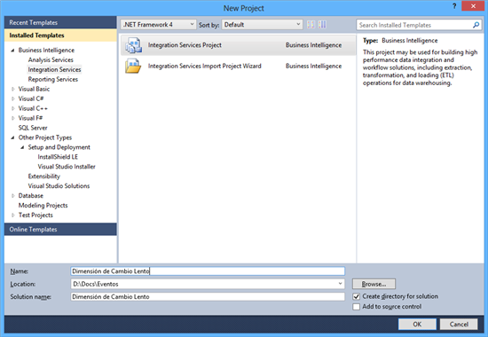
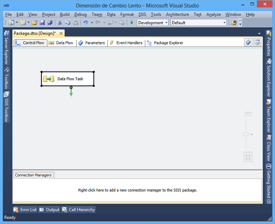
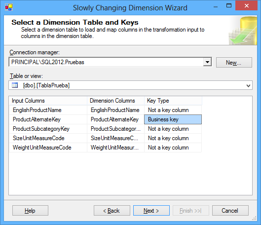
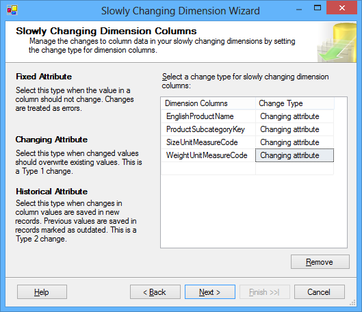
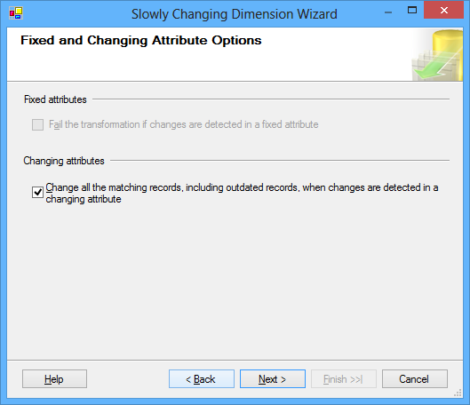
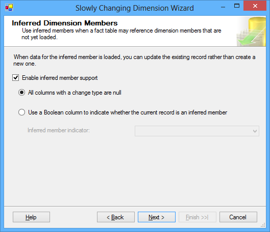
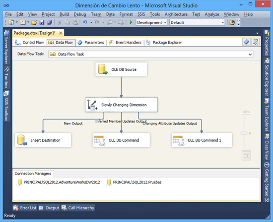
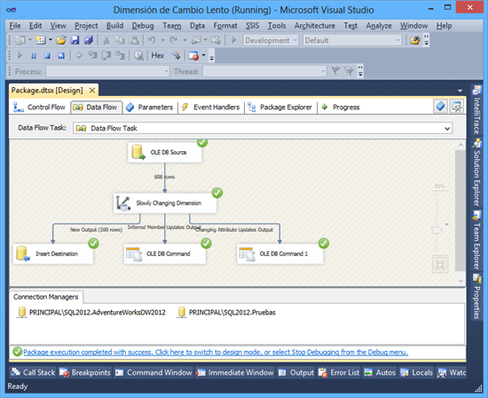

# Detectar cambios en una base de datos 


Por **FREDDY LEANDRO ANGARITA C.**
**SqlServer MVP** 
[Perfil MVP](https://mvp.support.microsoft.com/es-es/mvp/Freddy%20Leandro%20Angarita%20Castellanos-4028407) / <freddy_angarita@hotmail.com> / <http://geeks.ms/blogs/fangarita/default.aspx>

Detectar cambios en una base de datos es muy importante para el
desarrollo de soluciones de inteligencia de negocios y el mantenimiento
de los warehouses asociados, por lo que realizarlo de manera eficiente y
fácil de mantener es de vital importancia para permitir un desarrollo y
sostenibilidad del proyecto en el tiempo

En este especial de detección de cambios se presentarán tres diferentes
técnicas usables en diferentes escenarios:

- Dimensión de cambio lento en SSIS

-    Merge Join

-    Técnica especial de detección de cambios SSIS

    

En este primer artículo discutiremos el uso de la transformación de
cambio lento de SSIS, esta transformación

Para este artículo se usará la base de datos 
[AdventureWorksDW2012](http://msftdbprodsamples.codeplex.com/downloads/get/165405)

El primer paso, será crear una tabla de prueba en donde realizaremos la
detección del cambio:


``` SQL
CREATE TABLE [dbo].[TablaPrueba](
    [ProductKey] [int] IDENTITY(1,1) NOT NULL,
    [ProductAlternateKey] [nvarchar](25) NULL,
    [ProductSubcategoryKey] [int] NULL,
    [WeightUnitMeasureCode] [nchar](3) NULL,
    [SizeUnitMeasureCode] [nchar](3) NULL,
    [EnglishProductName] [nvarchar](50) NOT NULL
) ON [PRIMARY]

GO
```

Luego se crea (o sea agrega un paquete para realizar la detección de
cambios)



Luego se agrega un DataFlowTask



Dentro del DataFlowTask

 Se agrega un origen de datos Ole DB con la siguiente consulta:


<!-- -->
``` SQL
SELECT [ProductKey]
    ,[ProductAlternateKey]
    ,[ProductSubcategoryKey]
    ,[WeightUnitMeasureCode]
    ,[SizeUnitMeasureCode]
    ,[EnglishProductName]
  FROM [DimProduct]
```

Luego se agrega una transformación de cambio lento (Slowly Changing
Dimension)

Luego de conectar el origen de datos con la transformación de cambio
lento se edita la transformación

Configuración de Datos
----------------------

En este punto se selecciona la conexión con la base de datos con la que
se desea trabajar y la tabla en la que se desean ubicar los cambios



También, se selecciona la llave de negocio (para este caso se
selecciona ProductAlternateKey) con la que se va a realizar la
comparación (se puede pensar como un JOIN)

El objeto es identificar:

- Si no existe la llave en la tabla destino (para este caso Pruebas),
    crear el registro

-     Si existe la llave en la tabla destino, actualizar las columnas
    configuradas

-     Si existe en la tabla destino y no en la tabla de origen debe ser
    eliminado el registro en la  tabla destino

    

Configucíon el tipo de atributo de cada columna
-----------------------------------------------



|  Tipo Configuración  |   Descripción  |    Uso|
|---------|----------|-------|
|  Fixed Attribute    |    Attributo Fijo, si cambia se presenta un error |          Se usa para validar que valores no cambien y que se presente un error en tal caso|
|  Changing Attribute   |  Atributo Cambiante, si cambia se actualiza   |            Se usa para actualizar en la tabla destino los cambios encontrados al comprarla con la tabla destino|
|  Historical Attribute |  Atributo histórico, guarda los cambios en nuevas filas  | Permite llevar un historial de cambios realizados en la tabla origen en la tabla destino|

Configuración de atributos fijos y cambiantes
---------------------------------------------



<!-- -->

- Si se han seleccionado atributos fijos se podrá seleccionar la
    opción para que la transformación falle en caso que se detecten
    cambios

-    Si se han seleccionado atributos cambiantes se puede activar la
    opción para que realice cambios en todos los registros que se
    encuentren (eso es importante dado que Merge, el cual se estudiará
    en la parte 2) no permite este comportamiento

    

Configuración de Inferencia de Miembros de Dimensión
----------------------------------------------------



 En caso que se esté haciendo la actualización de un Warehouse y alguno
de los campos haga referencia a una dimensión aún no cargada, el sistema
infiere este elemento y lo agrega (como si existiera en la tabla
relacionada); esta práctica no es recomendada ya que puede llevar a
inconsistencias relacionales

Finalization Asistente
----------------------


Presenta un resumen con las opciones seleccionadas

Visualización del paquete
-------------------------



 Ejecución del paquete
----------------------



Luego de modificar una fila en la tabla origen


Éste método tiene varias ventajas, pero una de sus desventajas es que la
actualización- inserción - borrado se realizan registro a registro lo
que no ofrece alto desempeño

Para casos en donde la cantidad de registros es poca ésta técnica puede
ser favorable dada su fácil aplicación

 

Los comentarios son bienvenidos, espero sea de ayuda,

**FREDY LEANDRO ANGARITA CASTELLANOS**

**SQL Server MVP**


