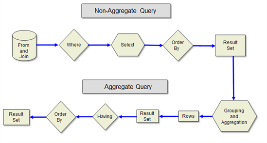

#Optimización de Consultas Parte 1 - Generalidades


Por **FREDDY LEANDRO ANGARITA C.**

**SqlServer MVP** 

[Perfil MVP](https://mvp.support.microsoft.com/es-es/mvp/Freddy%20Leandro%20Angarita%20Castellanos-4028407) / <freddy_angarita@hotmail.com> / <http://geeks.ms/blogs/fangarita/default.aspx>

En la siguiente gráfica se presenta el esquema de ejecución de consultas
en SQL Server


    

**From y Join**

1\. Usar Hints
Podemos utilizar hints de consultas tales como (nolock) sobre las tablas
que queremos consultar para cambiar el modo de acceso de readcommited a
[readuncommited](http://msdn.microsoft.com/es-co/library/ms187373.aspx)
>ADVERTENCIA: Utilizar este hint puede traer problemas de datos, tales
como lecturas sucias o registros fantasma.

El uso de hints debe realizarse con especial cuidado y teniendo en mente
las consecuencias de los mismos, asimismo, el optimizador de consultas
podrá fácilmente encontrar el mejor camino para retornar la consulta
dado que utiliza información estadística, caché, entre otros elementos
para devolver los resultados.

 

2\. Otra técnica que podemos usar antes del Where es poner las
condiciones del where (cuando sean aplicables) dentro del mismo Join, es
decir:

    select a.Id, from tabla1 a inner join tabla2 b on a.id = b.id where b.cantidad > 50
puede ser reescrito como:

    select a.Id, from tabla1 a inner join tabla2 b on a.id = b.id and b.cantidad > 50
    
Esto aplica especialmente para SQL Server 2005 y versiones anteriores,
el analizador de SQL Server 2008 se vale de su algoritmia avanzada para
determinar cuál es el mejor camino entre estas dos opciones.\

3\. Favorecer la lógica y operaciones por Conjuntos

Las operaciones por conjuntos implican la realización de operaciones por
bloques, para lo cual SQL está optimizado:

3\.1\.  Evitar el uso de funciones escalares en las consultas para cada
campo (en cualquier parte de la consulta), dado que la ejecución se
realiza una por una, lo cual no favorece las operaciones por bloques.

3.2. Evitar al MAXIMO el uso de cursores.

3.3. Estimular el uso de funciones de usuario que devuelven tablas, pues se calculan primero y luego se aplican a la consulta favoreciendo operaciones de conjuntos.

3.4. Asimismo, estimular el uso de expresiones CTE:

Permite la reutilización de consultas, usando el join, de esta manera
consultamos dos (2) veces la misma tabla
``` SQL
select a.Id from tabla1 inner join tabla2 b on a.Tipo = B.IdTIpo inner join tabla2 c on a.Tipo2 = C.IdTIpo
```

Con CTE, solo una vez:
``` SQL
declare @tabla1 table (Id int, TipoA int, TipoB int) --Solo por ejemplo
declare @tabla2 table (IdTipo int) --Solo por ejemplo
;with Tabla(Id)
as(select IdTipo from @tabla2)
select * from @tabla1 a inner join Tabla
on a.TipoA = tabla.id
inner join @tabla1 b on b.TipoB = tabla.id
```

**Where**

1\. Escribir las expresiones lógicas de menos completa a más compleja, es
decir, es mejor:
``` SQL
select a.Id, from tabla1 a inner join tabla2 b on a.id = b.id and b.cantidad > 50 and nombre like '%abc%'
```
que usar:

``` SQL
select a.Id, from tabla1 a inner join tabla2 b on a.id = b.id a nombre
like '%abc%' and b.cantidad > 50 
```

Esto se debe a la evaluación de la lógica tipo corto circuito

Select
1. Evitar el uso de funciones escalares por cada campo.
2. Usar Case puede ser una buena alternativa para devolver resultados directamente al usuario, usarlos con precaución, si es posible, reemplazarlos con case del lado del cliente (Reporting Services, por ejemplo).

Order By
1. Evitar al MÁXIMO los ordenamientos innecesarios dentro de las
consultas, si se observan los planes de ejecución de las consultas se
encuentra que es una de las cosas que más consume buena parte del tiempo
de ejecución de la consulta; se recomienda ordenar, en la mayoría de los
casos, del lado del cliente.

Result Set
1. Evitar al MÁXIMO el uso del select *, limitar la cardinalidad del
resultado (tiene como resultado) permite, genera, mejora el uso de...?
mejoras en el uso de memoria y latencia de red, dado que los resultados
son sólo aquellos que necesitamos, a la vez que evitamos que el
analizador de consultas deba determinar dinámicamente qué campos usar en
el conjunto de resultados.


Grouping and Aggregation

Una vez finalizada la etapa de la consulta en donde se obtienen los
resultados iniciales, el motor procede a realizar el agrupamiento y
agregación de los resultados (agregación: aplicar una función a un
grupo)

Debemos evitar al máximo realizar Agrupaciones y Agregaciones del lado
de la base de datos, dado que son operaciones costosas, esto es
especialmente cierto para operaciones de reportes.

Having

Sólo debe ser aplicado para filtrar sobre las funciones de agregación,
NO debe ser utilizado para filtrar las filas de la consulta, lo cual se
debe incluir en el Where de la consulta.


OTRAS RECOMENDACIONES

[Usar CLR](http://geeks.ms/blogs/fangarita/archive/2010/08/09/presentaci-243-n-sqlserver-clr.aspx)

Programación .Net para para crear procedimientos almacenados,
funciones de usuario y agregaciones, etc. Usarlo cuando se requiera
realizar cálculos avanzados del lado de la base de datos, en ningún
momento debe usarse como reemplazo para las operaciones a acceso a
datos.

Particionamiento de Datos

Crear grupos de archivos en diferentes discos y ubicar en ellos las
tablas de mayor uso, lo cual favorece las operaciones INNER JOIN 
(Versión inferior a la enterprise)


Particionamiento de Vertical de Filas

Crear particionamiento de filas usando funciones de particionamiento
para ubicar asimismo las filas en diferentes grupos de archivos y
optimizar el acceso a los datos en las operaciones JOIN (versión
Enterprise)


Dividir las consultas en consultas más pequeñas

Usando variables tipo tabla podemos realizar consultas preliminares
sobre algunas de las tablas que participan en las operaciones JOIN o
LEFT JOIN, de esta manera cargaremos a memoria (luego de cierto límite
de filas las variables tipo tabla también pasan a disco, por lo que
debemos ubicar en ellas solo las tablas que relativamente tengan pocos
registros: menos de 100,000)  de manera anticipada, permitiéndonos la
reutilización de las mismas, con la ventaja que cuando salen de ámbito
se destruyen automáticamente (no hay que realizar un drop como a las
tablas temporales).


En próximos artículos extenderé estos y otros temas

 

**FREDY LEANDRO ANGARITA CASTELLANOS**

**SQL Server MVP**


