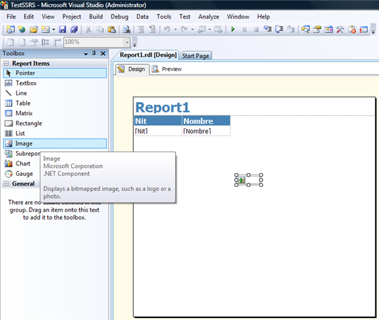
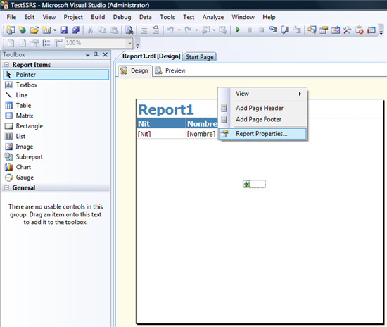
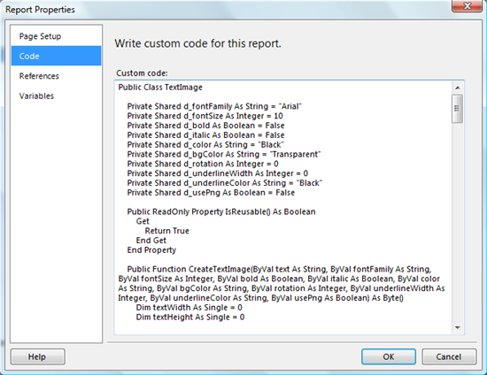
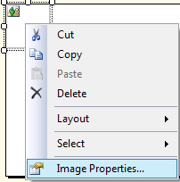
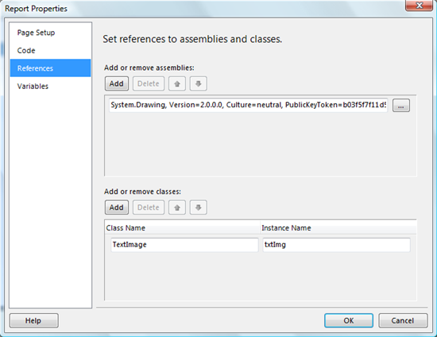
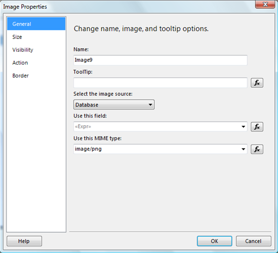
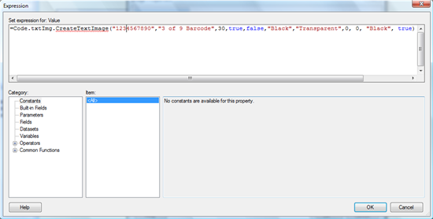

#Generando imágenes (códigos de Barras) en Reporting Services


Por **FREDDY LEANDRO ANGARITA C.**

**SqlServer MVP** 

[Perfil MVP](https://mvp.support.microsoft.com/es-es/mvp/Freddy%20Leandro%20Angarita%20Castellanos-4028407) / <freddy_angarita@hotmail.com> / <http://geeks.ms/blogs/fangarita/default.aspx>

Una de las principales características de Reporting Services e
Integration Services de  Microsoft es la habilidad de agregar código
.Net  en diferentes puntos de los items de la solución

En éste artículo veremos cómo generar una imagen dinámicamente
directamente dentro de un reporte, sin la necesidad de agregar ningún
código de terceros, ni de agregar assemblies de otros proveedores, sólo
código .Net directamente integrado al reporte

El problema\
Dentro de los diferentes escenarios que se tienen para la generación de
imágenes dentro de un reporte el que me llevó a desarrollar ésta
solución fue la solicitud de un cliente de generar códigos de barras, y
que los mismos fueran integrados al reporte, entonces el primer impulso
que se tiene es generar una imagen con un manejador HTTP ver artículo de
codeproject Text To Image With Rotation For The Web ésta es una buena
solución, de hecho buena parte del código presentado en éste artículo
fue extraído de éste artículo, traducido a Visual Basic y adaptado para
funcionar en Reporting Services

La Solución (Primera versión)\
Crear una página en donde mediante parámetros querystring se generara
una imagen mediante la respuesta HTTP creada por el ashx y puesta como
una imagen normal dentro del reporte, esto presenta el problema que
cuando el usuario pierde la conexión, no podrá ver la imagen de nuevo y
la misma no haría parte de la respuesta generada por reporting services
sino que sería una referencia a una imagen por demás debía ser una
página abierta al público sin contexto de seguridad lo cual sería
problemático y se prestaría para posibles inconvenientes

La Solución Reporting Services\
Usando la característica que permite agregar código a un reporte, se
agregó una clase, si una clase, al código personalizado del mismo y
luego llamando éste código desde el mismo reporte se pudo generar la
imagen para el código de barras\
Los pasos a seguir para elaborar ésta solución son:

1\. Agregar una imagen al reporte en cualquier parte del mismo,
incluyendo un grid, o un el área de diseño del reporte


    
2\. Hacer Clic fuera del recuadro y seleccionar propiedades del reporte


    
3\. Cuando aparezca el diálogo se hace clic sobre el tab de código y se procede a copiar o a digitar la clase que necesitamos para la generación de la imagen a partir de un texto


    
El código debe ser algo como esto

```
Public Class TextImage
    Private Shared d_fontFamily As String = "Arial"
    Private Shared d_fontSize As Integer = 10
    Private Shared d_bold As Boolean = False
    Private Shared d_italic As Boolean = False
    Private Shared d_color As String = "Black"
    Private Shared d_bgColor As String = "Transparent"
    Private Shared d_rotation As Integer = 0
    Private Shared d_underlineWidth As Integer = 0
    Private Shared d_underlineColor As String = "Black"
    Private Shared d_usePng As Boolean = False
    Public ReadOnly Property IsReusable() As Boolean
        Get
            Return True
        End Get
    End Property

    Public Function CreateTextImage(ByVal text As String, ByVal fontFamily As String, ByVal fontSize As Integer, ByVal bold As Boolean, ByVal italic As Boolean, ByVal color As String, ByVal bgColor As String, ByVal rotation As Integer, ByVal underlineWidth As Integer, ByVal underlineColor As String, ByVal usePng As Boolean) As Byte()
        Dim textWidth As Single = 0
        Dim textHeight As Single = 0
        Dim fontStyle As System.Drawing.FontStyle = System.Drawing.FontStyle.Regular
        If bold Then fontStyle = fontStyle Or Drawing.FontStyle.Bold
        If italic Then fontStyle = fontStyle Or Drawing.FontStyle.Italic
        Using font As New System.Drawing.Font(fontFamily, fontSize, fontStyle)
            ' Get the text measurements.
            ' I need to create a dummy bitmap so that I can get a Graphics object to get the text measurements.
            Using bitmap As New System.Drawing.Bitmap(1, 1)
                Using graphics As System.Drawing.Graphics = System.Drawing.Graphics.FromImage(bitmap)
                    textWidth = graphics.MeasureString(text, font).Width
                    textHeight = graphics.MeasureString(text, font).Height
                End Using
            End Using

        -

            ' Calculate the needed bitmap measurements based on the
            text measurements.
            Dim bitmapWidth As Integer = GetRotatedRectangleWidth(textWidth, textHeight, rotation)
            Dim bitmapHeight As Integer = GetRotatedRectangleHeight(textWidth, textHeight, rotation)
            ' Now I create the real bitmap of the necessary size to fit the text.
            Using bitmap As New System.Drawing.Bitmap(bitmapWidth, bitmapHeight)
                Using graphics As System.Drawing.Graphics = System.Drawing.Graphics.FromImage(bitmap)
                    If (Not usePng) Then graphics.Clear(System.Drawing.Color.FromArgb(255, 255, 255, 204))
                    'Color.FromArgb(&HFF, &HFF, &HFF, &HCC)
                    ' Since I will be rotating text, I need to move the rotation point using the TranslateTransform.
                    Dim x As Integer, y As Integer
                    ' But first I need to know the location of the rotation point.
                    GetXY(rotation, textWidth, textHeight, x, y)
                    graphics.TranslateTransform(x, y)
                    ' Now rotate and draw the text.
                    graphics.RotateTransform(rotation)

                    ' Fill in the background color

                    Using brush As
                        New System.Drawing.SolidBrush(System.Drawing.ColorTranslator.FromHtml(bgColor))
                        graphics.SmoothingMode = System.Drawing.Drawing2D.SmoothingMode.HighQuality
                        graphics.FillRectangle(brush, 0, 0, textWidth, textHeight)
                    End Using

                    graphics.TextRenderingHint =
                    Drawing.Text.TextRenderingHint.AntiAlias

                    Using brush As New System.Drawing.SolidBrush(System.Drawing.ColorTranslator.FromHtml(color))
                        graphics.DrawString(text, font, brush, 0, 0)
                    End Using
                    If (underlineWidth > 0) Then
                        graphics.SmoothingMode = System.Drawing.Drawing2D.SmoothingMode.HighQuality
                        Using pen As New System.Drawing.Pen(System.Drawing.ColorTranslator.FromHtml(underlineColor), underlineWidth)
                            graphics.DrawLine(pen, 0, textHeight, textWidth, textHeight)
                        End Using
                    End If
                    graphics.Flush()
                    Dim m As New System.IO.MemoryStream()
                    If usePng Then
                        bitmap.Save(m, System.Drawing.Imaging.ImageFormat.Png)
                    Else
                        bitmap.Save(m, System.Drawing.Imaging.ImageFormat.Gif)
                    End If
                    If (usePng) Then
                        Return m.ToArray()
                    Else
                        ' transparency hack.
                        Dim n As Byte() = {}
                        n = m.ToArray()
                        n(787) = 254
                        Return n
                    End If
                End Using ' using graphics
            End Using ' using bitmap
        End Using ' using font
    End Function

    Private Sub GetXY(ByVal rotation As Integer, ByVal tw As Single, ByVal th As Single, ByRef xT As Integer, ByRef yT As Integer)
        xT = 0
        yT = 0
        Dim radians As Double = GetRadians(GetReferenceAngleForPositioning(rotation))
        If (rotation >= 0 AndAlso rotation <= 90) Then
            xT = Convert.ToInt32(Math.Sin(radians) * th)
        ElseIf (rotation > 90 AndAlso rotation <= 180) Then
            xT = Convert.ToInt32((Math.Sin(radians) * tw) + (Math.Cos(radians) * th))
            yT = Convert.ToInt32(Math.Sin(radians) * th)
        ElseIf (rotation > 180 AndAlso rotation <= 270) Then
            xT = Convert.ToInt32(Math.Cos(radians) * tw)
            yT = Convert.ToInt32((Math.Cos(radians) * th) + (Math.Sin(radians) * tw))
        Else
            yT = Convert.ToInt32(Math.Sin(radians) * tw)
        End If
    End Sub

    Private Function GetRotatedRectangleWidth(ByVal width As Single, ByVal height As Single, ByVal rotation As Integer) As Integer
        Return GetRotatedRectangleWidth(width, height, GetRadians(GetReferenceAngleForSizing(rotation)))
    End Function

    Private Function GetRotatedRectangleWidth(ByVal width As Single, ByVal height As Single, ByVal rotationInRadians As Double) As Integer
        Dim w1 As Double = width * Math.Cos(rotationInRadians)
        Dim w2 As Double = height * Math.Sin(rotationInRadians)
        Return Convert.ToInt32(Math.Ceiling(w1 + w2))
    End Function

    Private Function GetRotatedRectangleHeight(ByVal width As Single, ByVal height As Single, ByVal rotation As Integer) As Integer
        Return GetRotatedRectangleHeight(width,
        height, GetRadians(GetReferenceAngleForSizing(rotation)))
    End Function

    Private Function GetRotatedRectangleHeight(ByVal width As Single, ByVal height As Single, ByVal rotationInRadians As Double)
        Dim h1 As Double = width * Math.Sin(rotationInRadians)
        Dim h2 As Double = height * Math.Cos(rotationInRadians)
        Return Convert.ToInt32(Math.Ceiling(h1 + h2))
    End Function

    Private Function GetRadians(ByVal referenceAngle As Double) As Double
        Return Math.PI * referenceAngle / 180.0
    End Function

    ' The only difference between the reference angles for sizing and positioning is in the 3rd quadrant (> 90 <= 180).
    Private Function GetReferenceAngleForSizing(ByVal rotationInDegrees As Integer) As Double
        If (rotationInDegrees >= 0 And rotationInDegrees <= 90) Then
            Return rotationInDegrees
        ElseIf (rotationInDegrees > 90 And rotationInDegrees <= 180)
        Then
            Return 180 - rotationInDegrees
        ElseIf (rotationInDegrees > 180 And rotationInDegrees <= 270)
        Then
            Return rotationInDegrees - 180
        ElseIf (rotationInDegrees > 270 And rotationInDegrees <= 360)
        Then
            Return 360 - rotationInDegrees
        Else
            Return rotationInDegrees
        End If

    End Function

    Private Function GetReferenceAngleForPositioning(ByValcrotationInDegrees As Integer) As Double
        If (rotationInDegrees >= 0 And rotationInDegrees <= 90) Then
            Return rotationInDegrees
        ElseIf (rotationInDegrees > 90 And rotationInDegrees <= 180)
        Then
            Return rotationInDegrees - 90
        ElseIf (rotationInDegrees > 180 And rotationInDegrees <= 270)
        Then
            Return rotationInDegrees - 180
        ElseIf (rotationInDegrees > 270 And rotationInDegrees <= 360)
        Then
            Return 360 - rotationInDegrees
        Else
            Return rotationInDegrees
        End If
    End Function

End Class
```
Claro, se ve un poco largo, pero tiene varias funcionalidades, entre
ellas ver una imagen rotada también

4\. Luego, en el mismo dialogo se agregan las referencias .Net que el
código agregado va a utilizar, en éste caso System.Drawing.
Adicionalmente, se agrega la identificación de la Clase y su nombre de
instancia (SSRS instancia automáticamente la clase ya que los métodos
utilizados son de instancia) para usarla como referencia en el código




    
Una vez finalizado se hace clic en ok

5\. En el diseñador del reporte se oprime botón derecho sobre la imagen que se agregó, se hace clic sobre propiedades y aparece el diálogo, y debemos configurarla como aparece en la imagen


    
6\. En el diálogo en donde indica "Usar éste campo" o "Use this
 field" hace clic sobre el botón fx, el cual presenta el siguiente diálogo, en donde digitaremos la expresión que aparece en la imagen la cual realizará el llamado al código enviado como parámetros: el texto a convertir, el tipo de letra a usar, el tamaño de la misma, si es en negrilla, si es itálica, color de la letra, color de fondo de la letra,  ancho del subrayado, color del subrayado y por último si utiliza el formato png como formato de salida



Hacemos clic en Ok y ya tenemos configurada la imagen

7\. Una vez finalizado el proceso podremos generar imágenes directamente en el reporte basado en texto como se aprecia en la imagen


Observaciones
-------------

Para generar códigos de barra es requerido tener un True Type Font en el
mismo computador en donde está instalado Reporting Services, algunos de
los tipos de letra que generan códigos de barra son licenciados buscando
parece que hay algunos que son gratis pero recomiendo leer detenidamente
la licencia y ver sus condiciones de uso antes de ponerlo en algún
ambiente de producción

El reporte adjunto probablemente no funcione al primer intento ya que
intenta leer de una base de datos llamada prueba con datos de
ejemplo, es posible eliminar la tabla y ver solamente el código de
barras

Otra situación que se presentará es que el código de barras posiblemente
no sea muy claro y el mismo no sea legible por algunos dispositivos,
razón por la cual publicaré la [parte 2](http://geeks.ms/blogs/fangarita/archive/2010/10/12/webcast.aspx) de
éste artículo


**FREDDY LEANDRO ANGARITA CASTELLANOS**

**SQLSERVER MVP**


