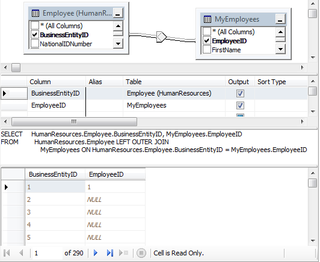
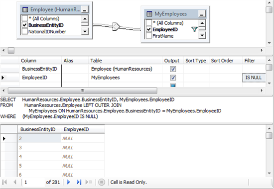
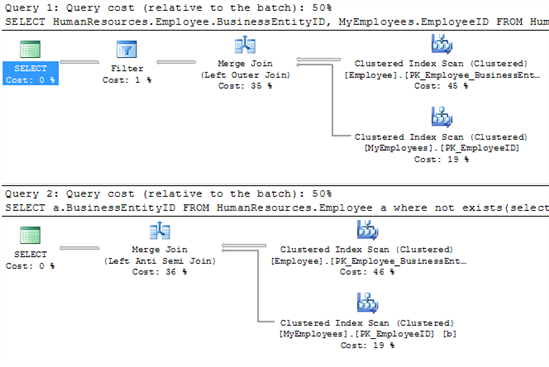

#Optimización de Consultas Parte 2 - Anti Semi Joins


Por **FREDDY LEANDRO ANGARITA C.**

**SqlServer MVP**

[Perfil MVP](https://mvp.support.microsoft.com/es-es/mvp/Freddy%20Leandro%20Angarita%20Castellanos-4028407) / <freddy_angarita@hotmail.com> / <http://geeks.ms/blogs/fangarita/default.aspx>

Como todos los temas de optimización las soluciones presentadas en éste
artículo deben probarse, intentar varias alternativas y luego decidir
dependiendo de los resultados y especialmente de la evolución de los
datos, es decir, dependiendo del momento del ciclo de vida de la base de
datos tendremos cierto uso de la información (por ejemplo durante
procesos de migración) y luego tendremos otro tipo (en Producción,
cuando cierto tipo de producto salga de circulación, etc.)

El proceso de optimización y mantenimiento es algo continuo y debe estar
acorde a las necesidades y cambios del negocio

Primero, qué es un **SEMI JOIN**



``` SQL
SELECT HumanResources.Employee.BusinessEntityID, MyEmployees.EmployeeID
FROM HumanResources.Employee LEFT OUTER JOIN
    MyEmployees ON HumanResources.Employee.BusinessEntityID = MyEmployees.EmployeeID
```
Es cuando queremos hacer un left (o Right join) con otra(s) tabla(s) y
queremos ver qué registros figuran en la primera tabla
(HumanResources.Employee) y cuales en la segunda (MyEmployees)


Si en la segunda tabla no existe dicho registro se presentará NULL como
se ve en la gráfica

Ahora, Definamos un **ANTI SEMI JOIN**



``` SQL
SELECT HumanResources.Employee.BusinessEntityID, MyEmployees.EmployeeID
FROM HumanResources.Employee LEFT OUTER JOIN
    MyEmployees ON HumanResources.Employee.BusinessEntityID = MyEmployees.EmployeeID
WHERE (MyEmployees.EmployeeID IS NULL)
```
Queremos encontrar los registros que estén en la primera tabla
(HumanResources.Employee) que NO  estén en la segunda tabla (MyEmployee)

Ésta consulta cumple su cometido pero analicemos a fondo su
funcionamiento, realiza el Left Join que más pesado que realizar un
inner join normal y filtra los resultados para la columna null


Ahora, qué **ALTERNATIVA** tenemos para éste caso:

Usaremos la función
[Exists](http://technet.microsoft.com/es-es/library/ms188336.aspx)

``` SQL
SELECT a.BusinessEntityID
FROM HumanResources.Employee a
where not exists(select EmployeeID from MyEmployees b where a.BusinessEntityID = b.EmployeeID)
```

Observemos la comparación entre el primer método y la alternativa:


    

El costo relativo para el batch es el mismo, y aparentemente tienen  el
mismo costo, pero observemos 2 cosas interesantes sobre éste plan de
ejecución, primero es que de la primera manera tenemos un filtro, es de
recordar que los ordenamientos, las agrupaciones y los filtros son las
operaciones más costosas dentro de una consulta; en la segunda parte
ejecutando con Not Exists, vemos que el analizador identifica que es un
Left Anti Semi Join, por lo cual automáticamente aplica las
optimizaciones para este caso y luego realiza las operaciones
adicionales de la consulta

Usando repetidamente ésta técnica, especialmente para consultas que
impliquen muchos registros puede aumentar el rendimiento de la misma a
la vez que permite una fácil escritura y mantenimiento e incluso control
sobre la consulta a realizar

 

 

**FREDDY LEANDRO ANGARITA CASTELLANOS**

**SQL Server MVP**


