#Restaurar (Restore) llaves de cifrado de Reporting Services

Por **FREDDY LEANDRO ANGARITA C.
SqlServer MVP** - [Perfil MVP](https://mvp.support.microsoft.com/es-es/mvp/Freddy%20Leandro%20Angarita%20Castellanos-4028407)

<freddy_angarita@hotmail.com>

<http://geeks.ms/blogs/fangarita/default.aspx>

Cualquiera que haya intentado hacer un respaldo y luego restaurar una
base de datos de Reporting Services (sin hacer respaldo de las llaves de
cifrado) se ha encontrado con que no le es posible ver la mayoría de
configuraciones que requieren de una llave de cifrado para proteger la
información sensible de las contraseñas, razón por la cual es necesario,
para poder pasar de un servidor a otro, o restaurarlas en el mismo
servidor en caso de una reinstalación; restaurar las llaves de cifrado
contenidas en Reporting Services mediante los siguientes pasos:

Backup de Base de Datos ReportServer
------------------------------------

El backup de la base de datos y de las llaves de cifrado se puede hacer
en cualquier orden

Se debe tener un backup de la base de datos ReportServer, para lo cual
se deben seguir lo siguientes pasos:

1\. Seleccionar la base de datos ReportServer, hacer clic derecho sobre
la misma y seleccionar Back up…

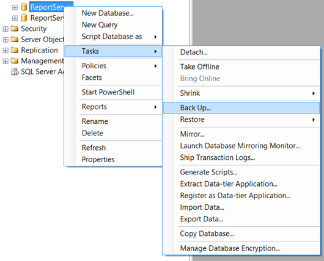

2\. Posteriormente seleccionar la ubicación del backup (para este ejemplo
se selección c:\\Bak, pero se recomienda que se ubique en una carpeta o
unidad especializada para el backup)

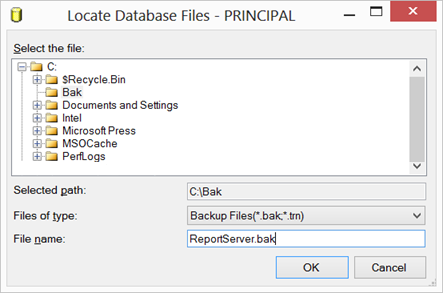

3\. Una vez seleccionado el destino del BackUp el diálogo debe aparecer
similar a:

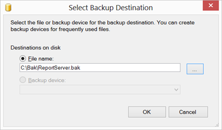

4\. La pantalla para finalizar la configuración el backup de ReportServer
debe observarse de la manera que se presenta a continuación (la ruta
c:\\bak\\ReportServer.bak puede ser cambiada para ubicar el backup en
una zona de conveniencia para el usuario)

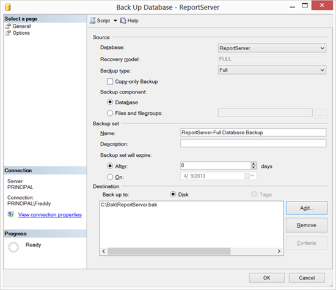

5\. Una vez finalizado el backup exitosamente se debe observar el
siguiente diálogo

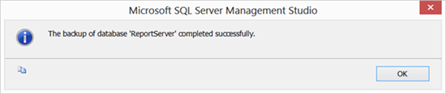

 

Backup de las llaves de cifrado
-------------------------------

1\. Se debe abrir el programa Reporting Services Configuration Manager
ubicado como se observa en la siguiente imagen

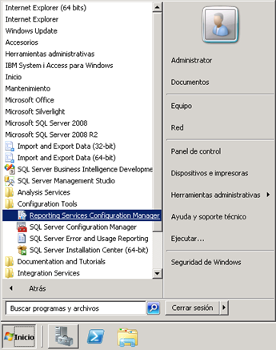

2\. Se realiza la conexión al servidor al que se desea realizar el backup
de las llaves de cifrado, una vez seleccionado se hace clic en Connect

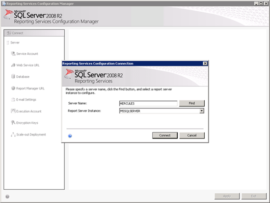

3\. Se selecciona la zona Encryption Keys y se hace clic en el Botón
Backup

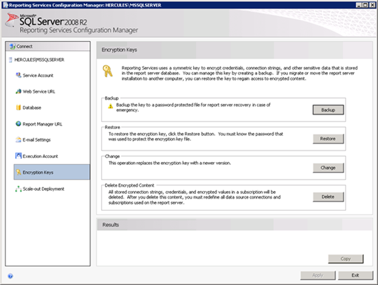

4\. El Backup de las llaves de cifrado se compone de un archivo con la
extensión SNK y una clave que se usa para cifrar dicho archivo (esta
clave se puede generar usando
[www.strongpasswordgenerator.com](http://www.strongpasswordgenerator.com)
y debe guardarse en un archivo de texto junto con el archivo SNK), estos
archivos deben almacenarse en un lugar seguro, si no se recuerda la
clave o si el archivo sufre algún daño debe realizarse de nuevo todo el
proceso de Backup. Si no se cuenta con un backup de las llaves de
cifrado, o si no se puede usar, se tendrá que realizar toda la
configuración de Reporting Services de nuevo (subir reportes,
Suscripciones, Orígenes de Datos, etc.)\
Al hacer clic en las elipsis (…) se presenta un diálogo para seleccionar
la ubicación del archivo SNK

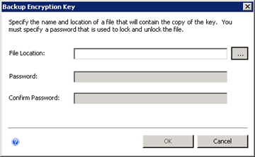

5\. Para este ejemplo se ubica el archivo en el escritorio, este archivo
debe ubicarse en una zona segura

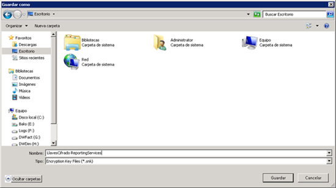

6\. Una vez seleccionada la ubicación del archivo se procede a introducir
la clave generada para este Backup en los campos Password y Confirm
Password (las textos en los dos campos deben ser idénticos)

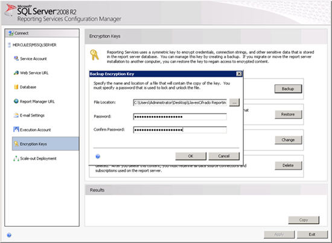

7\. Una vez generado el archivo se verá la notificación en la parte
inferior en la zona Results, como aparece en la siguiente imagen:

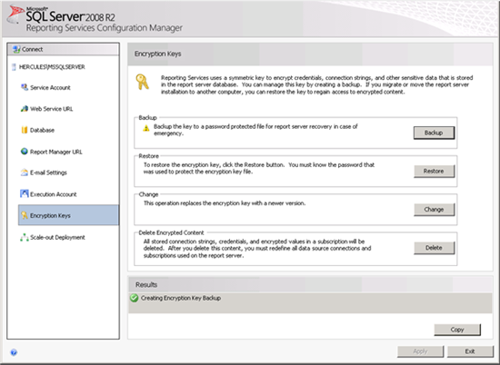
 

Las instrucciones para restaurar las llaves se pueden encontrar
en: [\[How to\] Restaurar (Restore) llaves de cifrado de Reporting
Services](http://geeks.ms/blogs/fangarita/archive/2013/07/01/how-to-restaurar-restore-llaves-de-cifrado-de-reporting-services.aspx)

Los comentarios son bienvenidos, espero sea de ayuda,

**FREDY LEANDRO ANGARITA CASTELLANOS**

**SQL Server MVP**

