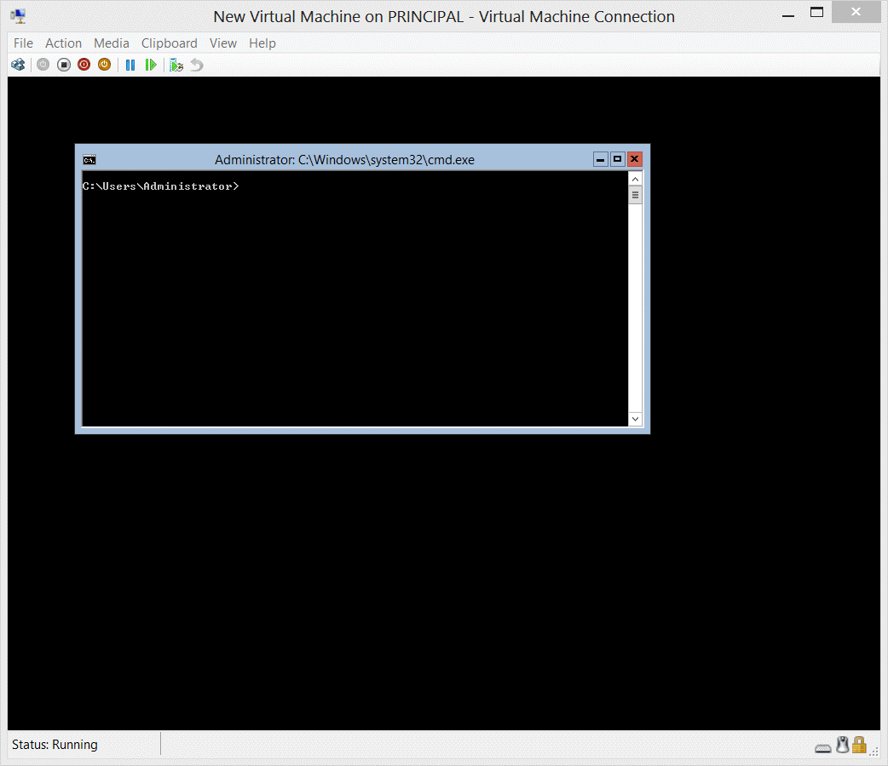
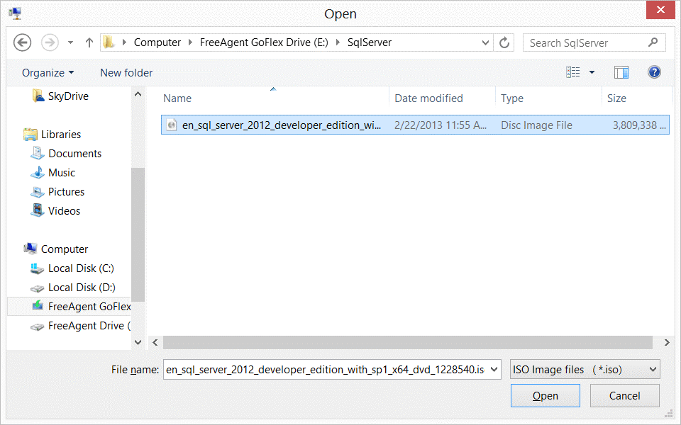
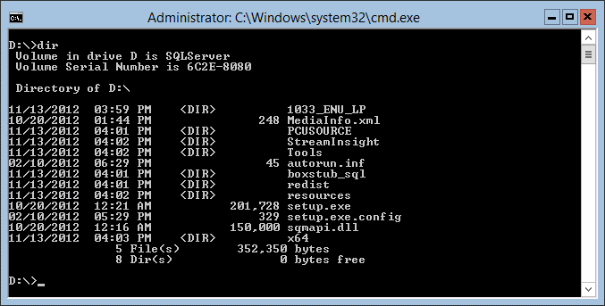
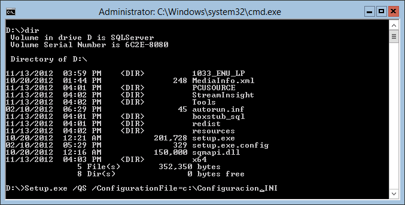
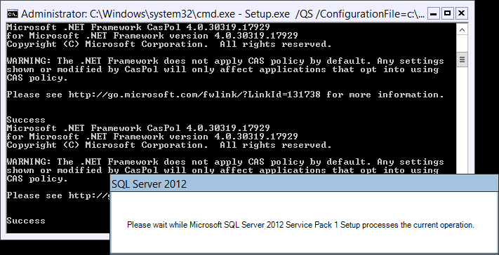
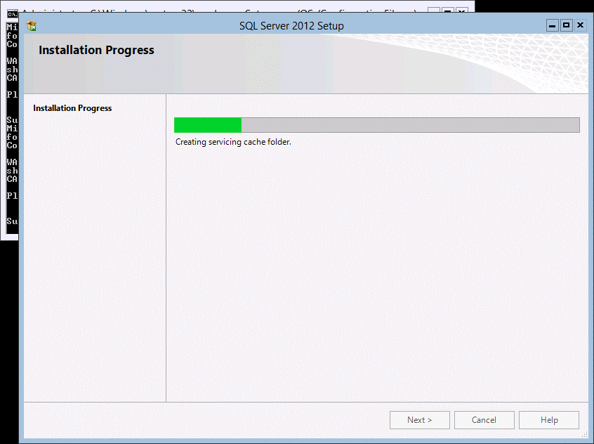
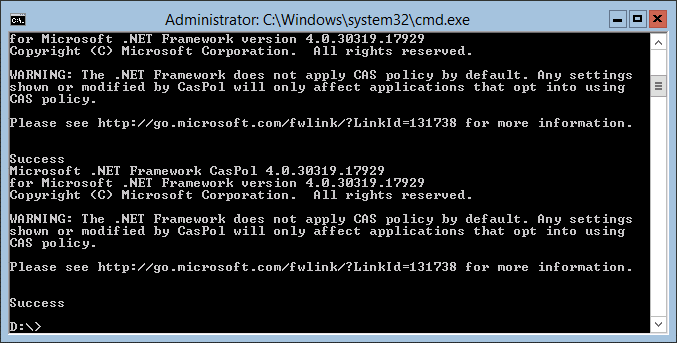

#Cómo realizar una instalación de SQL Server 2012 en Windows 2012 Core

Por **FREDDY LEANDRO ANGARITA C.**

**SqlServer MVP**

[Perfil MVP](https://mvp.support.microsoft.com/es-es/mvp/Freddy%20Leandro%20Angarita%20Castellanos-4028407)

<freddy_angarita@hotmail.com>

<http://geeks.ms/blogs/fangarita/default.aspx>


Para realizar la prueba se requiere una máquina (física o virtual) para
realizar la prueba, si no se cuenta con una licencia se puede descargar
una versión de prueba en la página de
[Microsoft](http://technet.microsoft.com/evalcenter/hh670538.aspx)

Para el ejemplo usaré Hyper-V en una máquina con Windows 8 y SQL Server
2012 Developer Edition ([descargar versión de
prueba](http://www.microsoft.com/en-US/download/details.aspx?id=29066)),
aunque funciona para todas las versiones

Pero antes de empezar qué es [Windows Server
Core](http://msdn.microsoft.com/en-us/library/windows/desktop/hh846323(v=vs.85).aspx),
para ponerlo en términos simples, es una versión que no tiene GUI, es
decir, interface gráfica con el usuario (Algunos Programas como el bloc
de notas sí están disponibles) reduciendo así la cantidad de recursos
requeridos por el sistema operativo para funcionar , lo que implica que
la administración del sistema operativo debe realizarse enteramente
mediante consola, claro, para SQL Server, existe la posibilidad de
conectar remotamente un Management Studio lo que permitirá su
administración gráfica

Una vez instalada o conectada la máquina virtual Windows Server 2012
Code Edition presenta una consola como la que se presenta en la
siguiente imagen:


    

En el Menú de Hyper-V, Seleccionar Media =&gt; DVD Drive =&gt; Insert
Disk... y seleccionar el Archivo .ISO del instalador de SQL Server, para
este ejemplo usaré Developer Edition, pero para un servidor se debe usar
Standard o Enterprise dependiendo del esquema de licenciamiento con el
que se cuente




Una vez se conecte el Disco, el mismo aparecerá como un DVD en la
máquina virtual



Una vez preparado el archivo de configuración, se procede a la ejecución
de la instrucción que inicia la instalación usando el archivo de
configuración de ejemplo ubicado en [\[Code\] Archivo de configuración
de Ejemplo para Instalaciones Desatendidas de SQL Server en Windows
Server 2012
Core](http://geeks.ms/blogs/fangarita/archive/2013/04/04/code-archivo-de-configuraci-243-n-de-ejemplo-para-instalaciones-desatendidas-de-sqlserver.aspx),
el cual contiene comentarios que explican las diferentes configuraciones
realizadas en el archivo



 Una vez se inicia la instalación correctamente se visualiza en pantalla
el diálogo presentado en la siguiente gráfica:



Dado que las opciones de configuración ya fueron dadas en el archivo de
[configuración el
instalador](http://geeks.ms/blogs/fangarita/archive/2013/04/04/code-archivo-de-configuraci-243-n-de-ejemplo-para-instalaciones-desatendidas-de-sqlserver.aspx)
no realiza ninguna pregunta al usuario, y los valores no provistos serán
tomados por defecto por instalador, para realizar una instalación
completa se recomienda revisar todas las [opciones de
instalación](http://msdn.microsoft.com/es-co/library/hh231669.aspx); en
la siguiente gráfica se observa el avance de la instalación:



Una vez Finalizada la instalación:


 

Para habilitar las conexiones remotas se debe ejecutar

```SQL
EXEC sys.sp\_configure N'remote access', N'1'

GO

RECONFIGURE WITH OVERRIDE

GO
```
 

Los comentarios son bienvenidos, espero sea de ayuda,

**FREDY LEANDRO ANGARITA CASTELLANOS**

**SQL Server MVP**


