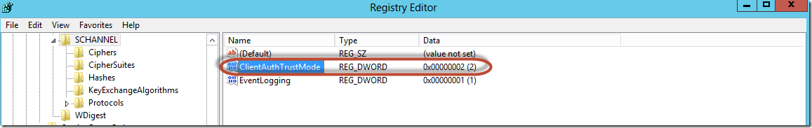

**Por Peter Diaz**

Profesional en el área de IT con más de 10 años de experiencia en
proyectos y consultorías de Seguridad Informática, Infraestructura y
Comunicaciones Unificadas. MVP/MCT/MCITP Lync/MAP 2012/MCC MCP ID:
3095363 MVP ID: 4039848

LinkedIn: <http://www.linkedin.com/pub/peter-diaz/8/61b/a72>

Microsoft MVP

Escenario
---------

Nuestro Servidor de Edge Server de Lync 2013 no replica, nos vamos al
Lync Control Panel y verificamos la Topología:

1.  {width="6.5in"
    height="0.3861111111111111in"}

Ahora nos vamos a nuestro Lync Managment Shell y ejecutamos el siguiente
comando, para verificar el estado de las replicaciones:

Get-CsManagementStoreReplicationStatus
--------------------------------------

1.  {width="4.1672484689413825in"
    height="0.8438681102362204in"}

Como podemos ver nuestro servidor de Edge no está replicando.

Solución
--------

La solución pasa por agregar una nueva llave en el **REGEDIT** de
nuestro servidor **Windows Server 2012** donde está instalado el Edge
Server de Lync 2013.

En la clave:

1.  {width="5.240314960629921in"
    height="0.3229615048118985in"}

Agregamos un nuevo registro **DWORD** bajo el nombre:

**Value Name: ClientAuthTrustMode **

**Value data: 2**

1.  {width="6.5in"
    height="1.0277777777777777in"}

Inmediatamente “**reiniciamos nuestro servidor de Edge Server de Lync
2013”** y ejecutamos el siguiente comando Lync Managment Shell en el
Front End para forzar la replicación:

**Invoke-CsManagementStoreReplication**

1.  {width="5.604948600174978in"
    height="0.729268372703412in"}

Luego nos vamos a nuestro Lync Control Panel, ya ahora debería de ir la
replicación sin problemas:

1.  {width="6.5in"
    height="0.33402777777777776in"}

    {width="5.4382589676290465in"
    height="2.604529746281715in"}

Peter Diaz

MVP-MCT-MAP
