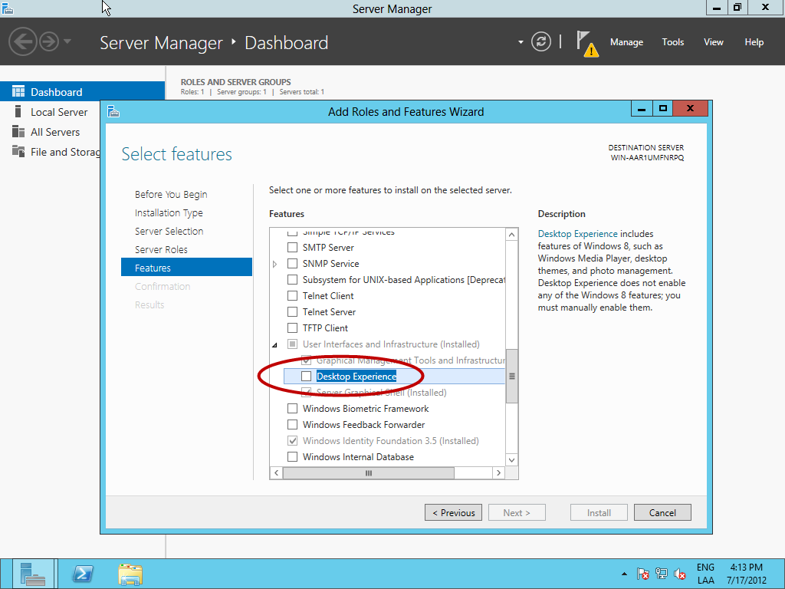
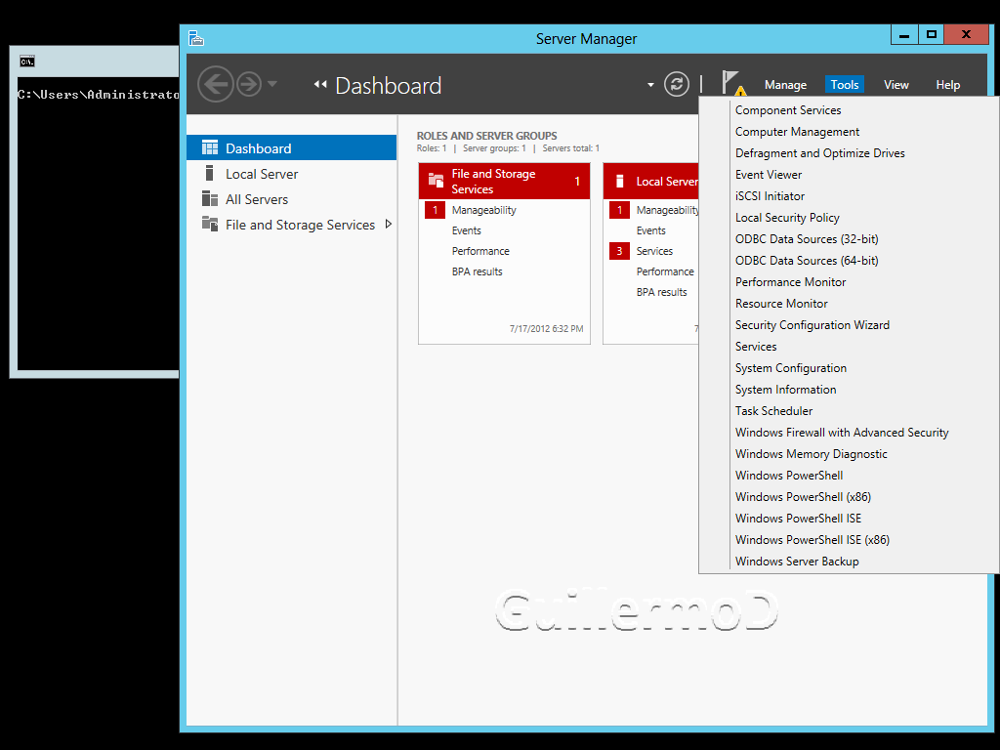

  --------------------------------------------------------------------------------------------------------------------------------------------------------------------------------------------------------------------------------------------------------------------------------
  Guillermo Delprato, MCT-MCITP-MCTS-MCSE(NT 3.51/4.0/2000/2003)-MCSA                                                                                                                                                                                               Octubre 2012
                                                                                                                                                                                                                                                                    
  Soy uno de los primeros certificados en Argentina en tecnologías Microsoft desde el año 1996, dedicándome principalmente a capacitación, siendo MCT, y actualmente a consultoría sobre sistemas operativos, soluciones de conectividad entre redes y seguridad.   
  ----------------------------------------------------------------------------------------------------------------------------------------------------------------------------------------------------------------------------------------------------------------- --------------
  [Blog](http://windowserver.wordpress.com/)
  --------------------------------------------------------------------------------------------------------------------------------------------------------------------------------------------------------------------------------------------------------------------------------

Sigo investigando Windows Server 2012 (Release Candidate en este
momento) y cada vez encuentro nuevas sorpresas, o configuraciones hasta
ahora poco documentadas

Como todos sabemos, durante el proceso de instalación nos ofrece dos
alternativas: por omisión es “Server Core”, o además “Server with GUI”\
Además tenermos 3 opciones más, sólo que debemos configurarlas

Podemos tener una “Más Full” que “Server con GUI”, una intermedia, y una
“Más chica” que “Server Core”

Por ahora las llamaré con un número, ascendente cuanto menos ocupe: 1,
2, 3, 4 y 5. Siendo la 2 “Server with GUI”, y la 4 correspondiente a
“Server Core”

Y como si fuera poco, veremos que podemos cambiar de una otra en la
misma instalación :)

**ACTUALIZADO 15/08/2012**

A estas opciones las llamaré:

**Server Full-Full**

**Server with GUI**

**Server with Reduced GUI**

**Server Core**

**Server Core Reduced**

Voy a partir de la instalación más común que hacemos los que estamos
investigando el producto como es “Server with GUI” (2.) ya que nos
ofrece la interfaz gráfica amigable, y permite administrarlo más
fácilmente, aunque no sea la opción más eficiente y conveniente

“Server with GUI” a “Server Full-Full” (2. a 1.) y Viceversa
------------------------------------------------------------

Veamos cómo pasamos de la (2.) a la (1.). Esta opción, en realidad es la
menos interesante para los administradores, ya que en realidad está
orientada al uso con Remote Desktop y la experiencia de usuario.

Aunque yo no descartaría en este momento que en algunos casos suceda
algo semejante a lo ocurrido durante la salida de Windows Vista, como
fue el uso de “Server as Super Workstation”

Si agregamos el componente “Desktop Experience”

1.  {width="6.5in" height="4.875in"}

Veremos algunas “sorpresas”

1.  {width="6.5in" height="4.875in"}

    {width="6.5in" height="4.875in"}

    {width="6.5in" height="4.875in"}

    {width="6.5in" height="4.875in"}

    {width="6.5in" height="4.875in"}

Ahora vamos a ir cambiando a versiones con “menos”. Lo primero que haré
es desinstalar “Desktop Experience”, para volver a “Server with GUI”. No
pondré capturas de pantalla porque entiendo que todos ya sabemos cómo
desinstalar un “Feature”

“Server with GUI” a “Server with Reduced GUI” (2. a 3.) y Viceversa
-------------------------------------------------------------------

Volviendo al asistente para desinstalar “Features”, veo que bajo “User
Interfaces and Infrastructure” aparece la opción “Server Graphical
Shell”, que de acuerdo a la descripción aunque permite la administración
mediante GUI, elimina Windows Explorer, e Internet Explorer.\
Para el primero ya veremos un “truco”. Para la segunda, bueno sin
comentarios si alguno utiliza el servidor para navegar por Internet, no
voy a hacer comentarios :)

1.  {width="6.5in" height="4.875in"}

Desinstalemos, reiniciemos y observemos

Podemos ver que hemos “perdido” el escritorio, pero “Server Manager”
funciona, y además, probando las “Tools” veo que todas funcionan
normalmente, salvo “Performance Monitor” que muestra un error de
incialización de la MMC, pero luego funciona normalmente

1.  {width="6.5in" height="4.875in"}

Internet Explorer no está más disponible, como así tampoco el “Desktop”

Había comentado de un “truco” para el Windows Explorer. No es lo mismo
pero para las operaciones básicas de archivos servirá. Abrimos el
Notepad, y desde el menú Open, mostrando todos los archivos, podremos
hacer las operaciones básicas, siempre y cuando no se animen con la
línea de comandos (CMD.EXE) :)

1.  {width="6.5in" height="4.875in"}

Para deshacer el cambio, como es lógico sólo alcanza con reinstalar
“Server Graphical Shell”

“Server with GUI” a “Server Core” (3. a 4.) y Viceversa
-------------------------------------------------------

Siguiendo un proceso análogo al anterior, en este caso desinstalaré
“Graphical Management Tools and Infrastructure”

Con esto lo que conseguiremos es llegar a “Server Core”, ~~equivalente a
que hubiéramos elegido esa versión durante el proceso de instalación~~

ACTUALIZACION:

Si durante la instalación elegimos la opción “Server Core” (4), en
realidad estamos instalando “Server Core Reduced” (5)\
Y por lo tanto para agregar cualquier componente debemos poder acceder a
los archivos de instalación

Para montar la imagen de donde se sacarán los binarios necesarios
debemos poder acceder al DVD, y ejecutar:

MD C:\\Mount

DISM.EXE /Mount-Image\
/ImageFile:&lt;DVD&gt;:\\Sources\\Install.wim /Index:4
/MountDir:c:\\Mount /ReadOnly

1.  {width="6.5in" height="4.875in"}

Si luego de esto nos arrepintiéramos y quisieramos volver a la interfaz
gráfica, es sencillo con PowerShell

Desde línea de comandos llamamos a PowerShell simplemente escribiendo su
nombre, y luego ejecutamos

Import-Module ServerManager

Install-WindowsFeature Server-Gui-Mgmt-Infra, Server-Gui-Shell -Source
C:\\Mount\\Windows\\Winsxs –Restart

O ejecutar

Install-WindowsFeature -IncludeAllSubFeature User-Interfaces-Infra
-Source C:\\Mount\\Windows\\Winsxs -Restart

1.  {width="6.5in" height="4.875in"}

“Server Core” a “Server Core Reduced” (4. a 5.) y Viceversa
-----------------------------------------------------------

Aunque “Server Core” ya es una versión muy reducida, inclusive porque
aún no soporta ciertas funcionalidades, la podemos achicar aún más

Cuando tenemos instalada una versión “Server Core” los componentes no
están instalados, pero en realidad están presentes, y ocupando espacio
en disco

Por lo tanto si estamos seguros que no utilizaremos alguna funcionaliad
la podremos desinstalar

Para eso debemos acudir a la ayuda de PowerShell. Lo primero es cargar
el módulo ServerManger, luego debemos averiguar cuál es el nombre del
“feature” que deseamos remover, y por último proceder a su remoción

Así que debemos ejecutar

PowerShell ←Ejecutamos PowerShell

Import-Module ServerManager ←Importamos el módulo ServerManager

Get-WindowsFeature ←Obtenemos el nombre exacto del Feature

Uninstall-WindowsFeature &lt;FeatureName&gt; –Remove ←Eliminamos

Cabe aclarar que el “-Remove” realmente elimina los archivos necesarios
para la reinstalación, con lo cual podemos achicar el espacio ocupado en
disco

Pero de todas formas siempre podremos recuperarlos en caso de
arrepentirnos, aunque en este caso debemos montar una imagen WIM de una
versión con Gui para recuperar los archivos

El proceso no es complicado

Creamos una carpeta para montar el WIM\
\
mkdir C:\\Mount

Determinamos el índice de la versión a montar\
\
DISM /get-wiminfo /wimfile:&lt;DVD&gt;:\\Sources\\install.wim

Montamos la imagen\
\
DISM /mount-wim wimfile:&lt;dvd&gt;:\\Sources\\install.wim\
\
/index:&lt;\#paso-anterior&gt; /Mountdir:C\\Mount

Y finalmente ejecutamos\
\
Install-WindowsFeature &lt;FeatureName&gt; -Restart\
\
-Source:C:\\Mount\\Windows\\Winsxs

1.  {width="6.5in" height="4.875in"}

Esto es todo por ahora, no son sólo 2 las versiones, sino que en
realidad son 5 opciones diferentes, desde “casi un desktop” hasta la
versión “más minimalista”
