Por [Juan José Diaz
Antuña](http://mvp.microsoft.com/en-us/mvp/Juan%20Jose%20Diaz%20Antu%c3%b1a-5000260),
[@diazantuna ](https://twitter.com/diazantunahttps:/twitter.com/diazantuna)

Microsoft MVP

Windows Expert-IT Pro

En este artículo vamos a ver cómo llevar GPO’s de un dominio de pruebas
a un dominio de producción, o como migrar GPO´s de un dominio a otro.
Esta operación es bastante habitual, ya que normalmente probamos las
configuraciones (settings) de nuestras GPO’s previamente.

Vamos a ver un paso a paso de cómo hacerlo. Para ello solo voy a
utilizar la consola de Administración de Directivas de Grupo o GPMC. En
mi laboratorio tengo dos dominios con un controlador cada uno de ellos.

Dominio origen – Controlador de dominio Origen
----------------------------------------------

Lo primero que hacemos es un backup de las GPO’s a migrar en un
controlador de dominio del dominio origen.

1.  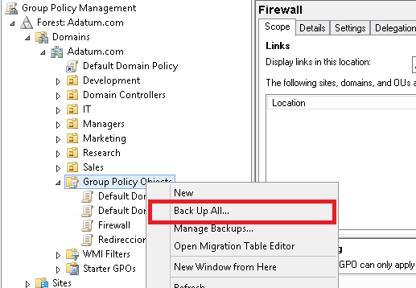{width="5.384743000874891in"
    height="3.728700787401575in"}

Esto lo que hace es una copia de todas las directivas de SYSVOL, o lo
que es lo mismo, de mi dominio. Indico el path donde dejar la copia.

1.  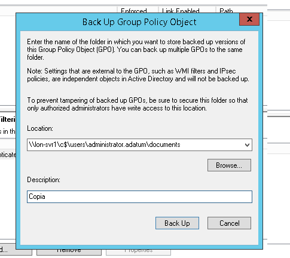{width="5.051452318460193in"
    height="4.499437882764655in"}

Progreso del backup

1.  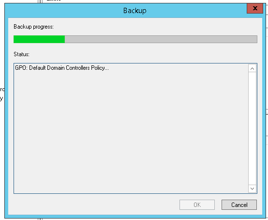{width="5.7701115485564305in"
    height="4.728575021872266in"}

    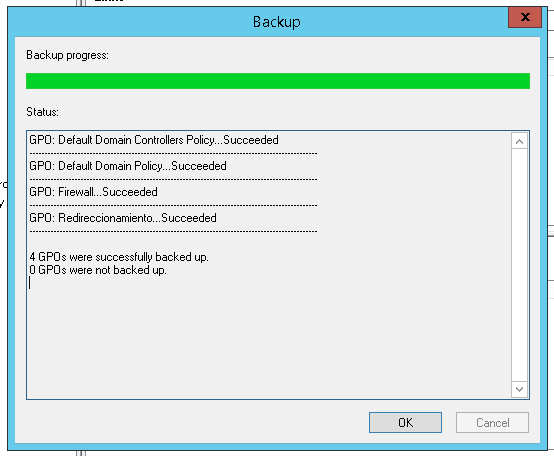{width="5.7701115485564305in"
    height="4.749406167979003in"}

Compruebo que el backup se ha hecho en la ubicación indicada

1.  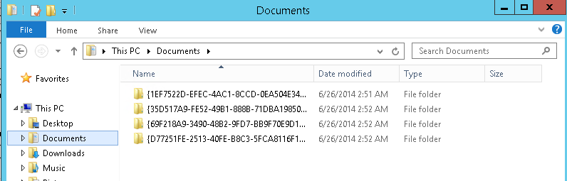{width="5.905555555555556in"
    height="1.8916666666666666in"}

Una vez hecho el backup debo de ir al dominio de destino, a uno de sus
controladores de dominio y acceder a la consola de GPMC

En el menú Action, selecciono Open Migration Table Editor

1.  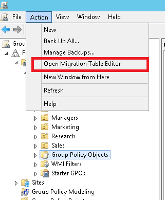{width="3.343332239720035in"
    height="4.051576990376203in"}

En la ventana de Migration Table Editor, en el menú selecciono Tools y
dentro Populate from Backup

1.  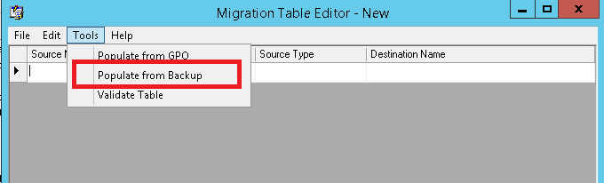{width="5.905555555555556in"
    height="1.7881944444444444in"}

Busco en la ubicación donde he dejado el backup

1.  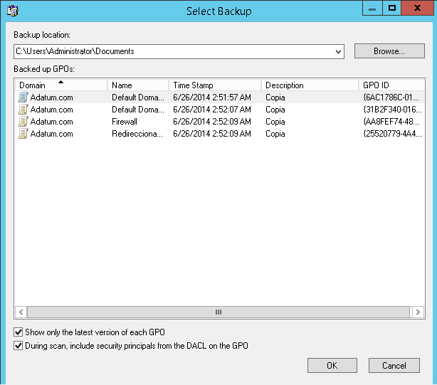{width="5.905555555555556in"
    height="5.2034722222222225in"}

Se nos muestra objetos principales específicos del dominio de origen y
que deberíamos de cambiar y sustituirlos por los del dominio de destino.

1.  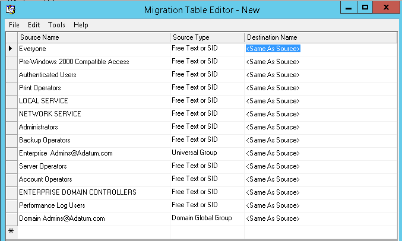{width="5.905555555555556in"
    height="3.5416666666666665in"}

Para hacerlo hago botón derecho sobre el objeto de origen y selecciono
Browse

1.  {width="5.905555555555556in"
    height="2.9916666666666667in"}

    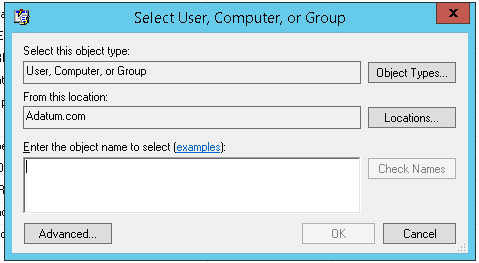{width="4.990279965004374in"
    height="2.7399660979877516in"}

Una vez encontrados todos los objetos y sustituirlos por los del dominio
de destino debo de guardar la tabla de migración. Para ello voy a File –
Save As

1.  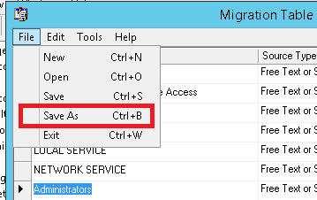{width="3.7401049868766405in"
    height="2.354494750656168in"}

    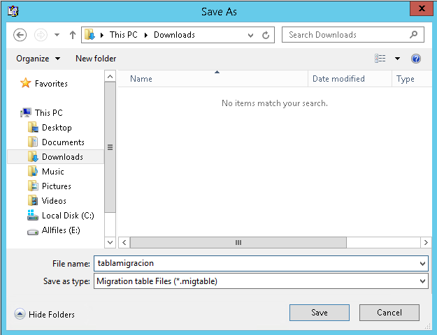{width="5.905555555555556in"
    height="4.536111111111111in"}

Una vez guardada la tabla debo de recrear las GPO en el dominio de
destino. Para ello voy a Group Policy Objects y selección New

1.  {width="5.448676727909011in"
    height="2.542020997375328in"}

Y creo una GPO

1.  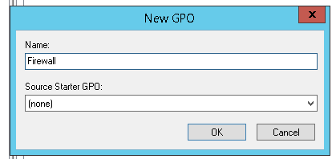{width="4.364037620297463in"
    height="2.062787620297463in"}

Ahora vamos a importar los Settings. Para ello hago botón derecho sobre
la GPO y selección Import Settings

1.  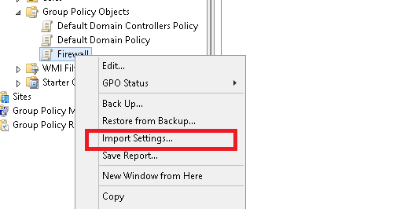{width="5.354913604549432in"
    height="2.771220472440945in"}

Se nos muestra el asistente

1.  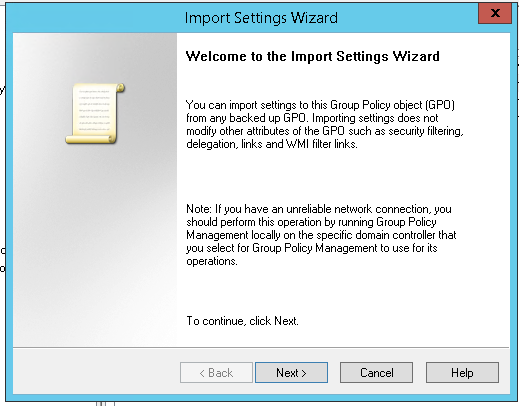{width="5.407004593175853in"
    height="4.22863845144357in"}

Puedo hacer un backup previo de la GPO antes de importar los nuevos
settings. En nuestro caso la GPO no tiene nada configurado con lo que no
voy a hacer el backup

1.  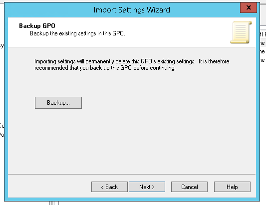{width="5.551388888888889in"
    height="4.280715223097113in"}

Busco el directorio del backup

1.  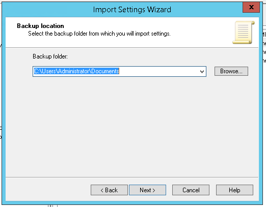{width="5.4368208661417325in"
    height="4.240174978127734in"}

Selecciono la directiva del backup

1.  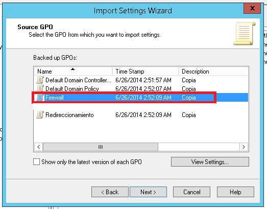{width="5.448676727909011in"
    height="4.259884076990376in"}

Ahora selecciono la tabla de migración que cree antes

1.  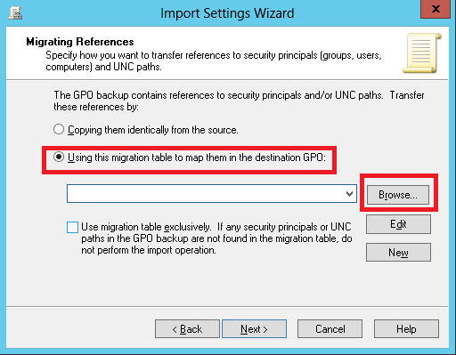{width="5.3340780839895015in"
    height="4.156829615048119in"}

Y finalizo

1.  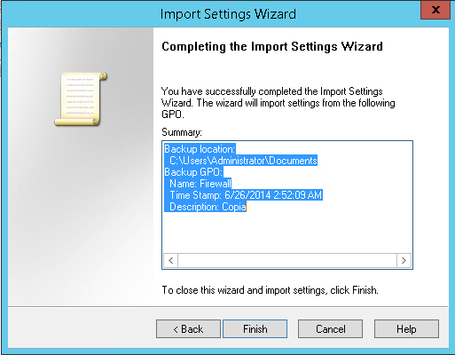{width="5.343081802274716in"
    height="4.166146106736658in"}

