[Marcela Berri*\
*](https://plus.google.com/102022832380927697290/posts/p/pub)Instructor
/ Consultor Senior IT\
MCT – MVP Configuration Manager

MCTS Server Administrator - MCTS AD 2008 - MCTS Network Inf\
MCTS - Server Virtualization\
MCTS W7 & Off2010 - MCTS SCCM 2012/2007 - MCTS SCOM 2007\
MCITP Exchange 2010/2007 - MCTS Exch 2010/2007 - MCTS Lync 2010

Blog [IT Technology Site: *About
me*](http://ittechnologysite.blogspot.com.ar/)

Una vez finalizada y establecida la conexión, estamos listos para migrar
los objetos que se deseen. Ver tambien: [Paso 1 -
conexión](http://msdn.microsoft.com/es-es/library/dn387639.aspx)

**\
Job de Migración:**

**\
**Una vez que la conexión ya queda establecida, en la botonera,en el tab
de “HOME”, tenemos “Create migration Job” para comenzar el asistente de
la migración de objetos.\
\

1.  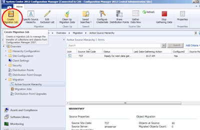{width="4.1672484689413825in"
    height="2.708711723534558in"}

Comienza el asistente y nos ofrece 3 alternativas:

  ------------------------------------------------------------------------------------------------------------------------------------------------------------------------------------------------------------------------
  Job                                    Jerarquía Origen        Qué migra
  -------------------------------------- ----------------------- ---------------------------------------------------------------------------------------------------------------------------------------------------------
  Collection migration                   CM 2007 SP2             Migra todos los objetos que están relacionados a la colección que se seleccionó, incluyendo los objetos asociados con los miembros de dicha colección.\
                                                                 Se puede excluir instancias de objetos específicos durante la creación del job.

  Object migration                       CM 2007 SP2\            Migra objetos individuales que se seleccionen para ser migrados.
                                         CM 2012 SP1 solamente   

  Previously migrated object migration   CM 2007 SP2\            Migra los objetos previamente migrados de la jerarquía origen. Se utiliza si los objetos fueron actualizados luego de la última migración.
                                         CM 2012 SP1 solamente   
  ------------------------------------------------------------------------------------------------------------------------------------------------------------------------------------------------------------------------

1.  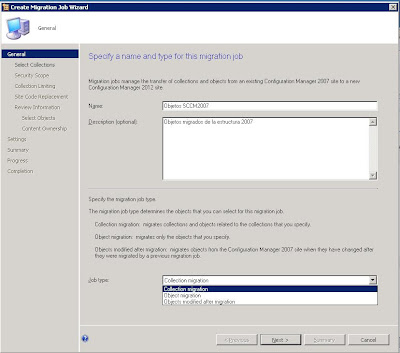{width="4.1672484689413825in"
    height="3.6775962379702536in"}

El tipo de job elegido en este caso es por Colección; así que comienza
explorando las colecciones que encontró de la estructura 2007. En el
ejemplo, existen subcolecciones.\
Si se eligiera “Object migration” el asistente sería un poco más
sencillo, ya que no contará con la posibilidad de elegir las
colecciones; el resto será igual a lo expuesto posteriormente.

Recuerden que CM migrará también los seteos incluyendo las ventanas de
mantenimiento y variables de la colección.\
Si la colección “Ed Central” no tiene miembros, pasará como una carpeta
y dentro pasarán las subcolecciones que tenía la estructura anterior.
Estos objetos se crearán en “User Collections” o “Device Collections”
dentro de Assets and Compliance

1.  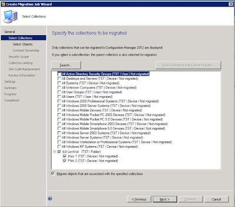{width="4.1672484689413825in"
    height="3.6775962379702536in"}

En la ventana de Selección de objetos, se podrán elegir aquellos objetos
que se deseen migrar.

Específicamente, se deja sin migrar “ConfigMgr 2007 Toolkit” para verlo
mas adelante (figura 21)

1.  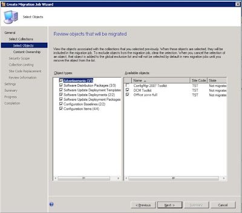{width="4.1672484689413825in"
    height="3.6775962379702536in"}

Luego se debe asignar un site CM 2012 que va a ser “owner” del contenido
. (figura 13) Esto va a permitir que los objetos de 2007 sean migrados y
se traiga el contenido a un punto específico dentro de la nueva
jerarquía. El default es el Site Central de Administración (CAS)

TIP: Debería elegirse el Site que se encuentre más cercano al contenido,
para acceder a él vía red cuando se necesite.

1.  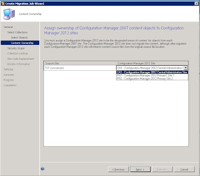{width="4.1672484689413825in"
    height="3.6775962379702536in"}

Aquí se de asignar la seguridad que tendrán de los objetos migrados.
Salvo que se requiera algo específico, se encuentra disponible la
seguridad “Default” (la habitual) de los Objetos. (figura 14)

1.  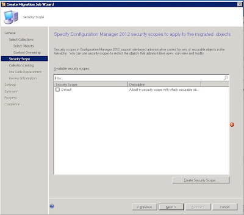{width="4.1672484689413825in"
    height="3.6775962379702536in"}

Es posible limitar cualquier colección que pueda incrementar la
membresía luego de la migración. Esto se debe a que las colecciones en
CM 2012 son [“Globla
Data”](http://ittechnologysite.blogspot.com.ar/2012/08/replicacion-cm2012.html)
y son evaluadas en cada Site dentro de la jerarquía.\
Por consiguiente los advertisements asociados podrían ser evaluados en
cada site y afectar a un número de miembros distintos o no deseados;
entonces, durante la migración, se puede elegir o acotar la colección
destino 2012 para evitarlo (si es que la estructura nueva está armada).

1.  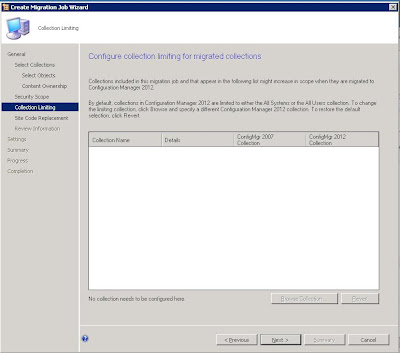{width="4.1672484689413825in"
    height="3.6775962379702536in"}

En el caso en que hubiera alguna Colección con un query que referencie
al código de Site, el asistente brindará la posibilidad de cambiar el
código de Site y acomodarlo a la nueva estructura.

1.  {width="4.1672484689413825in"
    height="3.6775962379702536in"}

Ya casi finalizando, se permite que el administrador revea antes de
migrar, cualquier información adicional a tener en cuenta que el
asistente considere importante. (a modo de ayuda) y deja inclusive
pasarla a un .txt en donde explica las consideraciones finales
dependiendo de los objetos a migrar.

1.  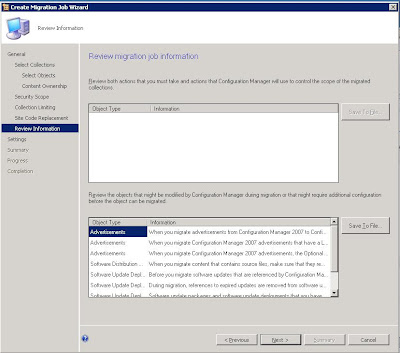{width="4.1672484689413825in"
    height="3.6775962379702536in"}

Por último, está la posibilidad de agendar el job. Además provee
controles adicionales para aquellos objetos que puedan llegar a existir
en el Site destino y su comportamiento luego de la migración.

1.  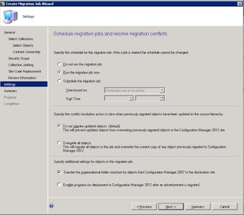{width="4.1672484689413825in"
    height="3.6775962379702536in"}

El Job puede ser visto y manipulado en el ítem de “Migration Jobs”
dentro de “Migration” en la consola.

Es necesario refrescar la consola para actualizar la información del
job.

1.  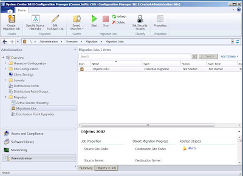{width="4.1672484689413825in"
    height="3.0316732283464565in"}

Al finalizar la migración, contamos con un resumen con los tipos de
objetos migrados.

1.  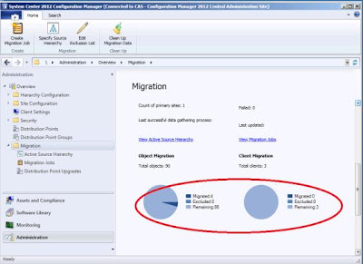{width="4.1672484689413825in"
    height="3.0316732283464565in"}

 *Tareas post Migración:*

En “Active Source Hierarchy” donde encontramos las conexiones realizadas
a la estructura 2007, podemos manipularlas pudiendo iniciar o parar
obtensión de datos.

1.  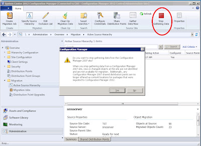{width="4.1672484689413825in"
    height="3.0316732283464565in"}

 

Parados en Migration, en la botonera, en “Edit Exclusion List”, es
posible ver los objetos que fueron excluidos de la migración. Los
objetos aquí listados (figura 22), serán automáticamente excluidos en
futuras migraciones (no seleccionados por default). Si se remueven de
esta lista, podrán ser nuevamente elegidos y migrados en el próximo job.

1.  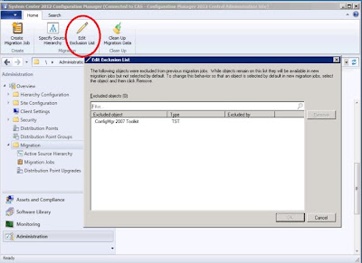{width="4.1672484689413825in"
    height="3.0316732283464565in"}

El último paso a realizar luego de haber migrado todo, es “Clean Up
Migration Data” , después de haber parado todas las conexiones. Aquí se
remueven los datos de la base de datos acerca de la migración a la nueva
jerarquía 2012. Sin embargo, algunos datos útiles quedan, para poder ir
nuevamente al contenedor de “Migration” y rever por ejemplo los objetos
que fueron migrados, quien es el site dueño de los objetos, etc.

1.  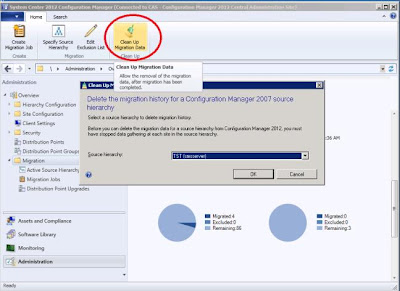{width="4.1672484689413825in"
    height="3.0316732283464565in"}

