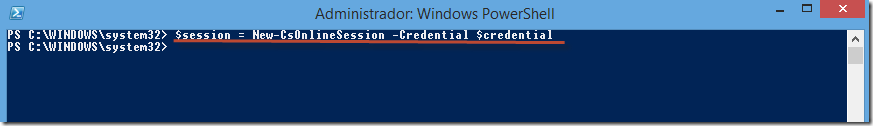
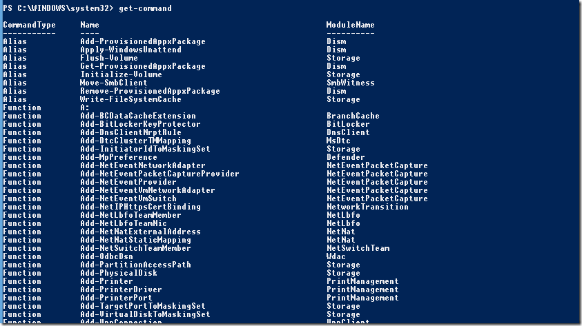

**Por Peter Diaz**

Profesional en el área de IT con más de 10 años de experiencia en
proyectos y consultorías de Seguridad Informática, Infraestructura y
Comunicaciones Unificadas. MVP/MCT/MCITP Lync/MAP 2012/MCC MCP ID:
3095363 MVP ID: 4039848

LinkedIn: <http://www.linkedin.com/pub/peter-diaz/8/61b/a72>

Microsoft MVP

Como parte de los laboratorios realizados el día de ayer en el [*IT CAMP
de Lync
Online*](http://ucenespanol.com/2014/01/11/itcamp-lync-onlinecomunidad-office-365-espaa-2/)
en la [*Fundación
Tajamar*](http://www.tajamar.es/index.php?option=com_content&view=article&id=523:fundacion-tajamar&catid=94:noticias-fundacion&Itemid=349),
hubo uno de ellos el cual es mi favorito  que es instalar el módulo de
administración para Lync Online con Powershell a continuación intentare
de manera sencilla el paso a paso:

Pre requisitos:
---------------

La administración remota de Lync Online con Windows PowerShell solo se
admite en equipos de 64 bits que ejecutan uno de los siguientes sistemas
operativos:

Windows 7

Windows Server 2008 R2

Windows Server 2012

Windows 8

Además del sistema operativo admitido, el equipo también debe ejecutar
lo siguiente:

Windows PowerShell 3.0

Microsoft Online Services – Ayudante para el inicio de sesión para
profesionales de TI RTW

Módulo del conector de Lync Online

[*http://technet.microsoft.com/es-es/library/dn362839.aspx*](http://technet.microsoft.com/es-es/library/dn362839.aspx)

1.- Debemos de descargar el módulo de Powershell para Lync Online en el siguiente URL:
--------------------------------------------------------------------------------------

[*http://www.microsoft.com/en-us/download/details.aspx?id=39366*](http://www.microsoft.com/en-us/download/details.aspx?id=39366)

1.  {width="5.146551837270342in"
    height="3.7296872265966754in"}

2.- Inmediatamente debemos de abrir nuestra consola de Windows Powershell 
--------------------------------------------------------------------------

1.  {width="3.43798009623797in"
    height="1.9377701224846895in"}

Import-Module LyncOnlineConnector

1.  {width="6.5in"
    height="1.179861111111111in"}

3.- Ahora instalaremos el ayudante de administración para Lync Online:
----------------------------------------------------------------------

3.1
[*http://www.microsoft.com/es-es/download/details.aspx?id=28177*](http://www.microsoft.com/es-es/download/details.aspx?id=28177)

1.  {width="6.261290463692038in"
    height="4.083903105861768in"}

Nota: Debemos antes de abrir la consola de Powershell para la
administración de Lync Online verificar si tenemos instalado el módulo
de Windows Powershell 3.0 como mínimo ejecutando el siguiente comando
Powershell.

Get-Host | Select-Object Version

1.  {width="6.5in"
    height="1.3354166666666667in"}

En este caso tenemos la versión 4.0 por tratarse de un sistema operativo
Windows 8.1

4.- Ahora si vamos a conectarnos a nuestro Lync Online para Administrarlo vía Powershell:
-----------------------------------------------------------------------------------------

4.1 Desde la consola Windows Powershell ejecutar los siguientes
comandos:

**\$credential = Get-Credential**

1.  {width="6.5in"
    height="3.4569444444444444in"}

Nota: Con este comando cargamos en cache nuestra credencial
administrativa de la cuenta de Lync Online

4.2 Ejecuta el siguiente comando para verificar que estar cargadas en
cache nuestras credenciales

\$credential

1.  {width="6.5in"
    height="1.0583333333333333in"}

5.- Iniciar la sesión con nuestro Lync Online (tardara algunos segundos no desesperes)
--------------------------------------------------------------------------------------

\$session = New-CsOnlineSession -Credential \$credential

1.  {width="6.5in"
    height="0.9381944444444444in"}

6. - Importar los módulos Powershell
------------------------------------

Import-PSSession \$session

1.  {width="6.5in" height="0.9125in"}

7.- Chequeamos los módulos descargados
--------------------------------------

Get-Module

1.  {width="6.5in"
    height="1.2756944444444445in"}

8.- Listo ya podemos administrar nuestro Lync Online verificando todos los comandos disponibles con el siguiente comando
------------------------------------------------------------------------------------------------------------------------

Get-Command

1.  {width="6.5in"
    height="3.6465277777777776in"}

Si deseas descargar la guía completa de los laboratorios de Lync Online
ve al siguiente enlace:

[*http://sdrv.ms/1gtZ8KY*](http://sdrv.ms/1gtZ8KY)

Peter Diaz

Lync MVP – MCT – MAP
