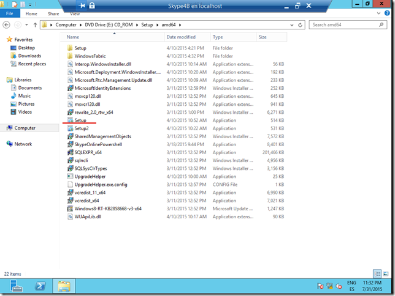
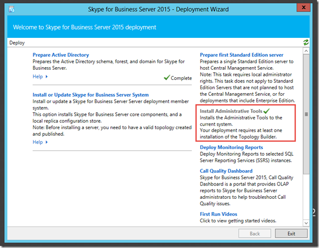
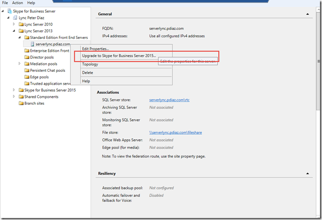
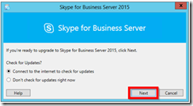
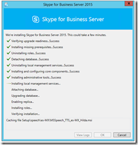

Por Peter Diaz

Profesional en el área de IT con más de 10 años de experiencia en
proyectos y consultorías de Seguridad Informática, Infraestructura y
Comunicaciones Unificadas. MVP/MCT/MCITP Lync/MAP 2012/MCC MCP ID:
3095363 MVP ID: 4039848

LinkedIn: <http://www.linkedin.com/pub/peter-diaz/8/61b/a72>

Microsoft MVP

Hola a todos, hemos visto como con la nueva versión de Microsoft en el
área de Comunicaciones Unificadas en este caso Skype for Business
tenemos la opción de migrar en dos escenarios.

**In-Place**: Sin necesidad de cambio de hardware y software podemos
migrar con simplemente correr un wizard de actualización nuestros
servidores de Lync 2013 a Skype For Business.

**On-Place**: Consiste en la realizar una migración limpia levantando un
entorno de Skype for Business nuevo coexistiendo con nuestra plataforma
de Lync 2013.

Los argumentos a nivel de preventa en el primer escenario (In Place) son
los más poderosos a la hora de dar servicios profesionales a nuestros
clientes como lo es:

No tienen que invertir en nuevo Hardware

No tienen que invertir en Software

No tienen que invertir en licenciamiento

La migración es rápida y sencilla siempre y cuando se disponga de un
buen plan de proyectos y de un experto en entornos de comunicaciones
Microsoft

Nota: Podemos descargar los diagramas técnicos desde este enlace en
formato Visio

[*https://technet.microsoft.com/es-ES/library/dn594589.aspx*](https://technet.microsoft.com/es-ES/library/dn594589.aspx)

En nuestro caso daré el paso a paso para migrar entornos de Lync 2013 de
la versión Standard Edition a Skype for Business Standard Edition.

Actualizando nuestro SQL Express
--------------------------------

Lo que mucho dejamos pasar por alto es que antes de migrar nuestro
servidor de Lync 2013 debemos de actualizar el SQL Express 2012 que
viene por default en nuestro servidor Front End.

Para ello debemos de [descargar el
SP1](http://www.microsoft.com/es-ES/download/details.aspx?id=35579) y
luego ejecutar vía comando Power Shell los siguientes comandos:

Si es la versión Standard Edition los comandos Powershell son:

***SQLEXPR\_x64\_ENU.exe /ACTION=Patch /INSTANCENAME=RTCLOCAL /QS
/HIDECONSOLE /IAcceptSQLServerLicenseTerms***

***SQLEXPR\_x64\_ENU.exe /ACTION=Patch /INSTANCENAME=LYNCLOCAL /QS
/HIDECONSOLE /IAcceptSQLServerLicenseTerms***

***SQLEXPR\_x64\_ENU.exe /ACTION=Patch /INSTANCENAME=RTC /QS
/HIDECONSOLE /IAcceptSQLServerLicenseTerms***

Descarga el SP1 aquí :
<http://www.microsoft.com/es-ES/download/details.aspx?id=35579>

Actualizando nuestro servidor de Lync 2013
------------------------------------------

Ahora procedemos a actualizar nuestro servidor de Front End de Lync 2013
que mínimo debe estar en el Cummulative Update 5.

Para saber en qué CU se encuentra nuestro servidor podemos utilizar los
siguientes comando Lync Management Shell:

***Get-WmiObject –query ‘select \* from win32\_product’ | where
{\$\_.name –like “Microsoft Lync Server\*”} | ft Name, Version
–AutoSize***

***Get-CsServerversion***

Para descargar el ultimo Cummulative Update tenemos que ir al siguiente
enlace:

<https://support.microsoft.com/es-es/kb/2809243>

Update a los servidores Windows Server
--------------------------------------

Es importante realizar un update a nuestros servidores de Windows Server
dependiendo de la versión en donde tengamos alojados nuestra solución de
Lync 2013.

Es un KB que nos prepara nuestro servidor de Lync antes de la migración
In-Place

[Kb2533623](http://support.microsoft.com/kb/2533623) **Windows Server
2008 R2**

[Kb2858668](http://support.microsoft.com/kb/2858668) **Windows Server
2012**

[KB2982006](https://support.microsoft.com/en-us/kb/2982006) **Windows
Server 2012 R2**

**Importante que este KB requiere reinicio así que tomarlo en cuenta.**

Preparando nuestro servidor de Skype4B y la migración In-Place
--------------------------------------------------------------

Es importante saber que para realizar la migración In-Place debemos de
contar con un servidor “nodriza” el cual debe estar limpio sin ningún
tipo de herramienta o software pre instalado, solo dedicado para la
migración In-Place.

Para ello debemos de instalar los siguientes pre requisitos en el
servidor para prepararlo pre migración e instalación de Skype for
Business.

Instalar componentes de IIS y otros con los siguientes comandos Power
Shell en el servidor Nodriza.

**Windows Server 2012:**

*Add-WindowsFeature RSAT-ADDS, Web-Server, Web-Static-Content,
Web-Default-Doc, Web-Http-Errors, Web-Asp-Net, Web-Net-Ext,
Web-ISAPI-Ext, Web-ISAPI-Filter, Web-Http-Logging, Web-Log-Libraries,
Web-Request-Monitor, Web-Http-Tracing, Web-Basic-Auth, Web-Windows-Auth,
Web-Client-Auth, Web-Filtering, Web-Stat-Compression,
Web-Dyn-Compression, NET-WCF-HTTP-Activation45, Web-Asp-Net45,
Web-Mgmt-Tools, Web-Scripting-Tools, Web-Mgmt-Compat,
Desktop-Experience, Telnet-Client, BITS -Source D:\\sources\\sxs*

**Windows Server 2012R2:**

*Add-WindowsFeature RSAT-ADDS, Web-Server, Web-Static-Content,
Web-Default-Doc, Web-Http-Errors, Web-Asp-Net, Web-Net-Ext,
Web-ISAPI-Ext, Web-ISAPI-Filter, Web-Http-Logging, Web-Log-Libraries,
Web-Request-Monitor, Web-Http-Tracing, Web-Basic-Auth, Web-Windows-Auth,
Web-Client-Auth, Web-Filtering, Web-Stat-Compression,
Web-Dyn-Compression, NET-WCF-HTTP-Activation45, Web-Asp-Net45,
Web-Mgmt-Tools, Web-Scripting-Tools, Web-Mgmt-Compat,
Desktop-Experience, Telnet-Client, BITS -Source D:\\sources\\sxs*

***Nota: Importante que siempre debemos de tener nuestra media de
Windows Server montada en nuestra unidad DVD física o virtual durante la
instalación de los pre requisitos***.

Una vez montado los componentes necesarios procedemos a instalar las
**herramientas administrativas en nuestro servidor de Skype for
Business.**

Para ello solo montamos la unidad DVD física o virtual con la media de
Skype for Business y ejecutamos Setup.

Ruta por defecto:

**E:\\Setup\\amd64**

1.  {width="6.5in"
    height="4.885416666666667in"}

    {width="6.5in"
    height="5.041666666666667in"}

– La instalación de las herramientas administrativas nos permitirá abrir
el **Skype For Business Topology Builder,** donde procederemos a
descargar la Topología actual y decir que vamos a realizar un upgrade
del servidor de **Lync 2013 Standard Edition.**

1.  {width="6.5in"
    height="4.450694444444444in"}

– Una vez que digamos que vamos a realizar el update es importante parar
todos los servicios de nuestro servidor de Lync 2013 para ello lo
realizaremos con el siguiente comando desde la consola Lync Management
Shell:

**Disable-CsComputer –Scorch**

“Con este comando garantizas que los servicios queden totalmente parados
y no se reinicien por ningún motivo”

Ahora procedemos a ejecutar el Wizard de Skype for Business en nuestro
servidor de Lync 2013 y solo resta esperar a que todo esté listo.

Este proceso dura aproximadamente entre 25 a 40 minutos.

1.  {width="2.542020997375328in"
    height="1.3960279965004374in"}

 

1.  {width="2.4170034995625547in"
    height="2.542020997375328in"}

Aunque la misma es desatendida recomiendo que no abandonemos el
servidor.

Luego de que concluya el wizard de la instalación procedemos a levantar
los servicios con el siguiente comando Lync Management Shell:

**Start-CSPool  -PoolFqdn &lt;nombre del pool&gt;**

**Nota: Para otros roles utilizar**

**Start-CsWindowsService**

Listo ya hemos concluido nuestra migración In-Place.

Bienvenidos a Skype For Business!!!!!

 

Peter Diaz

MVP Skype4B – MCSE Communication – MCT
