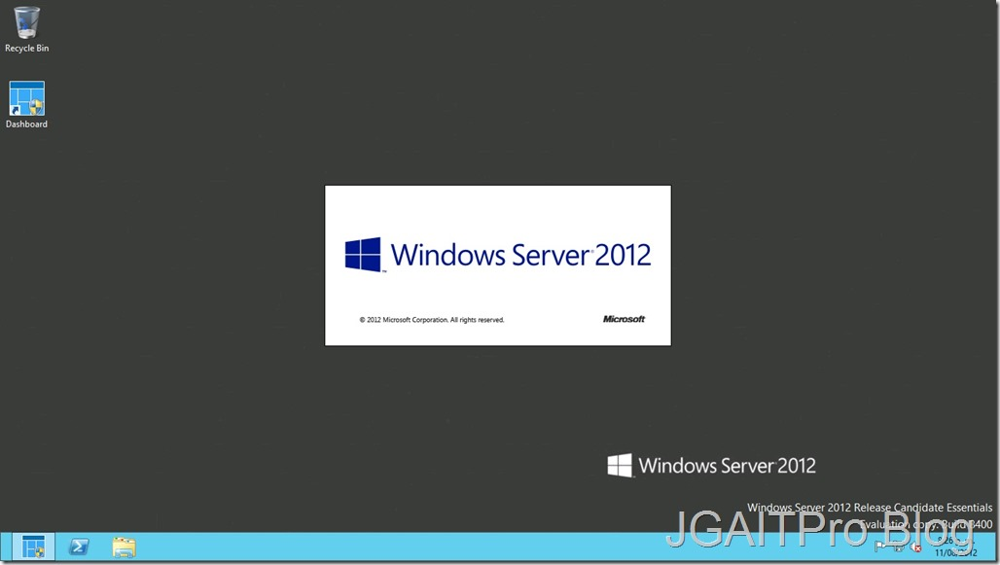

  Jair Gomez Arias, Ingeniero de infraestructura Microsoft Y Microsoft Community Specialist de la ciudad de Barranquilla Colombia, con conocimiento y experiencia en Administración de Centros de datos en Plataforma Microsoft.   Septiembre 2012
  -------------------------------------------------------------------------------------------------------------------------------------------------------------------------------------------------------------------------------- -----------------
  [Blog](http://blogs.itpro.es/jairgomez/)

Después del proceso de
instalación de Windows Server 2012 Essentials, un proceso algo largo
debido a la comprobación de requisitos del sistema, estamos listos para
ver que tiene de diferencia en cuanto a las ediciones Standard o
Datacenter.

En Windows Server 2012 Essentials una gran ayuda es que el mismo en la
instalación solo nos pide unos datos básicos y tendremos un Domain
Controller ya configurado, además DNS, Servidor de Archivos, RDS etc…

Al terminar tenemos nuestro escritorio con el cambio que no tenemos el
mismo Server Manager, si no el Windows Server 2012 Essentials Dashboard,
en este tenemos lo necesario para comenzar a administrar el servidor que
nos proporcionara la solución para 25 usuarios y 50 dispositivos en
nuestra red.

1.  {width="6.5in"
    height="3.667361111111111in"}

    {width="6.5in"
    height="3.673611111111111in"}

Una de las primeras tareas en cualquier servidor o equipo cliente, es la
activación, por lo cual realizaremos el proceso, veremos un error como
vemos en la imagen, además en la barra de titulo del Dashboard nos dice
que no esta activado.

1.  {width="6.5in"
    height="3.667361111111111in"}

Algo también diferente es que en esta área tenemos el Visor de Alertas,
vemos el error debido a la no activación de la copia y como podemos
activarla.

1.  {width="6.5in"
    height="4.226388888888889in"}

    {width="6.5in"
    height="3.667361111111111in"}

    {width="6.5in"
    height="3.667361111111111in"}

    {width="6.5in" height="4.60625in"}

Lo bueno de este Dashboard es que toda la administración que podamos
realizar en el la realizamos por asistentes, es por esto que nos muestra
5 paneles (**Setup, Email, Add-Ins, Quick Status, Help**) los cuales nos
proporcionaran la ayuda suficiente para acabar de configurar nuestro
Essentials en base a las condiciones de nuestra empresa.

El primero **Setup,** tenemos las configuraciones básicas, a medida que
vamos llevando a cabo estas recomendaciones se nos va marcando como
realizada.

Como primera medida nos recomienda activar las actualizaciones para los
productos Microsoft, Windows Update.

1.  {width="6.5in"
    height="3.667361111111111in"}

    {width="6.5in"
    height="3.673611111111111in"}

Por ultimo veremos lo comentado de el visto bueno de la recomendación,
así sucesivamente con varios puntos de configuración hasta dejar nuestro
Servidor con las buenas prácticas.

1.  {width="6.5in"
    height="3.667361111111111in"}

Para los siguientes artículos que he decidido crear sobre esta edición
del nuevo Windows Server 2012 destinada a pequeñas empresas y bajas
cargas de trabajo, veremos como es la creación de Usuarios y carpetas
compartidas.

Hasta la próxima y muchas gracias.
