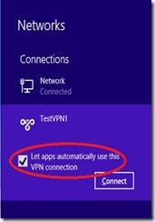

# Activación automática de conexiones VPN y VPN Diagnóstico Mejoras en Windows 8.1

Por [Server & Management Blogs, Networking Blog](http://blogs.technet.com/b/networking/archive/2013/10/03/automatically-triggering-vpn-connections-and-vpn-diagnostics-enhancements-in-windows-8-1.aspx)

Windows Networking Team \[MSFT\]

8.1 de Windows permite que un cliente VPN SE conecte automáticamente a
la red corporativa. Desde la perspectiva del usuario final, el acceso a
los recursos corporativos funciona igual que cuando se está dentro de la
red corporativa.

Cada vez que se lanza una aplicación corporativa o accede a un recurso
de la empresa por su nombre, la conexión VPN se activa automáticamente,
si no está ya conectado.

Aplicación basada en activación
-------------------------------

El administrador puede configurar una lista de aplicaciones que
activarán la conexión VPN. Cada vez que se inicia una aplicación de la
lista, se activa automáticamente la conexión VPN.

Configuración
-------------
La lista de aplicaciones para las cuales se activa la conexión VPN está
configurado en el cliente como parte del perfil de VPN. Puede agregar
aplicaciones al perfil VPN mediante el cmdlet Add-
VpnConnectionTriggerApplication.

Add- VpnConnectionTriggerApplication \[ -Name \] &lt;cadena&gt; -
ApplicationID &lt;string\[\]&gt; - PassThru

Aquí, el nombre es el nombre del perfil de la VPN y el ApplicationID es
el identificador de una aplicación. Puede agregar varias aplicaciones al
mismo tiempo. Windows admite ambas aplicaciones modernas y las
aplicaciones tradicionales.

1\. Para aplicaciones modernas, el ApplicationID es el nombre de la
familia del paquete de la aplicación actual. Ejemplos de ello son
Microsoft.BingNews\_8wekyb3d8bbwe para la aplicación de Bing Noticias y
Microsoft.SkypeApp\_kzf8qxf38zg5c de Skype aplicación.

Se puede obtener el nombre completo del paquete mediante el cmdlet Get-
appxpackage en PowerShell.

    

2\. Para aplicaciones tradicionales, el ApplicationID es el camino
binario en el que la aplicación está instalada en la máquina. Ejemplo
puede ser " C:\Windows\System32\notepad.exe". También puede
utilizar las variables ambientales en el camino. Por ejemplo: "$ env:
SystemDrive\Program Files (x86)\WTT Atlas\Studio\wttstudio.exe “.

Tenga en cuenta que si usted no ha instalado la aplicación en el mismo
camino binario como se especifica en el perfil, la conexión VPN no se
disparará cuando se inicia la aplicación.

Puede eliminar aplicaciones del perfil de VPN mediante el cmdlet Remove-
VpnConnectionTriggerApplication .

Remove- VpnConnectionTriggerApplication \[ -Name \] &lt;cadena&gt; -
ApplicationID &lt;string\[\]&gt; - PassThru

Aquí, el nombre es el nombre del perfil VPN y ApplicationID es el
identificador de una aplicación. Múltiples aplicaciones pueden ser
retiradas al mismo tiempo.

Activación basada en nombre
---------------------------

El administrador puede configurar un conjunto de sufijos de nombre que
activará la conexión VPN. Cada vez que se accede a un recurso que
pertenece al sufijo de nombre, la conexión VPN está activa auto.

Configuración
-------------
Puede configurar el sistema de sufijos de nombre de las cuales se activa
la conexión VPN en el cliente como parte del perfil de VPN. Nombre
sufijos se pueden agregar al perfil de VPN mediante el cmdlet Add-
VpnConnectionTriggerDnsConfiguration .

Add- VpnConnectionTriggerDnsConfiguration \[ -Name \] &lt;cadena&gt; -
DNSSuffix &lt;String&gt; \[- DnsIPAddress &lt;string\[\]&gt; \] -
PassThru

Aquí, Nombre es el nombre del perfil VPN y DNSSuffix es el sufijo de
conexión VPN que tiene que ser activado.

Por cada sufijo DNS, también debe proporcionar los servidores DNS. Para
todas las resoluciones de nombres de un recurso que coincide con el
sufijo DNS, se utilizan los servidores DNS correspondientes. Usted puede
proporcionar uno o varios servidores DNS para cada sufijo DNS.

Puede eliminar sufijos de nombre del perfil VPN mediante el cmdlet
Remove- VpnConnectionTriggerDnsConfiguration.

Remove- VpnConnectionTriggerDnsConfiguration \[-Name\] &lt;cadena&gt; -
DNSSuffix &lt;string\[\]&gt; - PassThru

Aquí, Nombre es el nombre del perfil VPN y DNSSuffix es el sufijo DNS
que tiene que ser eliminado. Múltiples sufijos DNS pueden ser retirados
al mismo tiempo.

No puede haber un caso en el que no quiere auto disparar su conexión VPN
para un recurso en particular, ya que se puede acceder directamente a
través de Internet (a pesar de que forma parte del espacio de nombres de
empresa). Por ejemplo, la red corporativa es contoso.com y tienes un
servidor web con URL http://internetsite.contoso.com que se puede
acceder directamente a través de Internet. Usted proporciona contoso.com
como sufijo DNS para el que se debe activar la conexión VPN. Ahora,
cuando se intenta acceder a un servidor web, VPN se disparará
innecesariamente. Resolución también puede fallar si los servidores DNS
de la empresa no resuelven nombres externos. Para evitar la activación
automática en este caso, usted puede agregar internetsite.contoso.com
sin direcciones de servidor DNS como parte del nombre de la base
propiedades de disparo. La resolución de nombres se replegará para la
interfaz física del cliente y pasará a través de Internet.

Cuando se especifica una exención, no sólo es la conexión VPN no
provocado por ese nombre, pero si hay una conexión VPN ya está en marcha
, los nombres de las empresas que coincidan con la entrada exención
tampoco se resolvió . En cambio, este tipo de resoluciones caen de nuevo
a la interfaz VPN y si hay un servidor DNS configurado en esta interfaz,
que se utiliza para resolver el nombre.

Acceso de Nombre corto
----------------------
También puede configurar la conexión a la VPN para que se active cuando
se accede a un recurso de la empresa utilizando nombres no jerárquicos.
Muchas veces, los usuarios acceden a los recursos web corporativos o
desde un escritorio remoto a sus máquinas de oficina utilizando sólo
nombres planos (en comparación con el FQDN completo de la máquina). Esto
funciona bien si su empresa sólo tiene un único dominio, pero si hay
varios dominios y los recursos a los que se tiene acceso son diferentes
al sufijo DNS principal de la máquina, el acceso de nombre no jerárquico
no funcionará.

Para resolver este problema, puede configurar una lista de búsqueda de
sufijos DNS como parte de su perfil de VPN. Estos sufijos se añaden en
la lista de búsqueda de sufijos DNS de la máquina tan pronto como el
perfil auto activado se sondea en la máquina. Por lo tanto, cada vez que
intente acceder a un recurso por nombre no jerárquico, cada uno de estos
sufijos se añade al nombre no jerárquico de uno en uno hasta que la
resolución de nombres tiene éxito a través del servidor DNS de la
empresa. Para configurar la lista de búsqueda de sufijos DNS, puede usar
el cmdlet Set- VpnConnectionTriggerDnsConfiguration.

Set- VpnConnectionTriggerDnsConfiguration \[ -Name \] &lt;cadena&gt; \[-
DNSSuffix &lt;String&gt; \] \[- DnsIPAddress &lt;string\[\]&gt; \] \[-
DnsSuffixSearchList &lt;string\[\]&gt; \] - PassThru

DnsSuffixSearchList es el parámetro que almacena la lista de sufijos.
Mientras se crea la lista de búsqueda de sufijos, toda la lista debe
especificarse incluyendo entradas que ya están presentes. La lista de
búsqueda de sufijos DNS sólo es aplicable para el nombre de la base de
disparo. Si se intenta establecer cuando se configura única aplicación
basada en activación, recibirá un error.

Cada acceso de Nombre no jerárquico podría desencadenar una conexión VPN
porque los clientes DNS agregan un sufijo al nombre del plano y el
nombre completo resultante debería cumplir una regla gatillo nombre.
Cuando DNS intenta resolver el nombre después de que la VPN aparece, la
resolución podría fracasar si no es un FQDN válido, pero la conexión VPN
todavía permanece conectada.

Desconexión automática de un perfil VPN
------------------
Una conexión VPN que ha sido configurada para la activación basada en el
nombre, perderá la conexión si no hay tráfico a la red de la empresa por
un período determinado de tiempo. Puede ajustar este tiempo al crear una
conexión VPN. El cmdlet relevante es Add- VpnConnection y el nombre del
parámetro es IdleDisconnectSeconds. También puede cambiar esto en
cualquier momento posterior, mediante el cmdlet Set- VpnConnection. Para
las conexiones auto activadas, el valor de tiempo de espera de
inactividad predeterminado es de 5 minutos.

Tenga en cuenta que si cualquier aplicación (configurada para la
activación automática en el perfil VPN) todavía se está ejecutando, no
se desconectará la conexión VPN, incluso si no hay tráfico a la red
corporativa de tiempo mayor que IdleDisconnectSeconds.

Si se desconecta manualmente un perfil VPN automático, la capacidad de
disparo automático se desactiva. Para activar la auto activación de
nuevo, usted tiene que comprobar manualmente la casilla de la interfaz
de usuario de las redes ("Dejar que aplicaciones utilicen
automáticamente esta conexión VPN”) para la conexión.

Redes de confianza para conexiones VPN automáticas
-----------------------
Una vez que ha configurado su perfil VPN con las normas de auto
activación (apps / espacios de nombres / ambos), es necesario determinar
si se debe activar la conexión VPN. Algunas organizaciones pueden querer
conexión la VPN que se disparé siempre, independientemente de si el
usuario está físicamente presente en la oficina o se encuentra en una
ubicación remota. Si usted está en esa categoría, no es necesario hacer
más cambios.

Algunas otras organizaciones no querrán conexión VPN que se active
cuando el usuario está físicamente dentro de la red corporativa. Para
lograr esto, debemos configurar redes de confianza para la conexión VPN.
Cada vez que el cliente VPN está en una red de confianza, no se activará
la conexión VPN, incluso si el usuario está tratando de acceder a una
aplicación/recurso que coincide con una regla de activación.

Lista de la red de confianza se configura como una lista de sufijos DNS.
Estos sufijos DNS coinciden con el sufijo DNS específico de la conexión
de la interfaz física de la máquina cliente. Si la conexión sufijo DNS
específica forma parte de la lista de sufijos especificados en la lista
de redes de confianza, no se activará la conexión VPN. Tenga en cuenta
que cada sufijo configurado en la lista de redes de actos de confianza
es como un comodín. Por lo tanto, si ha especificado contoso.com como la
red de confianza, y usted tiene cualquier sufijo \*. Contoso.com como
conexión sufijo DNS específico, entonces no disparará su conexión VPN.
Normalmente, cuando el usuario está en casa o en un punto de acceso
público, el ISP no proporciona una conexión de sufijo DNS específica de
conexión y la VPN siempre se activará.

Muchas organizaciones también tienen un concepto de redes de huéspedes,
lo que podría proporcionar sólo acceso a Internet para el usuario. Por
lo general, las redes de los huéspedes no tienen una conexión de sufijo
DNS específica, ni tienen un sufijo separado que el resto de la red
corporativa. Puede configurar el perfil para que su sufijo de red de
invitados forme parte de la lista de redes de confianza, o que queden
fuera de la lista.

Una cosa más, e importante a destacar es que siempre se activará la
conexión VPN si la interfaz física del equipo se encuentra en un perfil
público. Una red pública no puede ser realmente una red de confianza
para una organización.

Configuración
-------------
Al configurar la activación basada en el nombre, por defecto, se inicia
la adición de sufijos DNS a la lista de la red de confianza. Si usted no
desea que esta auto - población, es necesario eliminar las redes de
confianza ya añadidas a través de la auto - población. Una vez que se
elimina manualmente una red de confianza, la auto - población dejará de
actuar.

Usted puede agregar redes de confianza para el perfil VPN mediante el
cmdlet Add- VpnConnectionTriggerTrustedNetwork.

Add- VpnConnectionTriggerTrustedNetwork \[-Name \] &lt;cadena&gt; \[-
DNSSuffix \] &lt;string\[\]&gt;

Aquí, el nombre es el nombre del perfil VPN y DNSSuffix es la red de
confianza que desee agregar al perfil.

Para eliminar redes de confianza, utilice el cmdlet Remove-
VpnConnectionTriggerTrustedNetwork.

Remove- VpnConnectionTriggerTrustedNetwork \[ -Name \] &lt;cadena&gt;
\[- DNSSuffix \] &lt;string\[\]&gt;

Si está utilizando la población auto defecto para redes de confianza y,
a subsecuentemente, posteriormente, añadir / quitar redes de confianza
de la lista de red de confianza, la auto - población dejará de
continuar. Para volver a la auto - población defecto, puede usar el
cmdlet Set- VpnConnectionTriggerTrustedNetwork .

Set- VpnConnectionTriggerTrustedNetwork \[ -Name \] &lt;cadena&gt; \[-
DefaultDnsSuffixes \]

Aquí, el nombre es el nombre del perfil VPN y DefaultDnsSuffixes es un
parámetro del modificador obligatorio. Una vez configurado, todos los
sufijos que se añaden / eliminan del nombre basado activación se
actualizarán automáticamente en la lista de redes de confianza. No se
añaden entradas con exención, identificados por los sufijos que no
tienen servidores DNS.

Tenga en cuenta que volver a los valores predeterminados reemplazará
todos los sufijos añadidos manualmente con los sufijos DNS existentes en
las propiedades de activación basados ​​en nombres.

Múltiples perfiles auto activados
---------------------
Es posible que haya múltiples perfiles de auto activados en una máquina
cliente. Sólo un perfil puede ser habilitado para la activación
automática en cualquier punto del tiempo en un equipo cliente. Si hay
varios perfiles, el primer perfil provisionado en el sistema tendrá auto
activación habilitada y todos los perfiles posteriores de autos
activación capaces tendrán la auto activación desactivada. Si desea
habilitar la activación automática para cualquier otro perfil, puede
hacerlo accediendo a él en la interfaz de usuario de las redes. Una vez
que se habilita la activación automática para otro perfil, el auto
activador de perfil habilitado original será desactivado.

Si por alguna razón, el activador automático de perfil habilitado se
elimina del sistema, la siguiente disposición automática de perfil será
habilitada para la activación automática. Si hay más de un perfil que se
puede habilitar para la activación automática, el primero que se
encuentra provisionado en el sistema se ha seleccionado.

Si desactiva manualmente la auto activación de un modo, ninguno de los
otros perfiles están habilitados para la activación automática.

Experiencia del usuario
--------------
Un perfil VPN de activación automática puede ser visto en las redes de
interfaz de usuario como cualquier otro perfil VPN. Al hacer clic en el
perfil activado auto, que se expande y se puede ver una casilla de
verificación "Que aplicaciones utilizan automáticamente la conexión
VPN". Si esta casilla está marcada, la activación está habilitada para
el perfil. Si esta casilla no está marcada, la auto activación se
desactiva.

    

Si la activación automática está habilitada para un perfil, la conexión
VPN se activa cada vez que acceda a un recurso o aplicación corporativa
específica. Si sus credenciales se almacenan en caché / conocidas,
recibirá ninguna notificación y la conexión VPN se establecerá
automáticamente. La experiencia será transparente.

Si las credenciales no se guardan en caché/ las credenciales han
caducado, aparecerá una notificación tostadas sistema le pedirá que
introduzca las credenciales. Al hacer clic en el brindis, la interfaz de
usuario de redes se abrirá. Al hacer clic en la conexión VPN, se le
pedirá que introduzca sus credenciales. Una vez que haya introducido sus
credenciales y haya dado clic en Aceptar, la conexión VPN intentará
conectarse.

Acceso a los recursos locales
-----------------------------

Usted puede tener los recursos en su red doméstica local que tienen el mismo nombre que los recursos de la red corporativa. Si la activación automática está activada, usted no podrá acceder a los recursos de su red doméstica, ya que la conexión VPN se dispara cada vez que trate de hacerlo. Para tener acceso al recurso de red local, tiene que ir a la interfaz de usuario de las redes y desactivar la activación automática de la conexión VPN. Una vez que la activación automática se ha desactivado, usted podrá acceder a los recursos locales.
Si ya se ha establecido la conexión VPN, desconectarlo también deshabilitar la activación automática de la conexión. Para activar la auto activación de nuevo, usted tiene que comprobar manualmente la casilla de la interfaz de usuario de las redes ("Dejad aplicaciones utilizan automáticamente esta conexión VPN") para la conexión.

Dormir / reanudar el comportamiento
------------------
Para la aplicación basada en la activación, si una aplicación (que
está configurada para la activación) es abierta y la máquina se va a
dormir, cuando se reanuda, conexión VPN se activará
automáticamente.

Por nombre basado activación en las mismas circunstancias, la
conexión VPN se activará cuando el equipo se reanuda desde el sueño
y acceder a algunos de los recursos de la red corporativa (que
coincide con el sufijo DNS configurado para el nombre de la
base activación).

Los escenarios que no admitan la auto activación de la VPN
--------------------------
Auto activación no se admite en algunos escenarios, se mencionan a
continuación:

11. La Auto activación no está soportada por un perfil de VPN que ha
dividido túnel deshabilitado.

La división de túnel se refiere al hecho de que sólo las conexiones
a la red corporativa se envían a través de túneles VPN. Si desea
conectarse a los recursos de Internet, la conexión se realiza a
través del enlace local (es decir, la conexión se envía directamente
a Internet basado en la configuración de las direcciones IP de la
tarjeta de red del equipo cliente).

La división de túnel puede ser activada o desactivada por un perfil
VPN (marque cmdlet Add- VpnConnection o Set- VpnConnection para más
detalles).

Todavía se puede configurar la activación automática de propiedades
incluso cuando la división de túneles se ha desactivado. Del mismo
modo, si la activación automática se ha activado previamente, eso no
le impide desactivar un túnel dividido. Desde la perspectiva de la
funcionalidad, la capacidad de disparo automático no estará
disponible para la división de túneles perfiles de discapacidad.

2\. La Auto activación no se admite en equipos unidos por dominio

Auto activación de conexiones VPN no funcionará en máquinas unidas
por dominio. Dado que es posible que desee exportar perfiles a otros
equipos, puede configurar las propiedades de auto dominio de
activación se unió a las máquinas a través de PowerShell. Pero no va
a trabajar en las máquinas unidas dominio.

Solución de problemas
---------------------
Inicio de sesión
----------------

Recopilación de registros de VPN es muy simple en Windows 8.1. Usted
no tendrá más los problemas repro y usted puede conseguir fácilmente
los registros, incluso para problemas que se producen muy
inconsistentemente.

Cuando usted marca una conexión VPN, el registro se
inicia automáticamente. El registro se detiene cuando se desconecta
la conexión VPN. Cuando otra conexión VPN se marca después, los
antiguos registros se sobrescriben. Si se conectan varias conexiones
VPN, el registro se detendrá una vez que todas las conexiones se han
desconectado.

Para habilitar explícitamente el registro, puede utilizar el
siguiente comando:

Netsh ras set tr \* en

Para deshabilitar explícitamente el registro, puede utilizar el
siguiente comando:

Netsh ras set tr \* dis

Además de los registros de RAS de rastreo, puede obtener los
registros del sistema adicionales mediante el siguiente comando:

Netsh ras diagnósticos muestran todo tipo de destino = file = c:\\temp\\logs

El registro se genera como un archivo HTML. Contiene la siguiente
información:

- Seguimiento y registros de eventos - registros de seguimiento de
RAS , registros de eventos de acceso remoto y los registros de
eventos de seguridad

- Información de Instalación - Archivos de información , la lista y
los detalles de los componentes de red instalados y volcado de
registro

- Información de configuración - procesar la información , las
utilidades de línea de comandos ( ARP, ipconfig , rutas, netstat ,
nbtstate , netsh dump ) , y la agenda archivos

Tenga en cuenta que si ha habilitado manualmente el registro ,
tendrá que deshabilitar explícitamente el registro. Desconectar la
conexión VPN no deshabilitar el registro.

Eventos de Auto Activación
------------------
Hemos introducido eventos para desencadenar cambios en la
configuración y el estado de auto. Estos son útiles para la
depuración y se puede encontrar en los siguientes canales de
eventos, Windows Networking Vpn Programas plataforma / Operacional y
Microsoft-Windows-VPN/Operational.

Algunos de los eventos son los siguientes:

Aprovisionamiento de VPN a través Intune
----------------------------------------
System Center Configuration Manager 2012 R2 y Windows Intune ahora soporta perfiles de configuración VPN en los dispositivos de Windows 8.1. También apoyan a configurar las propiedades de disparo automático para conexiones VPN. También proporcionan la funcionalidad para cargar perfiles VPN XML de configuración (Windows 8 RT y los dispositivos de Windows 8.1). Más información sobre la configuración de perfiles VPN en Windows 8.1 se puede encontrar en 
System Center Configuration Manager 2012 R2 y el servicio de Windows Intune también proporcionan la capacidad de asociar un perfil VPN a una aplicación cuando la aplicación se implementa a través de Configuration Manager. Cuando la aplicación está instalada en el dispositivo del usuario final, el Administrador de configuración también se asocia automáticamente en el perfil de la VPN. Cada vez que el usuario inicia la aplicación, se activa automáticamente la conexión VPN. Más detalles se pueden encontrar en el blog
http://blogs.technet.com/b/configmgrteam/archive/2013/07/10/user-centric-application-management.aspx

