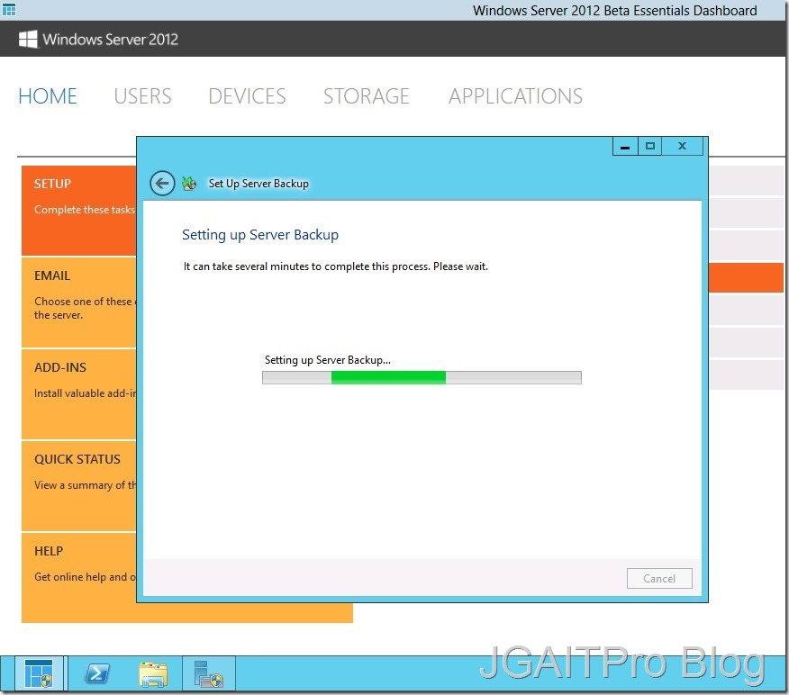

<properties
	pageTitle="Windows Server 2012 Essentials – Característica de Backup"
	description="Windows Server 2012 Essentials – Característica de Backup"
	services="servers"
	documentationCenter=""
	authors="andygonusa"
	manager=""
	editor="andygonusa"/>

<tags
	ms.service="servers"
	ms.workload="WS2012"
	ms.tgt_pltfrm="na"
	ms.devlang="na"
	ms.topic="how-to-article"
	ms.date="05/16/2016"
	ms.author="andygonusa"/>

#Windows Server 2012 Essentials – Característica de Backup

Por **Jair Gomez Arias**

[Blog](http://blogs.itpro.es/jairgomez/)

Hola a todos, continuando con la serie enfocada a **Windows Server 2012
Essentials** en esta ocasión veremos que poseemos de una característica
de Backup de la misma manera que en una edición completa, esta hace
parte del cuarto items que nos recomienda el Dashboard que configuremos.

Es muy importante en toda organización que se asegure la información y
como **Windows server 2012 Essentials** es enfocado a empresas que no
poseen soluciones de Backups mas completas como lo puede ser por ejemplo
un System Center Data Protection Manager, se pone a disposición esta
característica incluida en el servidor y sin adquirir otra licencia de
uso.

Con este podemos realizar un plan de recuperación ante desastres de
manera básica, realizar copias de archivos a discos duros, además de los
System State del nuestro S.O y así poder salvar nuestro entorno de
dominio.

Entonces veamos como es el funcionamiento, a lo cual debemos tener un
disco duro conectado a nuestro servidor o si en este caso es una Maquina
Virtual pues tener un VHD conectado por ISCSI, se recomiendan tener de 2
a 3 veces mas de espacio en disco al que se va a realizar Backup.

Para comenzar veremos como podemos lanzar el asistente de creación de
Backups desde el Dashboard

Comienza a configurarse la característica para su primer inicio.

Vemos una introducción a las posibilidades de Backup y que usos tiene.

    

A continuación vemos cuantos discos duros o en VHDs tenemos para
realizar la configuración de Copias de seguridad, como vemos no se
encuentra el disco C: porque seria estúpido realizar copias del mismo
disco al mismo disco.

    

Nos avisa que si estamos de acuerdo a utilizar este disco y que al
finalizar el asistente formateará esa unidad para completar la copia.

Definimos una etiqueta para nuestro volumen.

    

Aquí es donde comenzaremos a personalizar y configurar el Backup que en
este caso será programado y que se efectuara en una hora indicada todos
los días, podemos escoger entre dos Backups en el día para lo cual nos
dice que es recomendado, con esto en las dos horas definidas se llevara
acabo una copia, o que se lleve acabo una sola vez al día en una hora
también indicada.

    

El siguiente paso es elegir a que vamos a realizar Backup, como
recomendado nos marca el Estado del Sistema (System State) o Backup del
sistema, como practica recomendada, se debe realizar el Backup del
Sistema en un volumen diferente al de los archivos.

    

Por ultimo nos muestra un resumen de la configuración que acabamos de
hacer y podemos decirle que *Aplique la configuración.*

    

    

Finaliza el asistente y nos muestra cuando se realiza nuestro próximo o
primer Backup.

>
    

Y si volvemos al Dashboard vemos que ya tenemos completada la tarea de
Backup y operando.

Como vemos con esta característica que es muy fácil de operar desde el
Dashboard de **Windows server 2012 Essentials** nos proporciona una
manera confiable de tener nuestros S.O servidor y también nuestros
datos, además podemos volver a cambiar toda esta configuración de Backup
en el momento que nuestro entorno lo solicite.

Espero les sea de mucha ayuda y que para pequeñas empresas con **Windows
Server 2012 Essentials** tenemos una gran ventaja de ofrecer servicios
completos.

Muchas Gracias.
