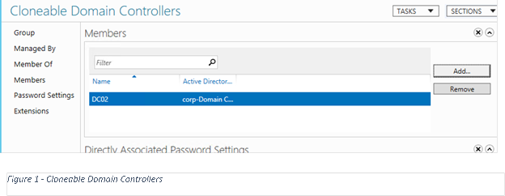
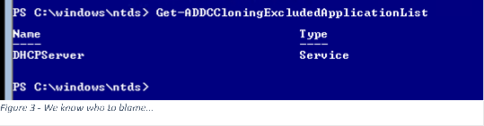
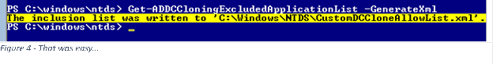
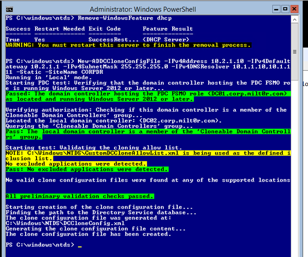
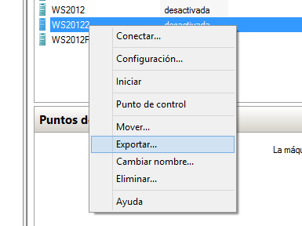
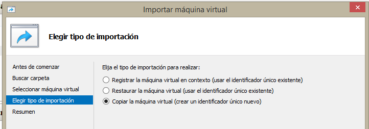
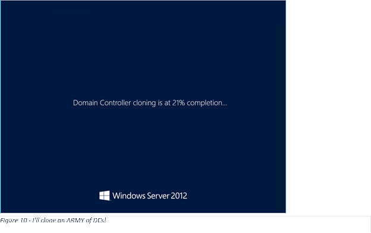

#Clonando DCs de Windows Server 2012

Por **Juan José Diaz Antuña**, @diazantuna 

Microsoft MVP

Windows Expert-IT Pro

Una de las novedades de Directorio Activo con Windows Server 2012 y
mejorada en R2 es la posibilidad de clonar un DC para posteriormente
implementar DCs adicionales en mi dominio.

El clonar un DC supone la ventaja de una implementación más rápida de tu
estructura de Directorio Activo y DCs adicionales.

Los controladores de dominio clonados pueden utilizarse para:

Rápida implementación de controladores de dominio

Optimización de implementación en nubes privadas

Estrategia de recuperación, rápida restauración ante desastres

Requerimientos
--------------

El Hypervisor debe de soportar VM-GenerationId, hoy en día soportado por
Hyper-V 2012 y VMware Vsphere 5.1 y 5.5 con los ESX a 5.0 Update 2.

El DC de origen debe de ser un Windows Server 2012 o posterior.

Debe de haber contacto con el DC con el rol de PDC emulator, que además
debe de estar en Windows Server 2012 o posterior.

Creación del clon
-----------------

Para poder crear el clon, un usuario perteneciente al grupo
**Administradores del Dominio** debe de preparar el DC.

Lo primero que debemos de hacer es meter el DC que queremos clonar en el
grupo de seguridad **Controladores de dominio clonables (Si el nombre
del grupo está en castellano os va dar un error, debéis de cambiarlo a
inglés Clonable Domains Controllers).** Una vez clonado el DC es una
buena práctica el sacarlo del grupo.

    

El siguiente paso será generar el fichero DCCloneConfig.xml, este
fichero se puede crear a mano o por PowerShell, pero debe de residir en
la misma ubicación que la base de datos, normalmente en
C:\\Windows\\ntds

El fichero incluye valores que distinguen a ese DC como configuración de
red (DNS, WINS, IP) el sitio de Active Directory, el nombre del DC etc.

Podéis ver todos los campos ejecutando la ayuda de PowerShell para el
comando New-ADDCCloneConfigFile

***Get-Help New-ADDCCloneConfig –Full***

Antes de crear este fichero debemos de comprobar que nuestro DC es
válido, ya que puede tener roles o características instaladas no válidas
para clonar. Para comprobarlo ejecutamos el comando
***Get-ADDCCloningExcludeApplicationList***

    

Si aparece algún servicio o aplicación no valido o del que se desconoce
si funcionara en el clon, tenemos dos opciones, una obvia que sería
quitar el servicio o aplicación correspondiente, y la otra añadirlo a la
lista de aplicaciones o servicios válidos para clonar. Lógicamente
deberemos de probar que va a funcionar la aplicación después de ser
clonado

Si escoges esta última opción debes de generar el archivo
***CloningExcludedApplicationList*** mediante el comando
***Get-ADDCCloningExcludeApplicationList –GenerateXML***

    

A continuación generamos nuestro fichero DCCloneConfig.xml, por ejemplo:

### New-ADDCCloneConfigFile -CloneComputerName "ClonDC2"-IPv4Address 10.0.100.10 -IPv4DefaultGateway 10.0.100.1 -IPv4SubnetMask 255.255.255.0 -IPv4DNSResolver 10.0.100.10 -Static -SiteName Oviedo

    

Una vez creado nuestro fichero solo debemos de exportar el DC, que como
sabéis en 2012 R2 podemos hacerlo en caliente aunque es recomendable
para este caso hacerlo con la maquina apagada.

    

Y por último debemos de importar la nueva máquina en nuestro Hypervisor
con la opción de generar un nuevo ID para el clon Insert Caption

    

Una vez importada la iniciamos y ya está.

    

Si quisiéramos implementar más controladores de dominio a partir del
clon, solo deberíamos modificar el fichero DCCLoneConfig.xml,
introduciendo los nuevos parámetros. Otra posibilidad es haber dejado el
nombre en automático y la IP por DHCP. El nombre dinámico se configura
cuando no introducimos ningún nombre de equipo en el fichero
DCCLoneConfig.xml.

Para modificar el fichero DCCloneConfig.xml para generar múltiples DC:

1. Creamos el disco virtual clonado exportando e importando la
    máquina virtual.

2.  Montar el nuevo disco virtual, de alguna de estas formas:

    * Doble clic sobre el disco

    * Usando Diskpart.exe.

    * Usando el cmdle Mount-DiskImage desde Windows PowerShell.

3. Utilizar el comando New-ADDCCloneConfigFile cmdlet.con los
    parámetros –offline y –path, donde E: debe de ser cambiada por la
    letra de unidad utilizada al montar el disco virtual:

    **New-ADDCCloneConfigFile –CloneComputerName LON-DC3 –Offline –Path
E:\\Windows\\NTDS**

4. Desmontar el disco virtual utilizando diskpart o mendiante o el
    cmdlet Dismount-DiskImage

