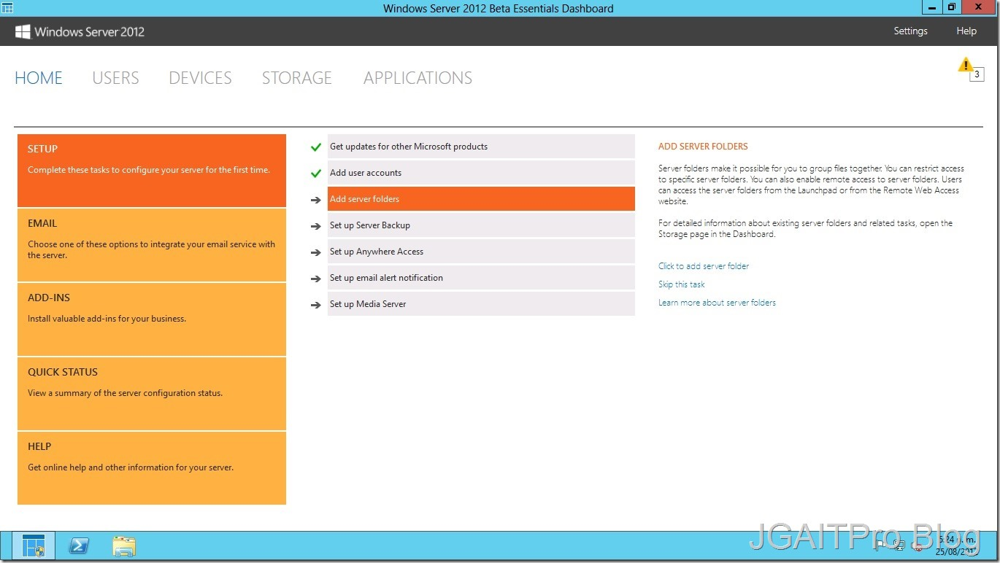
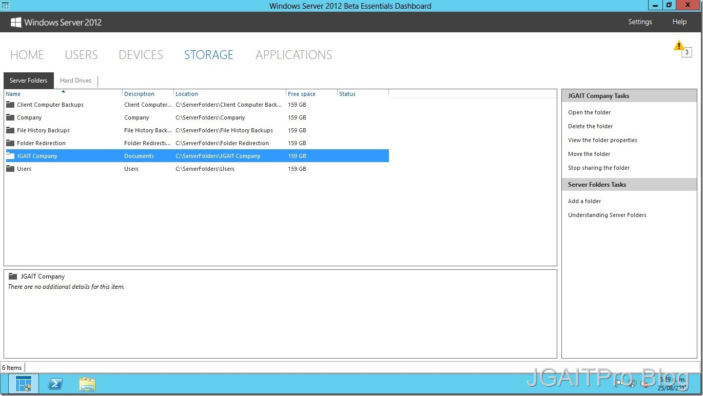

<properties
	pageTitle="Windows Server 2012 Essentials – Crear carpetas compartidas"
	description="Windows Server 2012 Essentials – Crear carpetas compartidas"
	services="servers"
	documentationCenter=""
	authors="andygonusa"
	manager=""
	editor="andygonusa"/>

<tags
	ms.service="servers"
	ms.workload="WS2012"
	ms.tgt_pltfrm="na"
	ms.devlang="na"
	ms.topic="how-to-article"
	ms.date="05/16/2016"
	ms.author="andygonusa"/>

#Windows Server 2012 Essentials – Crear carpetas compartidas

Por **Jair Gomez Arias**

[Blog](http://blogs.itpro.es/jairgomez/)
  

Hola a todos, después de revisar las primeras opciones de administración
en **Windows Server 2012 Essentials** veremos como es el proceso para la
creación de una carpeta compartida, para muchos puede ser esto algo muy
básico, pero hay que revisar que cambios se ven reflejados en cuanto
ediciones Standard o Datacenter.

En el anterior articulo sobre la creación de usuarios en nuestro
dominio, el cual se instala y configura automáticamente a la hora de la
instalación del S.O, mirábamos que en el Dashboard que proporciona
Essentials se detallan ciertos items que recomienda ir cumpliendo, la
creación de carpetas es el tercero.

Para la llevar a cabo este item solo debemos lanzar el asistente para
esta creación de folders.

Definimos el nombre del mismo y en que ubicación en disco se encontrará
a la vez una descripción de su contenido o uso.

    

En este segundo paso del asistente definimos los permisos que se le
otorgaran a los usuarios ya creados en nuestro dominio, los permisos
indicados según nuestra necesidad que posea este, podemos definir
Lectura/Escritura, Lectura, o denegado el acceso, como sabemos la
edición de Windows server 2012 Essentials esta destinada a entornos de
trabajo pequeños, por lo cual no tendremos muchos usuarios en nuestra
estructura de dominio.

    

Comienza la creación de la carpeta compartida.

    

Vemos que se ha creado el recurso compartido y ver la ruta de acceso al
Servidor.

    

Al finalizar veremos que ya se nos ha marcado como realizado el
procedimiento en el Dashboard como los casos anteriores.

Y por ultimo, podemos ver en la pestaña **Storage**, se encuentra la
carpeta compartida y sus propiedades, también unas series de acciones al
lado derecho que podemos efectuar sobre la misma.

Con esto vemos que son cosas muy sencillas, pero como esta edición de
Windows Server 2012 esta destinada a un termino que llama Microsoft
***“Mi Primer Servidor”*** son para empresas que no tienen un
departamento de TI definido y que el motivo de este Dashboard sea así
sencillo es que se facilite todo a la hora de administrar las diferentes
funciones.

Muchas Gracias y nos vemos en la próxima.
