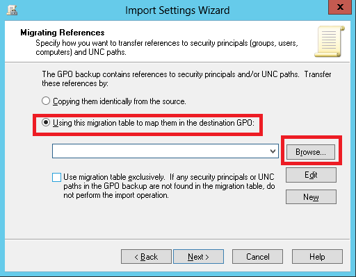

#Migración del Group Policy Object

Por [Juan José Diaz
Antuña](http://mvp.microsoft.com/en-us/mvp/Juan%20Jose%20Diaz%20Antu%c3%b1a-5000260),
[@diazantuna ](https://twitter.com/diazantunahttps:/twitter.com/diazantuna)

Windows Expert-IT Pro

En este artículo vamos a ver cómo llevar GPO’s de un dominio de pruebas
a un dominio de producción, o como migrar GPO´s de un dominio a otro.
Esta operación es bastante habitual, ya que normalmente probamos las
configuraciones (settings) de nuestras GPO’s previamente.

Vamos a ver un paso a paso de cómo hacerlo. Para ello solo voy a
utilizar la consola de Administración de Directivas de Grupo o GPMC. En
mi laboratorio tengo dos dominios con un controlador cada uno de ellos.

Dominio origen – Controlador de dominio Origen
----------------------------------------------

Lo primero que hacemos es un backup de las GPO’s a migrar en un
controlador de dominio del dominio origen.

Esto lo que hace es una copia de todas las directivas de SYSVOL, o lo
que es lo mismo, de mi dominio. Indico el path donde dejar la copia.

Progreso del backup

Compruebo que el backup se ha hecho en la ubicación indicada

Una vez hecho el backup debo de ir al dominio de destino, a uno de sus
controladores de dominio y acceder a la consola de GPMC

En el menú Action, selecciono Open Migration Table Editor

En la ventana de Migration Table Editor, en el menú selecciono Tools y
dentro Populate from Backup

Busco en la ubicación donde he dejado el backup

Se nos muestra objetos principales específicos del dominio de origen y
que deberíamos de cambiar y sustituirlos por los del dominio de destino.

Para hacerlo hago botón derecho sobre el objeto de origen y selecciono
Browse

Una vez encontrados todos los objetos y sustituirlos por los del dominio
de destino debo de guardar la tabla de migración. Para ello voy a File –
Save As

Una vez guardada la tabla debo de recrear las GPO en el dominio de
destino. Para ello voy a Group Policy Objects y selección New

Y creo una GPO

Ahora vamos a importar los Settings. Para ello hago botón derecho sobre
la GPO y selección Import Settings

Se nos muestra el asistente

Puedo hacer un backup previo de la GPO antes de importar los nuevos
settings. En nuestro caso la GPO no tiene nada configurado con lo que no
voy a hacer el backup

Busco el directorio del backup

Selecciono la directiva del backup

Ahora selecciono la tabla de migración que cree antes

Y finalizo

