#LAB Virtual WS 2012 y Windows 8 [Parte 2] – Instalación y Configuración en Windows Server 2012 de los roles: Active Directory, DNS, DHCP

Por [Jesús Enrique
Gonzales](http://mvp.microsoft.com/en-us/mvp/Jesus%20Enrique%20Gonzales%20Azcarate-5000714)

Blog: <http://geeks.ms/blogs/JesusGonzales/>

<http://pe.linkedin.com/pub/jesus-enrique-gonzales-azcarate/24/a41/530>

Continuamos con la elaboración de la segunda parte de la serie, así
vamos teniendo listo nuestro LAB con WS 2012 para luego realizar un
despliegue con Windows Deployment Services de Windows 8.

Ahora procedemos a realizar la instalación de Active Directory Domain
Services, así luego podemos concluir con la instalación de AD.

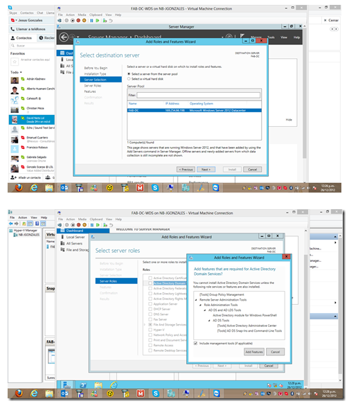

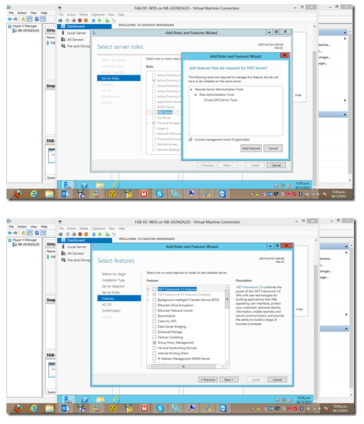
    

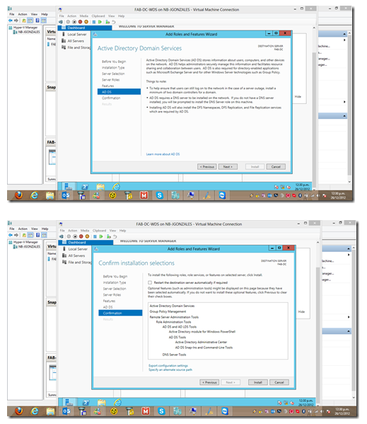
    

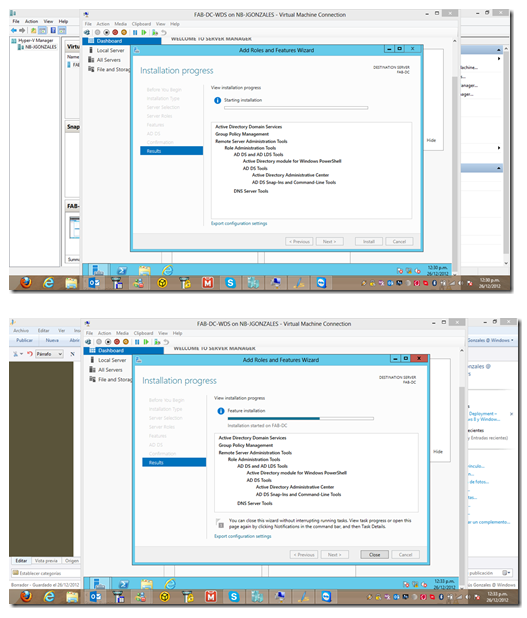
    

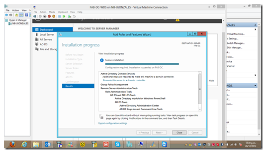
    

Una vez finalizada la instalación de Active Directory Domain Services,
podemos observar en el Server Manager una advertencia indicando que
falta ejecutar el asistente para la configuración de Active Directory. 

    

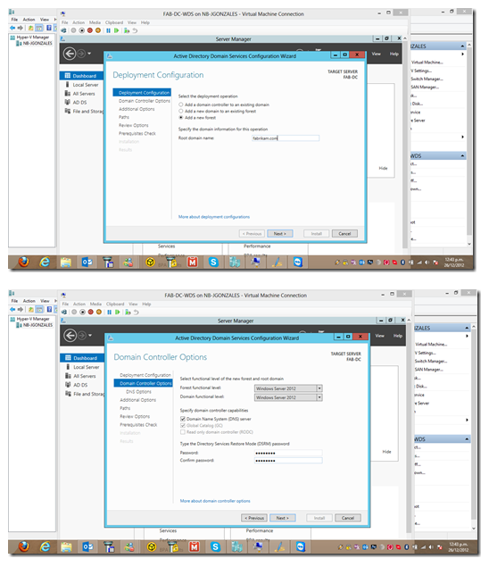
    

Se agrega de forma automática el rol de DNS:

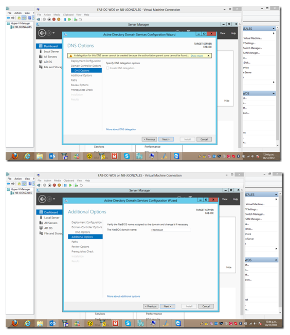
    

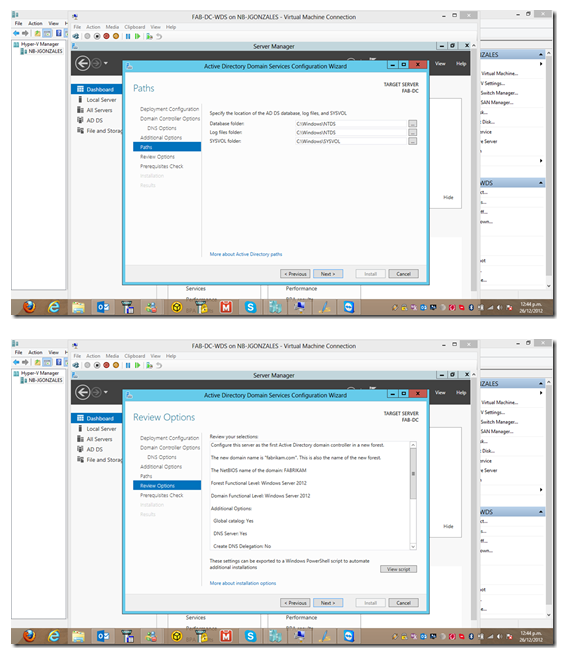
    

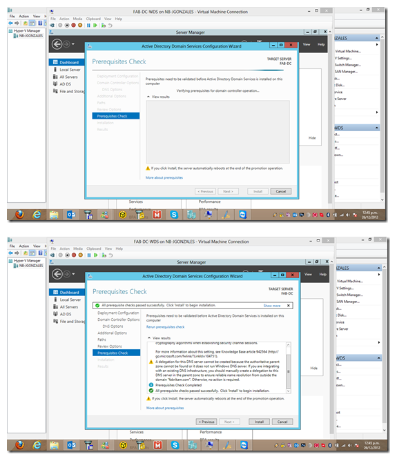
    

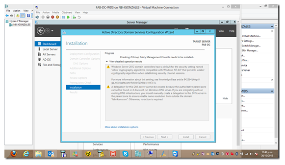
    

Reinicia el servidor y ahora nos autenticamos en el DC con la cuenta y
password respectivo:

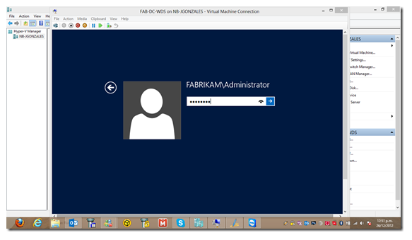
    

Nos dirijimos al Server Manager y agregamos el rol de DHCP:

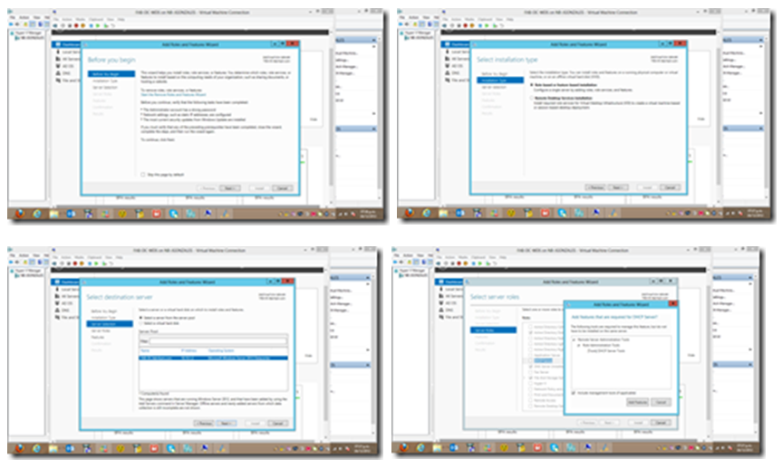
    

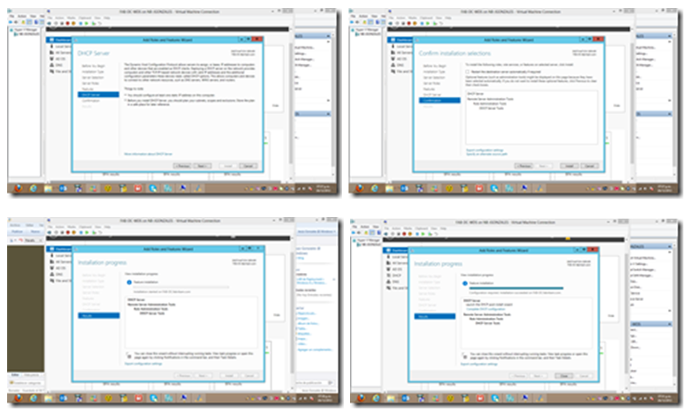
    

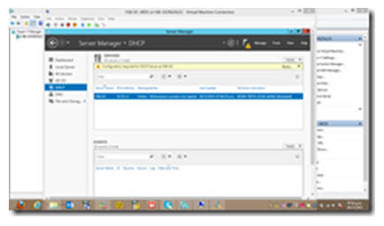
    

Ingresamos al DHCP para configurar el Scope respectivo:

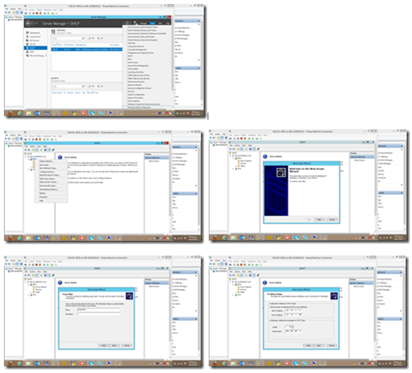
    

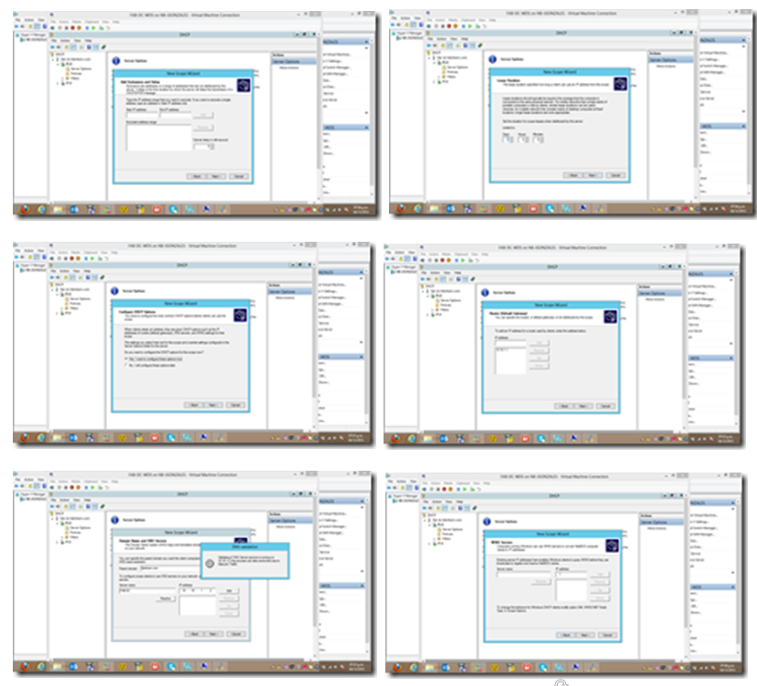
    

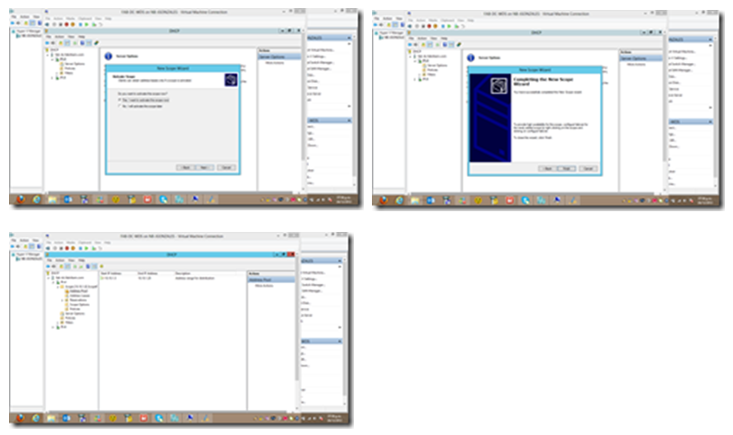
    

Hasta el momento ya tenemos configurado nuestro servidor WS 2012 como
DC, DNS y DHCP.

Continuaremos con la elaboración de la serie, ahora faltaría instalar y
configurar WDS para realizar el despliegue de Windows 8 por la red.

Saludos!

