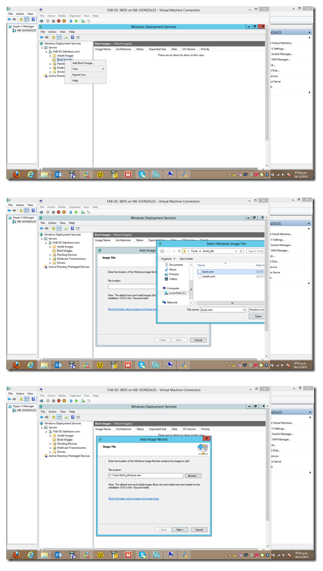
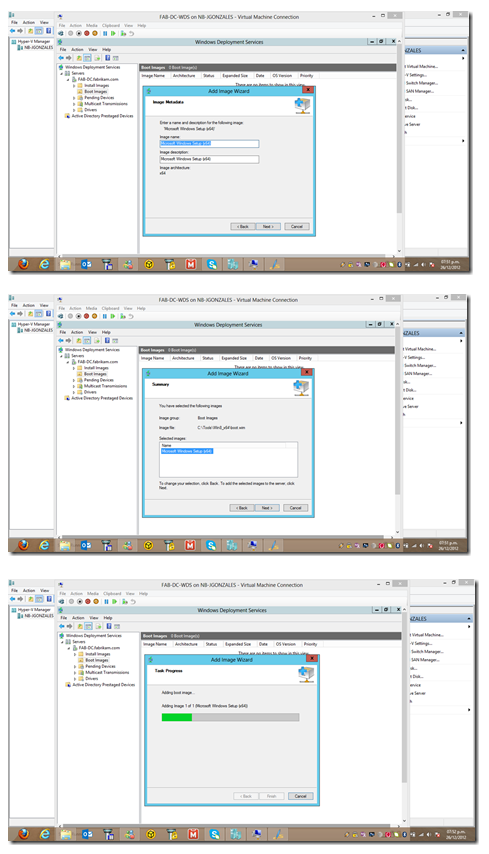
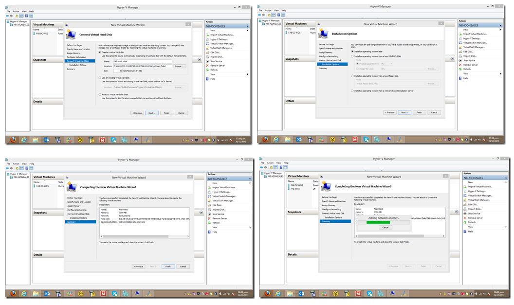
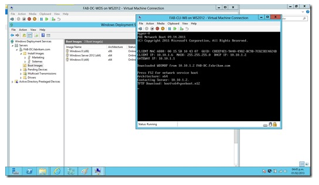
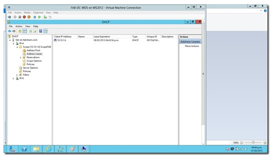
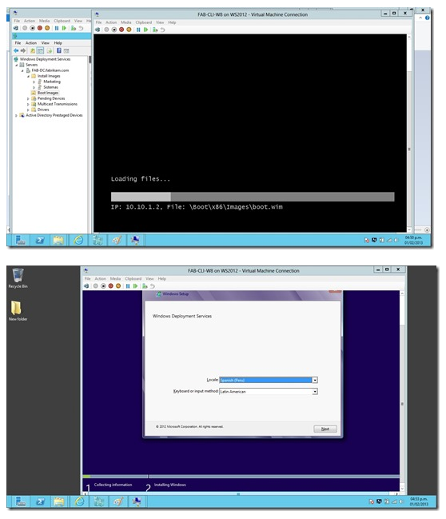
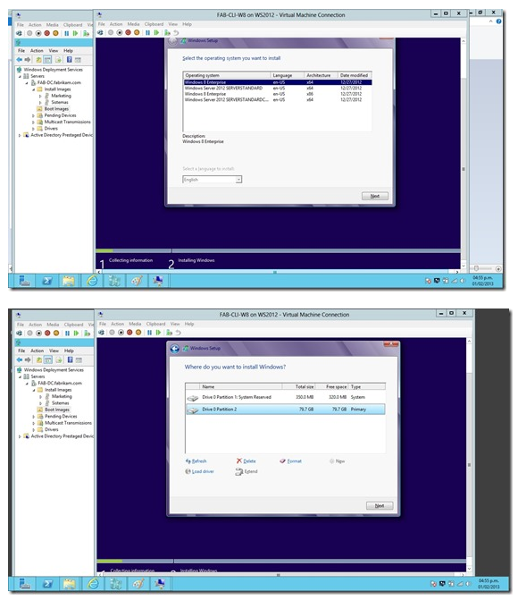

#LAB Virtual WS 2012 y Windows 8 [Parte 4] – Agregando las imágenes de Windows 8 a WDS y haciendo el despliegue mediante la red

Por [Jesús Enrique
Gonzales](http://mvp.microsoft.com/en-us/mvp/Jesus%20Enrique%20Gonzales%20Azcarate-5000714)

Blog: http://geeks.ms/blogs/JesusGonzales/

<http://pe.linkedin.com/pub/jesus-enrique-gonzales-azcarate/24/a41/530>

En esta 4ta parte de la serie de artículos, estaremos agregando las
imágenes de Boot e Instalación (boot.wim/install.wim) a

Windows Deployment Services. Estos archivos se encuentran dentro del DVD
de instalación de Windows 8, dentro de la carpeta sources.

Pueden descargar una copia trial de Windows 8 Enterprise desde:
<http://msdn.microsoft.com/en-us/evalcenter/jj554510.aspx>

Una vez terminada la configuración de agregar las imagenes .WIM, debemos
de crear una nueva máquina virtual para que simule nuestro cliente
Windows 8, y éste pueda bootear por la red conectandose al DHCP y
haciendole la petición que le entregue una dirección del scope
configurado.

Creamos nuestro cliente Windows 8:

A tener en cuenta, para que la máquina virtual pueda realizar el boot de
la red necesitamos agregar el adaptador de red legacy:

Ahora encendemos el cliente virtual, de esta forma se comunicará con el
DHCP para solicitar una dirección IP, presionamos F12 para que haga el
boot por la red mediante PXE:

Notamos en el DHCP que ya le entregó una dirección de IP válida:

Ahora seleccionamos la imagen de boot del S.O. a elegir:

Empieza la transferencia y carga del archivo boot.wim:

Una vez dentro del ambiente de preinstalación de windows, ingresamos las
credenciales del administrador del dominio o una cuenta similar, así
aparecerán las imagenes disponibles:

Y el proceso de instalación sigue su curso:

Podemos personalizar un archivo de instalación para que de esta forma
sea totalmente desatendido (que se instale de forma automática sin la
intervención del usuario). Para eso podemos utilizar System Image
Manager que viene dentro del paquete de herramientas de The Windows®
Assessment and Deployment Kit (Windows
ADK)(<http://www.microsoft.com/en-us/download/details.aspx?id=30652>)

Con esto finalizamos esta parte de configuración y deploy con WDS.
Continuaremos en nuestra próxima entrega commo hacer la instalación y
configuración para un deploy de Windows 8 con Microsoft Deployment
Toolkit 2012 Update 1.

Saludos!

