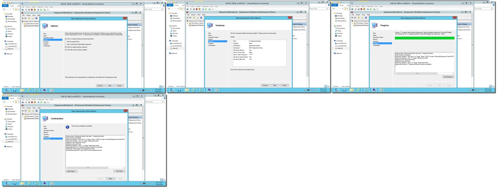

#LAB Virtual WS 2012 y Windows 8 [Parte 5] – Instalación y Configuración de Microsoft Deployment Toolkit 2012 (MDT) Update 1

Por [Jesús Enrique
Gonzales](http://mvp.microsoft.com/en-us/mvp/Jesus%20Enrique%20Gonzales%20Azcarate-5000714)

Blog: <http://geeks.ms/blogs/JesusGonzales/>

<http://pe.linkedin.com/pub/jesus-enrique-gonzales-azcarate/24/a41/530>

Ahora nos toca revisar como realizar la instalación y configuración del
MDT 2012, herramienta que forma parte de las soluciones de aceleración
de Microsoft para los proyectos de Despliegue.

Aquí les comparto el procedimiento:

En una próxima entrega estaremos revisando como agregar los paquetes de
instalación de Windows 8 y de Office 2010, así podemos armar una imagen
total para el despliegue.

Saludos!

