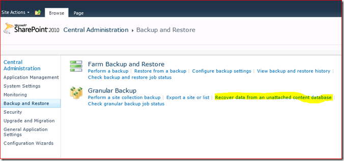
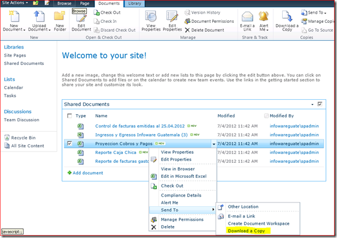

#Recuperando un documento de una base de datos de contenido desconectada SharePoint 2010

**Juan Manuel (Manolo) Herrera**

Amante de la tecnologia .NET, disfruto mucho enseñando y compartiendo la experiencia y conocimientos adquiridos de la tecnología.
En busca siempre por la alta calidad, mi investigación es sobre patrones de diseño, desarrollo ágil y factories. Soy un fiel seguidor y aprendiz de "Refactoring" y "Desing Patterns".

[Blog](http://jmhogua.blogspot.mx/)

*Octubre 2012*

Suele suceder en el manejo de documentos dentro de SharePoint 2010 que
un documento con modificaciones recientes es reemplazado por uno más
antiguo o vacío y sino se tiene habilitada la opción de versionamiento
en la biblioteca no podrá el usuario final recuperar la versión anterior
tendrá que escalar el requerimiento al departamento de IT para restaurar
una copia de respaldo y aquí es donde entra la opción nueva de
SharePoint 2010 denominada “Recover data from an unattached content
database” dentro del Central Administration. Esta opción nos permitirá
restaurar una copia de respaldo de SQL Server con otro nombre y de forma
desconectada extraer el contenido del mismo para recuperarlo.

Esta opción no existía en 2007 y se tenía que recurrir a herramientas de
terceros o a restaurar todo un ambiente de granja de SharePoint separado
para realizarlo. Hoy con SharePoint 2010 aunque no es una opción tan
automatizada como se desearía si nos brinda el camino para realizar una
restauración relativamente sencilla.

El procedimiento que realizaremos para la recuperación es el siguiente:

1\.  Identificar el nombre de la base de datos de Contenido donde esta el
    documento que se desea recuperar. Ejecute en PowerShell for
    SharePoint 2010 la siguiente línea de comando:

    Get-SPContentDatabase –site [url site collecction]

El resultado debería ser similar al siguiente:

    Id : 33cc84ba-3243-4e69-b542-c1d5ec18f6c8
    Name : WSS_Content_Administracion
    WebApplication : SPWebApplication Name=SharePoint - 80 - Portal
    Infoware
    Server : Infoware-WFE-01
    CurrentSiteCount : 1

En la línea “Name” encontrará el nombre de la base de datos de contenido
que esta buscando.

2\.  Restaurar la copia de respaldo de la base de datos de contenido
    deseada en el Servidor de SQL Server disponible (si es el mismo de
    SharePoint restaurar la base de datos de contenido con otro nombre)

    

Para mas información de cómo restaurar una base de datos en SQL Server
ir a: http://technet.microsoft.com/en-us/library/ms177429.aspx

3\.  Ahora nos conectamos al Central Administration por medio del
    navegador y vamos a la opción “Backup and Restore” y seleccionamos
    la opción “Recover data from and unattached content database”

4\.  Llenamos los campos requeridos. En este caso es solo necesitamos el
    nombre de la base de datos de contenido y presionar el botón Next.

    

5\.  Seleccione la colección de sitios, el sitio donde esta la biblioteca
    y en list: la biblioteca donde esta el documento a restaurar. Por
    ultimo seleccione la opción “Export site or list”, y presione el
    botón Next.

6\.  Escriba en la casilla “FileName:” la ruta y el nombre del archivo
    donde desea depositar el contenido. En esta caso como solo vamos a
    recuperar un documento no nos interesa recuperar la seguridad.
    Continue el proceso presionando el botón Start Export.

7\.  Espere a que le indique que a finalizado el proceso .

8\.  Ahora vamos a crear una base de datos de contenido nueva solo para
    depositar el backup y extraer el documento que deseamos. Para eso
    ejecute la siguiente línea de comando:

    New-SPContentDatabase –Name [DatabaseName] –WebApplication
    [WebApplication]

Reemplace \[DatabaseName\] con algo como WSS\_Content\_Recuperacion.
    Y \[WebApplication\] con el nombre de la aplicación Web a la que va
    asociar esta nueva base de contenido. Por ejemplo: <http://miportal>

9\.  Ahora vamos a crear el sitio primario de la colección de sitios de
    esta nueva base de datos para que podamos importar el contenido
    extraído anteriormente. Ejecute la siguiente línea de comando en una
    instancia de PowerShell for SharePoint 2010:

    New-SPSite –Url [FullUrl] –Template [Template] –ContentDatabase
    [DatabaseName] –Name [Title] -owneralias [PrimaryOwner]
    -Language [Language]

Reemplace \[FullUrl\] por la ruta donde va a crear la nueva
    colección de sitios. Ejemplo: http://miportal/area/recuperacion

Reemplace \[Template\] por el nombre de la plantilla equivalente al
contenido extraído. Que en este caso en una plantilla de Equipo por
lo que debe de escribir STS\#0. Para listar las plantillas
disponibles y sus codigos ejecute la línea de comando:
Get-SPWebTemplate o
consulte http://technet.microsoft.com/en-us/library/ff607910.aspx.

Reemplace \[DatabaseName\] por el nombre de la base de datos de
contenido recién creada para este propósito. El nombre utilizado
es WSS\_Content\_Recuperacion.

Reemplace \[Title\] por el título del sitio primario entre comías si
lleva espacios, algo como: “Recuperación\]

Reemplace \[PrimaryOwner\] por el nombre del usuario que esta
utilizando para realizar este proceso.
Ejemplo: midominio\\esteusuario.

Reemplace \[Language\] por el código del lenguaje del contenido
a recuperar. En este caso es inglés entonces corresponde el código
1033 y si fuera español por ejemplo es 3082. Para conocer la lista
completa de códigos de idiomas utilizados en SharePoint
vea: http://technet.microsoft.com/en-us/library/ff463597.aspx.

10\.  Si todo fue un éxito podrá navegar a la dirección y ver el sitio
    como le muestro a continuación:

11\.  Listo el sitio donde vamos a recuperar el documento, vamos a
    ejecutar la línea de comando desde PowerShell for SharePoint 2010
    que importará el contenido a este sitio. Ejecute la siguiente línea:

    import-SPWeb <http://portal.infowareguate.com/area/recuperacion>
    -path c:\temp\documentoArecuperar.cmp -updateversions overwrite

Reemplace el valor del parámetro -SPWeb por la url que corresponda a
su instalación y el valor del parámetro –path donde este tiene
ubicado el archivo .cmp donde extrajo el contenido. Al finalizar el
proceso le indicará que ha creado un archivo log, reviselo para
validar que el contenido pudo ser extraído.

    Log file generated:
    c:\temp\documentoArecuperar.cmp.import.log

12\.  Ahora el ultimo paso depende de usted y es que valide con el usuario
    final si es el documento con la información que espera. Si lo es
    solo le queda descargar el archivo de la biblioteca y subirlo a la
    biblioteca indicada.

    

En este artículos vimos como recuperar un documento de una copia de
respaldo de la base de datos de contenido en SQL Server, utilizando la
opción “Recover data from an unattached content database” el Central
Administration de SharePoint 2010. Y por ultimo favor habilítele al
usuario el versionamiento en la biblioteca, limitando la cantidad de
versiones por documento para controlar el crecimiento de la biblioteca.
Cómo hacerlo en la siguiente dirección:
<http://technet.microsoft.com/es-es/library/ff718246> 

