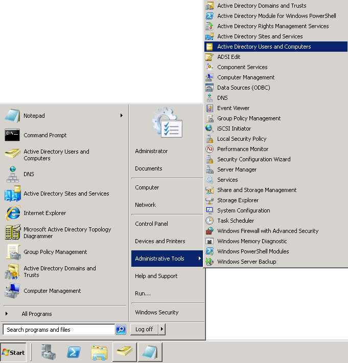
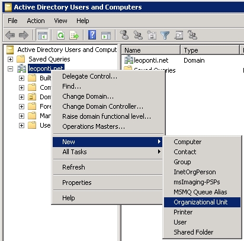
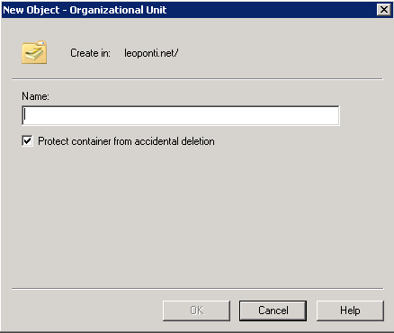
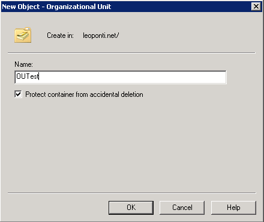
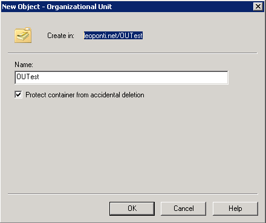
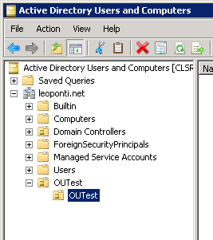
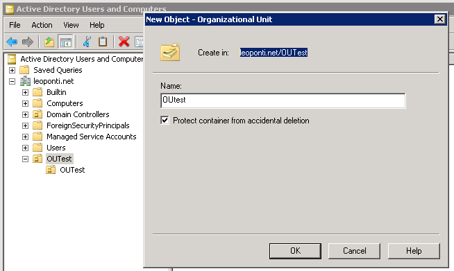
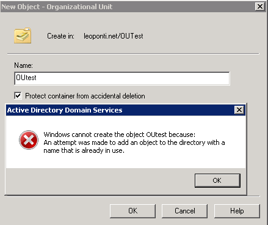

<properties
	pageTitle="Generando Unidades Organizativas en Active Directory"
	description="Generando Unidades Organizativas en Active Directory"
	services="servers"
	documentationCenter=""
	authors="andygonusa"
	manager=""
	editor="andygonusa"/>

<tags
	ms.service="servers"
	ms.workload="AD"
	ms.tgt_pltfrm="na"
	ms.devlang="na"
	ms.topic="how-to-article"
	ms.date="05/16/2016"
	ms.author="andygonusa"/>
#Generando Unidades Organizativas en Active Directory

Por **Leonardo Ponti**
                                                                                  
Especialista en Directory Services luego de Manejar la infraestructura desde el año 2003, pasando por migración de versiones, diseños, implementaciones, soporte, consultoría, testing, ofreciendo desde un principio la mejora continua del producto en las empresas que vi directamente la implementación o indirectamente desde el área de soporte Online   

[Blog](http://blogs.itpro.es/leoponti)

Octubre 2012

Hola a todos!

En esta oportunidad, como vengo haciendo en artículos anteriores, me
gustaría dejarles estos sencillos pasos de como crear distintos objetos
en nuestro dominio de Active Directory, en esta oportunidad, voy a
dejarles como crear Unidades Organizativas en Active Directory.

### *¿Que es una Unidad Organizativa (de ahora en mas diremos OU)? *

Simplemente, es un contenedor donde se pueden poner distintos objetos de
Active Directory como Usuarios, Computadoras, Grupos y hasta otras OUs.
Dentro de las mismas, podemos delegar permisos de Administración sobre
los objetos que tenemos dentro y podemos adjuntar políticas de dominio,
para aplicar distintas configuraciones sobre los tipos de objetos que
tengamos dentro.-

Para crear una OU desde la Consola de administración de Usuarios y
Computadoras, para lo cual, tenemos que estar trabajando desde un Domain
Controller o desde un equipo donde tengamos en Windows Server 2003 o
Windows XP las Herramientas Administrativas de Active Directory o en
Windows Server 2008 o Superior, el Feature de Administración instalado.

Luego hacemos **Start – Administrative Tools – Active Directory Users
and Computers** como se muestra en la siguiente pantalla:

    

También podemos abrir la consola, desde **Start – Run -** Poniendo la
llamada a la consola **dsa.msc**

Dentro de la consola de Active Directory que abriremos, nos vamos a la
OU ya existente o al raiz del dominio como muestro, donde queremos
generar la nueva OU, y ahí desplegamos el menu y vamos: **New –
Organizational Unit**:

    

Al seleccionar la opción según la pantalla, nos aparecerá la siguiente
ventana para cargar la OU:

    

La opción “Protect container from accidental deletion”, si la dejamos
tildada, aplicara una seguridad que evitará el borrar la OU en forma
accidental, si esta opción no la queremos tener, solo tenemos que
destildarla (esta tema lo hablamos en el blog: [VIDEO – Protection from
Accidental Deletion by
LeoPonti](http://blogs.itpro.es/leoponti/2012/08/30/video-protection-from-accidental-deletion-by-leoponti/))

Ponemos entonces, en el recuadro “Name”, el nombre de la OU que deseamos
crear:

    

Luego, como comente al principio, dentro de una OU, podemos también
crear otra OU y bajo la estructura de contenedores que querramos aplicar
y sea la mejor para nuestra empresa, ya que podemos organizar los
objetos de nuestro dominio como lo deseemos y de la forma que seria mas
práctica para administrarlos. Entonces, quedando el directorio como
leoponti.net/OUTest, crearemos otra OU “OUTest” dentro de la detallada,
como se muesta a continuación:

    

Quedando las OUs creadas, de la siguiente manera:

    

Sobre los nombres de OU, como mostramos anteriormente, podemos crear con
el mismo nombre siempre y cuando una este dentro de otra, no podemos
crear dos OUs con el mismo nombre, estando en la misma ruta de
directorio, de quererlo hacer como les muestro a continuación nos
aparecerá el error como les muestro:

Generaremos dentro de leoponti.net/OUTest, la OU “OUTest” existiendo
previamente una OU con el mismo nombre y en el mismo directorio:

    

Donde nos aparecerá el siguiente error:

    

De esta forma, les muestro también una limitación con la estructura de
nombres que querramos aplicar, ya que dentro de un mismo directorio de
OU, no podemos generar dos sub-OUs con el mismo nombre.

Espero que este artículo les sea de interés y puedan generar las OUs que
deseen, facilitando la administración de los objetos que tengamos en
nuestro Active Directory.
