  -------------------------------------------------------------------------------------------------------------------------------------------------------------------------------------------------------
  Juan Manuel (Manolo) Herrera                                                                                                                                                             Octubre 2012
                                                                                                                                                                                           
  Mas de 16 años como desarrollador de software para aplicaciones agrícola comerciales.\                                                                                                   
  \                                                                                                                                                                                        
  Amante de la tecnología .NET, disfruto mucho enseñando y compartiendo la experiencia y conocimientos adquiridos de la tecnología.\                                                       
  \                                                                                                                                                                                        
  En busca siempre por la alta calidad, mi investigación es sobre patrones de diseño, desarrollo ágil y factories. Soy un fiel seguidor y aprendiz de "Refactoring" y "Desing Patterns".   
  ---------------------------------------------------------------------------------------------------------------------------------------------------------------------------------------- --------------
  [Blog](http://jmhogua.blogspot.com/)
  -------------------------------------------------------------------------------------------------------------------------------------------------------------------------------------------------------

Esto es posible gracias a la opción “Incoming E-mail” disponible en
SharePoint 2010 en cualquiera de sus versiones
(Foundation,Standard,Enterprise). En este artículo vamos a ver como
configurarlo y que problemas podemos encontrar y posibles soluciones.

Los pasos resumidos a seguir son los siguientes:

1.  Configurar el servicio SMTP en el Front-End de SharePoint.

2.  Configurar la opción Incoming E-mail en el Central Administration.

3.  Configurar la lista de Blog.

4.  Validar registros MX y Puertos.

5.  Realizar las pruebas de funcionalidad.

Veamos a detalle cada uno de estos pasos.

### **Breve explicación del proceso**

El servicio SMTP de Windows nos permitirá escuchar en el puerto 25 (el
predeterminado) los correos que se redirecciones al servidor Front-End
de SharePoint, los cuales serán descargados en una carpeta de correo de
descarga, luego el mensaje será tomado por el Timer Service de
SharePoint 2010 a través del Timer-Job llamado (que esta disponible
hasta después de realizar el paso 2). Y este redirige el mensaje a la
lista que tiene la cuenta de correo especificada (Paso 3), donde es
depositada. No todas las listas tiene esta opción de recibir correos
como entradas (por ejemplo las tareas) y no todas las listas acepta el
formato del correo como (el calendario, necesario un evento con formato
ics), pero entre las mas usadas las bibliotecas y los blogs.

### **Paso 1:**

Valide si ya tiene el Servicio SMTP en el servidor Front-End de
SharePoint, sino siga el enlace de abajo.

Para instalar el servicio de SMTP de Windows Server favor seguir este
enlace:
http://technet.microsoft.com/es-es/library/cc772058(v=ws.10).aspx

Una vez que ya tenga el servicio instalado en el Front-End lo
configuraremos haciendo lo siguiente:

Creando un nuevo alias: Ejecute el IIS 6.0 Manager, luego presione clic
derecho sobre Domains, New y luego Domain…

1.  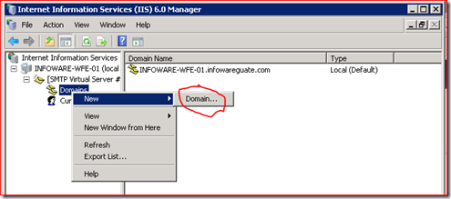{width="5.15833552055993in"
    height="2.2821719160104985in"}

Luego seleccione la opción Alias y luego presione el botón Next.

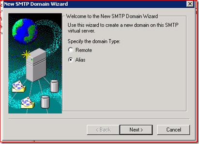{width="4.282981189851268in"
height="3.0950010936132983in"}

Seleccione un alias para este servicio. Para este ejemplo escogeremos
smtp.infowareplus.com por ultimo presione el botón Finish.

1.  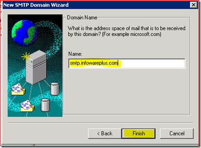{width="4.303823272090988in"
    height="3.16794728783902in"}

Nota: No se olvide de configurar el servicio para que inicie
automáticamente y su recuperación en caso de falla es que se reinicie
cada 5 minutos como se muestra en las imágenes de abajo:

1.  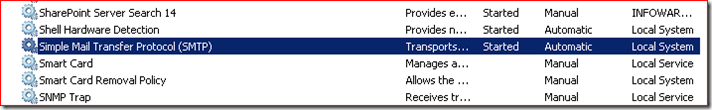{width="6.5in"
    height="1.0041666666666667in"}

    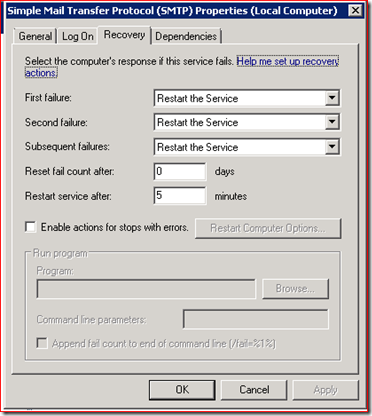{width="3.876567147856518in"
    height="4.33508530183727in"}

Ahora solo vamos a copiar la ruta del directorio de descarga o Drop
Directory que utilizaremos en el próximo paso. Para ello para el nombre
de dominio Predeterminado (Default) haga clic derecho y seleccione la
opción Properties, levantará una ventana donde le mostrará el directorio
de descarga. Copie la ruta Ctrl+C.

1.  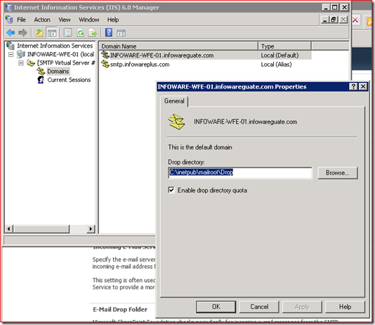{width="5.564749562554681in"
    height="4.824866579177603in"}

### **Paso 2:**

En este paso configuraremos SharePoint para habilitar en las listas y
bibliotecas la recepción de correo entrante.

Desde el Central Administration, seleccione System settings y luego el
enlace “Configure incoming e-mail settings”

1.  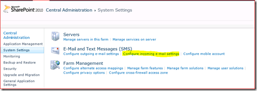{width="5.2312806211723535in"
    height="1.8549168853893263in"}

Seleccione los siguientes valores para las siguientes casillas:

Enable sites on this server to receive e-mail?

#### **Yes**

Settings mode:

#### **Advanced**

E-mail server display address: (ingrese el alias del dominio configurado
en el smtp service)

#### **smtp.infowareplus.com**

1.  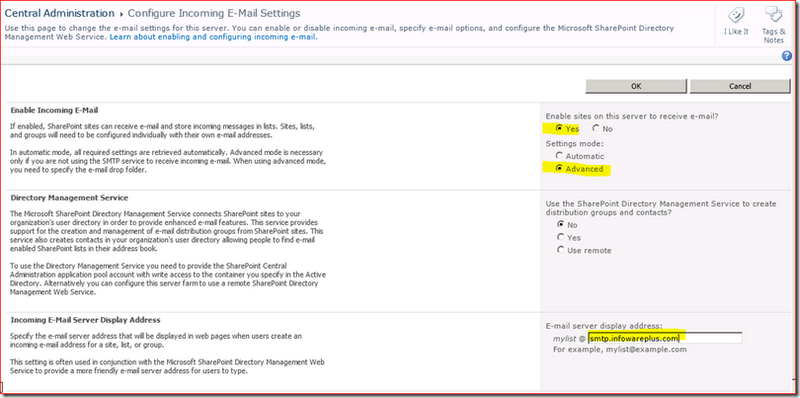{width="6.5in"
    height="3.234027777777778in"}

En la casilla E-mail drop folder: Pegue o escriba la ruta de la carpeta
de descarga o drop folder. Y por ultimo presione el botón Finish.

1.  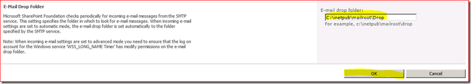{width="6.5in"
    height="1.1618055555555555in"}

Ahora vamos a verificar el permiso de la cuenta que ejecuta el Timer
Service de SharePoint en el directorio de descarga o Drop foler. Para
ello ejecute la consola de servicios: services.msc

1.  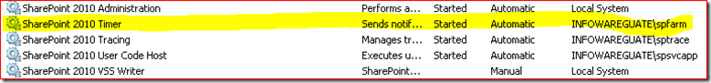{width="6.5in"
    height="0.7590277777777777in"}

La cuenta que ejecuta este servicio debe de tener los permisos
**Modify.** En esta caso la cuenta spfarm tiene permisos de
administrador local, por lo que no debo de preocuparme, pero usted
valide si esto es así para la cuenta que ejecuta este servicio en su
instalación.

1.  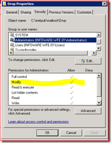{width="1.97996719160105in"
    height="2.542694663167104in"}

### **Paso 3:**

Ahora vamos a configurar el blog del perfil de usuario que esta
disponible en SharePoint Server 2010. En la parte superior derecha donde
esta el usuario conectado haga clic sobre el luego haga clic sobre My
Profile.

1.  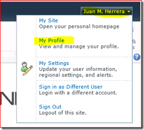{width="2.542694663167104in"
    height="2.2925929571303585in"}

Seleccione el enlace My Content

1.  {width="5.971163604549432in"
    height="0.614831583552056in"}

Luego haga clic en la opción Create Blog (si aún no lo tiene creado).

1.  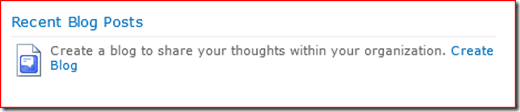{width="5.418857174103237in"
    height="1.1671380139982501in"}

En Blog Tools seleccion Manage Posts

1.  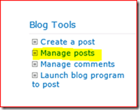{width="2.0945964566929134in"
    height="1.646499343832021in"}

Haga clic en List en el Ribbon y luego List Settings.

1.  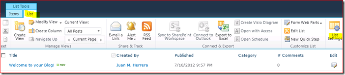{width="6.5in"
    height="1.4159722222222222in"}

Luego en la sección Communications, seleccione la opción Incoming e-mail
settings (sino le aparece y no es una lista de Tareas, es porque no
realizó el paso 2 o hubo algún error).

1.  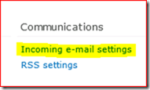{width="1.99038823272091in"
    height="1.1984011373578303in"}

Seleccione la opción Allow this list to receive e-mail? **Yes**

En la casilla E-mail address: escriba la cuenta de correo ficticia que
utilizará para enviar el correo y lo pueda redirigir SharePoint al Blog.

En la casilla E-Mail Security seleccione la opción: **Accept e-mail
messages based on list permissions.** Este opción es la recomendada para
que solo acepte corres enviados de usuarios que tiene correo electrónico
asociado y que tiene permiso asignado al sitio o a la lista de Blog. Si
estas dos condiciones no se cumplen le mostrará a nivel del USLogs de
SharePoint error de acceso denegado al procesar el mensaje.

En la casilla Post Publishing seleccione la opción que mas le haga
sentido y que cubra sus objetivos. Para finalizar presione el botón Ok.

1.  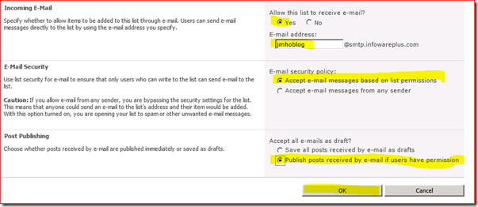{width="6.28378937007874in"
    height="2.7302701224846895in"}

### **Paso 4: Validar los registros MX y Puertos**

En este paso deberá registrar el alias que coloco en el paso 1 para que
todos los correos enviados a este alias sea redireccionado al servidor
de SharePoint.

Luego revise el Firewall local del Servidor y de la red interna
validando que el puerto 25 (el predeterminado) o el puerto que esta
escuchando el Servicio SMTP este abierto.

### **Paso 5: Realizar las pruebas de funcionalidad**

Revise lo siguiente:

1\) Si al enviar el correo a la dirección de ejemplo no le regresa un
correo de rechazo.

2\) Si el mensaje aparece como un archivo en el directorio
c:\\inetpub\\mailroot\\drop de extensión eml.

3\) Si no llega a la biblioteca y al revisar los registros de bitácora de
SharePoint da un error de acceso denegado es porque el usuario no tiene
permisos en la biblioteca o bien el usuario no tiene cuenta de correo
electrónico asociada, esto lo puede revisar en el perfil de SharePoint.

El contenido del archivo eml es el siguiente:

x-sender: micorreo@gmail.com\
x-receiver: miblog@alias.dominio.com\
Received: from mail.google.com (\[ip address\]) by x-corporation with
Microsoft SMTPSVC(7.5.7601.17514);\
Tue, 10 Jul 2012 10:02:04 -0600\
Received: by lbdb5 with SMTP id b5so64129lbd.3\
for &lt;miblog@alias.dominio.com&gt;; Tue, 10 Jul 2012 09:02:11 -0700
(PDT)\
X-Google-DKIM-Signature: v=1; a=rsa-sha256; c=relaxed/relaxed;\
d=google.com; s=20120113;\
h=mime-version:in-reply-to:references:date:message-id:subject:from:to\
:content-type:x-gm-message-state;\
bh=saQCDmOD7S38FXhx34I61T3upzX4EI8+pRbIkW3qkMU=;\
b=KoQccQW+6o2mVZbtPb+IYCdx9DP4/BSsoNKQ93StWohV4sx1+1FCNFpAjrfyW/2ad7\
cklTN0Xz0Oqwt1gSLgwlXRGSyrFLHQBCSaqdmdN59VGrKX+3PmIP1ZjdzhrooBbRqmaf\
bpRC1nVUFXYh2JZr0eI7+MKud5rPkwYhkjCeagXe59aXmDjDl4G5Z7Jb9WTTaZse464b\
hZRrT80BF5HSIpwN23/G0Mf/GduXCYKRbO90fnYZ1OHlsoS6cVddP2Ps1m5TT0a99U1s\
NRPoBjaTHH4W2cn3RKUpn2EFYqwTt53MLP9491Z/RBmTwdtWrb1kwVhwhiNnlYZnbY++\
op1g==\
MIME-Version: 1.0\
Received: by 10.152.127.98 with SMTP id nf2mr9706519lab.4.1341936131436;
Tue,\
10 Jul 2012 09:02:11 -0700 (PDT)\
Received: by 10.114.38.104 with HTTP; Tue, 10 Jul 2012 09:02:11 -0700
(PDT)\
In-Reply-To:
&lt;CACRdqqpPyxPtUH\_WQQJ2Cjhy-sPjPDj8arMr\_biJXa3HHXdw\_w@mail.gmail.com&gt;\
References:
&lt;CACRdqqpPyxPtUH\_WQQJ2Cjhy-sPjPDj8arMr\_biJXa3HHXdw\_w@mail.gmail.com&gt;\
Date: Tue, 10 Jul 2012 10:02:11 -0600\
Message-ID:
&lt;CACRdqqoxE3SYEzp6s=JTvcd8CjH0ARDCpBKwLW8Q-BqCrykmWg@mail.gmail.com&gt;\
Subject: Fwd: Testing from gmail\
From: micorreo@gmail.com\
To: miblog@alias.dominio.com\
Content-Type: multipart/mixed; boundary=f46d042d05aa6cf14304c47bda2f\
X-Gm-Message-State:
ALoCoQkgxOizZKw6JloykgwZwy9e+tQjs8GmEH1doXgmXGPRO4a3SkvLeHJMCueeFRBl6aHJwg3T\
Return-Path: micorreo@gmail.com\
X-OriginalArrivalTime: 10 Jul 2012 16:02:05.0304 (UTC)
FILETIME=\[59D81F80:01CD5EB5\]

--f46d042d05aa6cf14304c47bda2f\
Content-Type: multipart/alternative;
boundary=f46d042d05aa6cf13f04c47bda2d

--f46d042d05aa6cf13f04c47bda2d\
Content-Type: text/plain; charset=ISO-8859-1

\*Articulo\*

Lorem ipsum ad his scripta blandit partiendo, eum fastidii accumsan\
euripidis in, eum liber hendrerit an. Qui ut wisi vocibus suscipiantur,
quo\
dicit ridens inciderint id. Quo mundi lobortis reformidans eu, legimus\
senserit definiebas an eos. Eu sit tincidunt incorrupte definitionem,
vis\
mutat affert percipit cu, eirmod consectetuer signiferumque eu per. In
usu\
latine equidem dolores. Quo no falli viris intellegam, ut fugit veritus\
placerat per. Ius id vidit volumus mandamus, vide veritus democritum te\
nec, ei eos debet libris consulatu. No mei ferri graeco dicunt, ad cum
veri\
accommodare. Sed at malis omnesque delicata, usu et iusto zzril
meliore.\
Dicunt maiorum eloquentiam cum cu, sit summo dolor essent te. Ne quodsi\
nusquam legendos has, ea dicit voluptua eloquentiam pro, ad sit quas\
qualisque. Eos vocibus deserunt quaestio ei. Blandit incorrupte
quaerendum\
in quo, nibh impedit id vis, vel no nullam semper audiam. Ei populo
graeci\
consulatu mei, has ea stet modus phaedrum. Inani oblique ne has, duo et\
veritus detraxit. Tota ludus oratio ea mel, offendit persequeris ei
vim.\
Eos dicat oratio partem ut, id cum ignota senserit intellegat. Sit
inani\
ubique graecis ad, quando graecis liberavisse et cum, dicit option
eruditi\
at duo. Homero salutatus suscipiantur eum id, tamquam voluptaria
expetendis\
ad sed, nobis feugiat similique usu ex. Eum hinc argumentum te, no sit\
percipit

--f46d042d05aa6cf13f04c47bda2d\
Content-Type: text/html; charset=ISO-8859-1\
Content-Transfer-Encoding: quoted-printable

&lt;strong&gt;&lt;u&gt;Articulo&lt;/u&gt;&lt;/strong&gt;&lt;br&gt;&lt;br&gt;Lorem
ip=\
sum ad his scripta blandit partiendo, eum fastidii accumsan euripidis
in, e=\
um liber hendrerit an. Qui ut wisi vocibus suscipiantur, quo dicit
ridens i=\
nciderint id. Quo mundi lobortis reformidans eu, legimus senserit
definieba=\
s an eos. Eu sit tincidunt incorrupte definitionem, vis mutat affert
percip=\
it cu, eirmod consectetuer signiferumque eu per. In usu latine equidem
dolo=\
res. Quo no falli viris intellegam, ut fugit veritus placerat per. Ius
id v=\
idit volumus mandamus, vide veritus democritum te nec, ei eos debet
libris =\
consulatu. No mei ferri graeco dicunt, ad cum veri accommodare. Sed at
mali=\
s omnesque delicata, usu et iusto zzril meliore. Dicunt maiorum
eloquentiam=\
cum cu, sit summo dolor essent te. Ne quodsi nusquam legendos has, ea
dici=\
t voluptua eloquentiam pro, ad sit quas qualisque. Eos vocibus deserunt
qua=\
estio ei. Blandit incorrupte quaerendum in quo, nibh impedit id vis, vel
no=\
nullam semper audiam. Ei populo graeci consulatu mei, has ea stet modus
ph=\
aedrum. Inani oblique ne has, duo et veritus detraxit. Tota ludus oratio
ea=\
mel, offendit persequeris ei vim. Eos dicat oratio partem ut, id cum
ignot=\
a senserit intellegat. Sit inani ubique graecis ad, quando graecis
liberavi=\
sse et cum, dicit option eruditi at duo. Homero salutatus suscipiantur
eum =\
id, tamquam voluptaria expetendis ad sed, nobis feugiat similique usu
ex. E=\
um hinc argumentum te, no sit percipit=20\
&lt;/div&gt;&lt;br&gt;\
&lt;/div&gt;&lt;br&gt;

--f46d042d05aa6cf13f04c47bda2d--\
--f46d042d05aa6cf14304c47bda2f\
Content-Type: text/plain; charset=US-ASCII; name="blog.txt"\
Content-Disposition: attachment; filename="blog.txt"\
Content-Transfer-Encoding: base64\
X-Attachment-Id: f\_h4h5tdy90

DQoNCkxvcmVtIGlwc3VtIGFkIGhpcyBzY3JpcHRhIGJsYW5kaXQgcGFydGllbmRvLCBldW0gZmFz\
dGlkaWkgYWNjdW1zYW4gZXVyaXBpZGlzIGluLCBldW0gbGliZXIgaGVuZHJlcml0IGFuLiBRdWkg\
dXQgd2lzaSB2b2NpYnVzIHN1c2NpcGlhbnR1ciwgcXVvIGRpY2l0IHJpZGVucyBpbmNpZGVyaW50\
IGlkLiBRdW8gbXVuZGkgbG9ib3J0aXMgcmVmb3JtaWRhbnMgZXUsIGxlZ2ltdXMgc2Vuc2VyaXQg\
ZGVmaW5pZWJhcyBhbiBlb3MuIEV1IHNpdCB0aW5jaWR1bnQgaW5jb3JydXB0ZSBkZWZpbml0aW9u\
ZW0sIHZpcyBtdXRhdCBhZmZlcnQgcGVyY2lwaXQgY3UsIGVpcm1vZCBjb25zZWN0ZXR1ZXIgc2ln\
bmlmZXJ1bXF1ZSBldSBwZXIuIEluIHVzdSBsYXRpbmUgZXF1aWRlbSBkb2xvcmVzLiBRdW8gbm8g\
ZmFsbGkgdmlyaXMgaW50ZWxsZWdhbSwgdXQgZnVnaXQgdmVyaXR1cyBwbGFjZXJhdCBwZXIuIEl1\
cyBpZCB2aWRpdCB2b2x1bXVzIG1hbmRhbXVzLCB2aWRlIHZlcml0dXMgZGVtb2NyaXR1bSB0ZSBu\
ZWMsIGVpIGVvcyBkZWJldCBsaWJyaXMgY29uc3VsYXR1LiBObyBtZWkgZmVycmkgZ3JhZWNvIGRp\
Y3VudCwgYWQgY3VtIHZlcmkgYWNjb21tb2RhcmUuIFNlZCBhdCBtYWxpcyBvbW5lc3F1ZSBkZWxp\
Y2F0YSwgdXN1IGV0IGl1c3RvIHp6cmlsIG1lbGlvcmUuIERpY3VudCBtYWlvcnVtIGVsb3F1ZW50\
aWFtIGN1bSBjdSwgc2l0IHN1bW1vIGRvbG9yIGVzc2VudCB0ZS4gTmUgcXVvZHNpIG51c3F1YW0g\
bGVnZW5kb3MgaGFzLCBlYSBkaWNpdCB2b2x1cHR1YSBlbG9xdWVudGlhbSBwcm8sIGFkIHNpdCBx\
dWFzIHF1YWxpc3F1ZS4gRW9zIHZvY2lidXMgZGVzZXJ1bnQgcXVhZXN0aW8gZWkuIEJsYW5kaXQg\
aW5jb3JydXB0ZSBxdWFlcmVuZHVtIGluIHF1bywgbmliaCBpbXBlZGl0IGlkIHZpcywgdmVsIG5v\
IG51bGxhbSBzZW1wZXIgYXVkaWFtLiBFaSBwb3B1bG8gZ3JhZWNpIGNvbnN1bGF0dSBtZWksIGhh\
cyBlYSBzdGV0IG1vZHVzIHBoYWVkcnVtLiBJbmFuaSBvYmxpcXVlIG5lIGhhcywgZHVvIGV0IHZl\
cml0dXMgZGV0cmF4aXQuIFRvdGEgbHVkdXMgb3JhdGlvIGVhIG1lbCwgb2ZmZW5kaXQgcGVyc2Vx\
dWVyaXMgZWkgdmltLiBFb3MgZGljYXQgb3JhdGlvIHBhcnRlbSB1dCwgaWQgY3VtIGlnbm90YSBz\
ZW5zZXJpdCBpbnRlbGxlZ2F0LiBTaXQgaW5hbmkgdWJpcXVlIGdyYWVjaXMgYWQsIHF1YW5kbyBn\
cmFlY2lzIGxpYmVyYXZpc3NlIGV0IGN1bSwgZGljaXQgb3B0aW9uIGVydWRpdGkgYXQgZHVvLiBI\
b21lcm8gc2FsdXRhdHVzIHN1c2NpcGlhbnR1ciBldW0gaWQsIHRhbXF1YW0gdm9sdXB0YXJpYSBl\
eHBldGVuZGlzIGFkIHNlZCwgbm9iaXMgZmV1Z2lhdCBzaW1pbGlxdWUgdXN1IGV4LiBFdW0gaGlu\
YyBhcmd1bWVudHVtIHRlLCBubyBzaXQgcGVyY2lwaXQg\
--f46d042d05aa6cf14304c47bda2f--

En este artículo vimos como configurar el correo entrante en SharePoint
y así poder alimentar un blog desde el envió de un correo.
