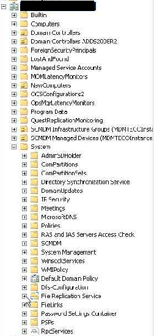

  -----------------------------------------------------------------------------------------------------------------------------------------------------------------------------------------------------------------------------------------------------------------------------------------------------------------------------------------------------------------------------
  Leonardo Ponti                                                                                                                                                                                                                                                                                                                                                 Octubre 2012
                                                                                                                                                                                                                                                                                                                                                                 
  Especialista en Directory Services luego de Manejar la infraestructura desde el año 2003, pasando por migración de versiones, diseños, implementaciones, soporte, consultoría, testing, ofreciendo desde un principio la mejora continua del producto en las empresas que vi directamente la implementación o indirectamente desde el área de soporte Online   
  -------------------------------------------------------------------------------------------------------------------------------------------------------------------------------------------------------------------------------------------------------------------------------------------------------------------------------------------------------------- --------------
  [Blog](http://blogs.itpro.es/leoponti)
  -----------------------------------------------------------------------------------------------------------------------------------------------------------------------------------------------------------------------------------------------------------------------------------------------------------------------------------------------------------------------------

Hola a todos!!

En esta oportunidad, voy a dejarles un procedimiento de como renombrar
un Domain Controller Windows Server 2008R2, en una organizacion, por
algun motivo u otro, puede aparecer la necesidad de renombrar el o los
equipos de nuestro dominio, con lo que les arme, el siguiente
procedimiento para que lo puedan ver ante la necesidad de aplicarlo en
sus organizaciones.

Como primer paso, lo que realizaremos es cambiar el nombre del Domain
Controller nuevo con Windows Server 2008 R2, para cual seguir los
siguientes pasos, logeado en el nuevo Servidor, vamos a **Start – y
sobre Computer**, desplegamos el menú seleccionando la opción
“Properties”

1.  {width="3.6166666666666667in"
    height="3.7666666666666666in"}

Sobre la nueva ventana que aparece, sobre el lado izquierdo
seleccionamos “Advanced system settings”

1.  {width="6.5in" height="3.86875in"}

Donde aparecerá una nueva ventana la cual tenemos que ir a la solapa
“Computer Name” y vamos a “change”

1.  {width="3.8026148293963256in"
    height="4.2714293525809275in"}

Ahí nos aparecerá una advertencia ya que al equipo al ser Domain
Controller hay que tener unos recaudos, tomando la siguiente ventana
como un aviso y damos OK

1.  {width="3.0833333333333335in"
    height="1.4166666666666667in"}

En la siguiente ventana que aparece, nos muestra el nombre actual del
servidor y el detalle del mismo como FQDN completo.

1.  Insert Caption

<!-- -->

1.  {width="3.021255468066492in"
    height="3.5734153543307086in"}

El nombre del mismo, lo modificamos quitando la extensión **(en este
caso) –N** para dejar el equipo con el nombre definitivo y damos OK a la
actual ventana.

1.  {width="3.073345363079615in"
    height="3.5734153543307086in"}

En la siguiente ventana, nos aparece la descripción que para que se
realicen los cambios, hay que reiniciar el servidor, el cual solo
tenemos que dar OK (esto no reinicia el equipo).

1.  {width="2.691666666666667in"
    height="1.1333333333333333in"}

En la siguiente ventana y ultima que queda, para confirmar lo realizado
tenemos que dar “close”

1.  {width="3.8130325896762907in"
    height="4.2714293525809275in"}

Ahora si nos aparecerá una ventana confirmando el cambio de nombre y
dándonos la opción de reiniciar el servidor para que los mismos hagan
efecto, el cual seleccionaremos la opción “Restart Now” (Importante
reiniciar el server para continuar con los siguientes pasos del
instructivo).-

1.  {width="2.7in" height="1.025in"}

Renombrar directorio de Backup con el nuevo nombre del server.
--------------------------------------------------------------

Una opción que tenemos para realizar backup de nuestros Domain
Controllers, es mediante Windows Server Backup, si al momento de
realizar el cambio de nombre el equipo ya esta realizandose Backup
mediante este medio, tienen que realizar los siguientes pasos para que
no se duplique la informacion de Backup en un nuevo directorio.

Una vez reiniciado el server, volvemos a logearnos, vamos a Computer
desde **Start – Computer** donde se nos abrirá la siguiente ventana (la
lista de volumenes aplicará segun cada diseño implementado, lo
importante en este caso y para seguir este instructivo, es cada uno
acceder al volumen donde se configuro el resguardo del server con
Windows Server Backup).

1.  {width="5.925in"
    height="2.2666666666666666in"}

De los volúmenes que nos aparecen, ingresamos al volumen que
configuramos para nuestro backup, y ahí nos aparecerá una carpeta que
dice “WindowsImageBackup”, la cual ingresamos.

1.  {width="4.833333333333333in"
    height="1.8833333333333333in"}

Al querer ingresar a la misma, nos puede aparecer un aviso de permisos
el cual vamos a la opción “Continue”

1.  {width="2.7083333333333335in"
    height="1.125in"}

Nos abrirá una ventana la cual aparece otra carpeta con el nombre que
tenía el server la cual tenemos que renombrar, quitando también como se
realizó en el cambio de nombre del equipo (en nuestro caso como ejemplo,
definido en este instructivo), la extensión **–N** del nombre actual en
la carpeta.

1.  {width="5.141666666666667in"
    height="2.0166666666666666in"}

Nos aparecerá una ventana de permisos elevados para realizar dicho
cambio, el cual damos la opción de “Continue” para confirmar el cambio
que estamos realizando.

1.  {width="4.941666666666666in"
    height="3.283333333333333in"}

Eliminar el registro DNS del equipo renombrado.
-----------------------------------------------

Una vez realizados los pasos anteriores, tenemos que suprimir el objeto
que nos quedó en DNS, haciendo referencia al equipo que ya fue
modificado, para eso, entramos a la consola DNS desde cualquier equipo
que la tenga instalada o desde el mismo Domain Controller nuevo con
Windows Server 2008 R2, que también es DNS Server y vamos a la zona DNS
**integrada a nuestro dominio**

1.  {width="6.5in"
    height="2.4902777777777776in"}

En dicha zona, buscamos el objeto DNS el cual aún tiene la extensión –N
(estar seguros que es el server recientemente renombrado), puede pasar
que según algún proceso DNS en el momento del reinicio del servidor
luego de que fue renombrado, haya ejecutado el rename del objeto en DNS
y ya el mismo no este, si es el caso, omitir este paso de eliminación.-

1.  {width="4.35in" height="2.05in"}

Una vez que encontramos el objeto que necesitamos suprimir, lo
seleccionamos y sobre el mismo desplegamos el menú, seleccionando la
opción de “Delete”.

1.  {width="4.341666666666667in"
    height="2.4166666666666665in"}

Nos aparecerá una ventana si queremos confirmar dicha tarea, la cual
seleccionamos la opción “YES”.

1.  {width="4.358333333333333in"
    height="2.825in"}

Repetir estos pasos en DNS en TODAS las zonas que tengamos integradas a
Active Directory.

Renombrar objeto de FRS al nuevo nombre del DC 2008R2 en AD.
------------------------------------------------------------

Si nuestro dominio actual se realizó upgrade de versiones anteriores, no
implementado desde cero como Windows Server 2008/2008R2 y aun omitimos
el migrar nuestra modalidad de replicacion de FRS a DFSR, seguir los
siguientes pasos para modificar el nombre de referencia del servidor
para la replicacion FRS:

Entrar desde el nuevo Domain Controller Windows Server 2008 R2, al Users
and Computers de Active Directory desde “Start – Administrative Tools –
Active Directory Users and Computers”

1.  {width="2.966666666666667in"
    height="3.7666666666666666in"}

En la consola que nos aparecerá, habilitaremos la vista avanzada para
poder ver objetos y opciones del dominio que no nos aparecen en la vista
default, para esto, en la barra de herramientas, ir a **View – Advanced
Features.**

1.  {width="3.604669728783902in"
    height="2.1148786089238847in"}

Ahora si en la consola estaremos viendo la vista avanzada habilitada en
la vista que estamos presente. Ahora en la consola, iremos a **FQDN
Nombre\_Dominio – system – File Replication Service**

1.  {width="2.6253663604549433in"
    height="5.719548337707787in"}

De File Replication Service, desplegar la opción Domain System Volume
(SYSVOL) el cual aparecerán todos los DCs que actualmente tengamos
activos en nuestro dominio.

1.  {width="1.975in"
    height="3.6083333333333334in"}

Buscar en dicha opción, el DC que acabamos de renombrar.

1.  {width="1.975in"
    height="2.3916666666666666in"}

Una vez encontrado, editamos el objeto.

1.  {width="1.9666666666666666in"
    height="2.6416666666666666in"}

En el mismo, como venimos haciendo anteriormente en nuestro ejemplo para
este post, suprimimos del nombre completo, la extensión **–N** y lo
confirmamos.-

1.  {width="1.9666666666666666in"
    height="2.8583333333333334in"}

En el caso de que la actual infraestructura se le realizo upgrade de una
version anterior y luego se migró la metodología de replicación del
SYSVOL de FRS a DFSR o el dominio fue implementado nativamente en
version Windows Server 2008 (automaticamente la metodologia de
replicacion de SYSVOL ya funciona como DFSR), se tiene que realizar los
mismos pasos anteriores, con la diferencia, de que acceder a la consola
de User and Computer, cambiar el directorio a seguir por el siguiente
Path: **FQDN Nombre\_Dominio – System – DFSR-GlobalSettings – Domain
System Volume – Topology**. Puede ocurrir, que ya se haya replicado el
cambio de nombre del Domain Controller con lo que no tendriamos que
realizar ninguna tarea en esta parte y solo seria un chequeo, pero si al
acceder a dicho directorio aun sigue el nombre del equipo anterior,
realizar la modificacion correspondiente como ya se detalló.

Una vez realizado este paso, podemos cerrar la consola de Active
Directory Users and Computers. En el mismo server Domain Controller con
Windows Server 2008R2, abrimos una ventana de CMD desde START – RUN y
corremos el comando **repadmin /replsummary** el cual no tenemos que ver
errores de replicación y ya aparece el nuevo Domain Controller con el
nombre definitivo como se muestra a continuación.-

1.  {width="4.416666666666667in"
    height="4.883333333333334in"}

    {width="3.8333333333333335in"
    height="4.241666666666666in"}

Espero les sea de utilidad!
