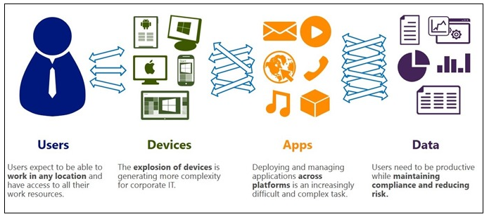
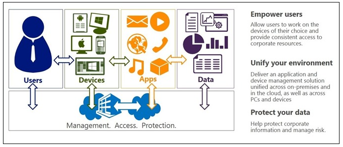
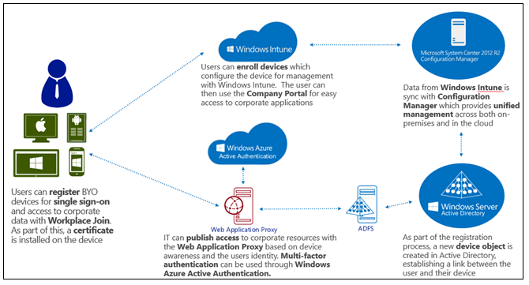
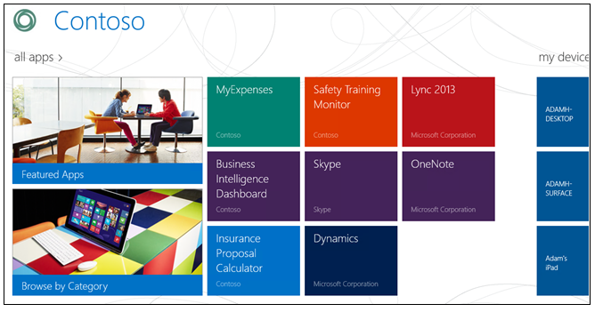
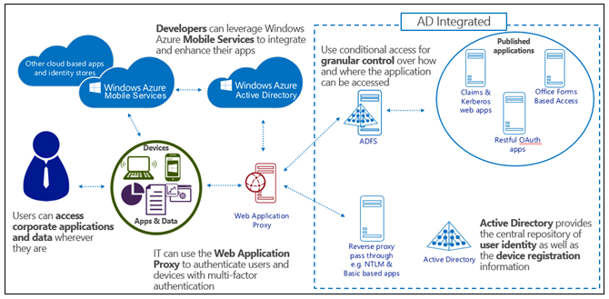
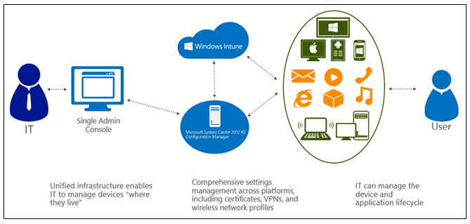
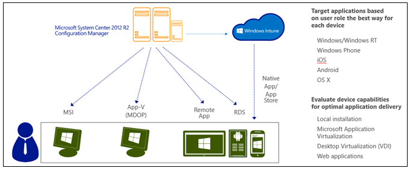
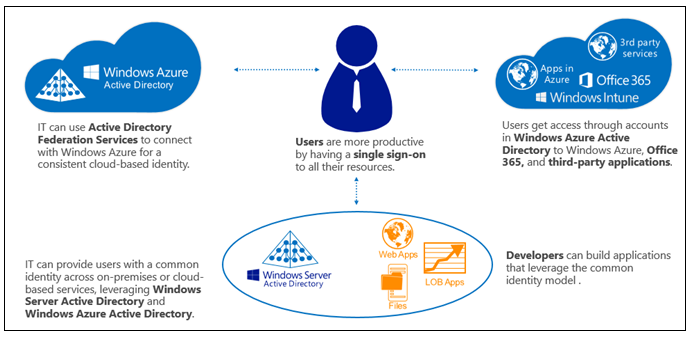
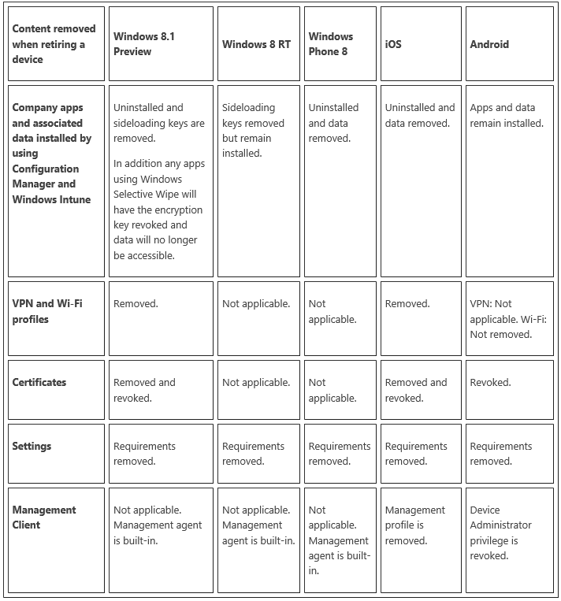
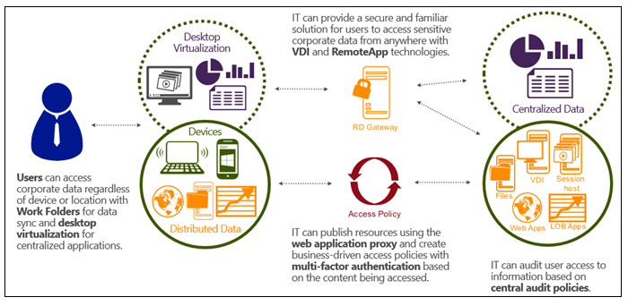

#¿Qué hay de nuevo en el 2012 R2? Haciendo a los usuarios de dispositivos más Productivos y Protegiendo de información corporativa

Por [Server & Management Blogs, In the
Cloud](http://blogs.technet.com/b/in_the_cloud/archive/2013/07/10/what-s-new-in-2012-r2-making-device-users-productive-and-protecting-corporate-information.aspx)

La fuerza laboral moderna no está sólo mejor conectada y es más móvil
que antes, también es más exigente sobre el hardware y e

l software utilizado en el trabajo. Mientras que los líderes de la
compañía de todo el mundo están celebrando el aumento de la
productividad y la accesibilidad de su fuerza de trabajo, el aumento
exponencial de los dispositivos y las plataformas que la plantilla
quiere utilizar puede estirar la infraestructura de una empresa (y el
departamento de TI) al límite.

Si su equipo de TI está lidiando con el impacto y la magnitud de esta
tendencia, permítanme reiterar un hecho he observado varias veces antes
en este blog: La (BYOD) tendencia " Traiga su Propio Dispositivo" está
aquí para quedarse.

Los materiales de construcción que se ocupan de esta necesidad es una
faceta importante del primer pilar de diseño que señalé la semana
pasada: TI centrada en las personas (PCIT).

En el post de hoy (y en cada uno que sigue en esta serie), esta visión
general de los componentes de la arquitectura y crítica del pilar PCIT
será seguida por una sección "Pasos siguientes " en la parte inferior.
Los "Pasos siguientes " incluirán una lista de nuevos mensajes (cada uno
escrito específicamente para el tema de ese día) desarrollados por
nuestro Sistema de ingenieros del Centro de Windows Server y, cada
semana, estos blogs de ingeniería proporcionarán detalles técnicos
profundos sobre los diversos componentes tratados en este post
principal. Hoy en día, estos blogs examinarán sistemáticamente y
analizarán la tecnología utilizada para alimentar nuestra solución
PCIT.

Nuestra meta es caminar a través de la arquitectura, los ejemplos y los
componentes críticos para cada pilar. La sección "Pasos siguientes "
proporciona una manera fácil de revisar todos los análisis de soporte de
nuestros equipos de ingeniería sobre el funcionamiento interno de la
tecnología en el trabajo dentro de System Center y de Windows Server.

Entrando en profundidad sobre PCIT es un importante tema de incontables
discusiones que he tenido con los líderes empresariales de todo el
mundo. En cada una de estas reuniones de retroalimentación ha sido
bastante directa: el número y la diversidad de los dispositivos de la
empresa sólo va a aumentar, lo que es una tendencia que realmente quiere
adoptar.

Esto no quiere decir que no hay organizaciones que hacen todo lo posible
para luchar contra la marea, pero yo creo que las empresas que adoptan
la oportunidad de mantener a sus empleados conectados y productivos
verán un retorno justificable de su inversión (ROI).

Materializar el ROI, sin embargo, dependerá de cómo una organización
abarca y permite a la tendencia BYOD. En particular, cada equipo tendrá
que identificar con cuidado y de forma individual el equilibrio derecho
de acceso a los recursos corporativos desde estos dispositivos y luego
asegurarse de que los protocolos de seguridad y cumplimiento necesarios
se hacen cumplir. Obtener este derecho puede tener un gran impacto en la
moral de los empleados, y un entorno de TI sin problemas, incluso puede
afectar la retención.

Hemos hecho una gran inversión en PCIT porque queremos permitir y
autorizar los profesionales de TI a ofrecer su fuerza de trabajo con el
apoyo firme y estable para los dispositivos que quieren trabajar,
mientras que también proporcionar a estos equipos de TI con los medios
para tomar la cantidad adecuada del control de los dispositivos - tanto
las empresas con suministro y de propiedad del usuario. La solución PCIT
detallada a continuación permite a los profesionales de TI a establecer
políticas de acceso a las aplicaciones corporativas y datos sobre la
base de tres criterios muy importantes:

1. El identidad del usuario

2. El dispositivo especifico del usuario

3. La red desde la cual el usuario está trabajando

Las soluciones que vamos a detallar en estos puestos PCIT permiten a los
equipos de TI controlar estrictamente los dispositivos basados ​​en el
tipo de trabajo que hacen y la sensibilidad de los datos de la empresa
en que se accede. Por ejemplo, los protocolos muy estrictos de
seguridad, controles de uso, y los requisitos de acceso a datos son
necesarios para dispositivos de punto de venta, dispositivos de una
línea de fabricación, los dispositivos en un laboratorio farmacéutico
fuertemente regulado, bancos, cajeros, ordenadores, etc… La necesidad de
estos tipos de dispositivos que se conecten y administren seguirá siendo
muy importante. En el otro extremo del espectro tiene dispositivos
personales como teléfonos y tabletas que simplemente no se pueden
controlar de la misma manera (Aquí está una prueba: Trate de decirle a
sus usuarios finales que van a desactivar las cámaras en sus teléfonos
personales y vea cuál es su reacción).

Lo que se necesita aquí es una solución de gestión única que permita a
las características específicas donde sea necesario un adecuado control,
y que también proporcione lo que yo llamo la "gobernanza ", o control de
la luz, cuando es necesaria menos administración. Esto significa que un
solo panel de vidrio para la gestión de equipos y dispositivos. Muy a
menudo me encuentro con empresas que tienen dos soluciones separadas que
corren lado a lado - uno para cada PC, y el segundo para gestionar
dispositivos. Esto no sólo es más caro y más complejo, crea dos
experiencias inconexas para los usuarios finales y un gran dolor de
cabeza para los profesionales de TI responsables de la gestión.

En el post de hoy, Paul Mayfield, el Gerente de Programa de Socios para
el Center Configuration equipo Intune System Manager / Windows, se
explica cómo todo lo que Microsoft ha construido con esta solución se
centra en la creación de la capacidad de los equipos de TI de utilizar
el mismo System Center Configuration Manager que ya cuenta con la
gestión de sus PCs y ahora se puede extender este poder de gestión de
dispositivos. Esto significa el doble de la capacidad de gestión dentro
de la misma consola familiar. Esta filosofía se puede ampliar aún más
mediante el uso de Windows Intune para administrar los dispositivos en
los que viven - Gestión basada en la nube, es decir para los
dispositivos basados ​​en la nube. La gestión basada en la nube es
especialmente importante para los dispositivos de propiedad de los
usuarios que necesitan actualizaciones periódicas.

Esta es una solución increíble, y el beneficio y facilidad de uso para
usted, el consumidor, es monumental.

\*\*\*

Como usted pudo haber visto en los eventos TechEd recientes, hemos
añadido varias nuevas capacidades a través de Windows, Windows Server,
System Center y Windows Intune este año. Estas nuevas funciones están
destinadas a permitir a nuestros clientes a adoptar la “consumerización”
de las TI y habilitar un escenario (BYOD) en sus organizaciones de todo
el mundo.

Nos referimos a estas nuevas capacidades, tales como: "centrado en las
personas de TI."

La TI centrada en las personas (PCIT) trata de ayudar a la gente a
trabajar en los dispositivos que elijan. Estamos proporcionando a los
usuarios acceso a sus aplicaciones y datos en cualquiera de sus
dispositivos en cualquier lugar. El reto que esto representa a los
equipos de TI es considerable: Tan pronto como los usuarios están
trabajando en un dispositivo que no logra (o incluso tiene el
conocimiento de), se hace muy difícil mantener el control de la
información confidencial de la empresa y ser capaz de responder a
situaciones como el dispositivo que se vende, se pierde o es robado.

En particular, los desafíos que enfrentan los equipos de TI responsables
de una moderna infraestructura de la empresa provienen de cuatro áreas
clave:

    

Con la ola del R2 2012 de las emisiones (por ejemplo, Windows Server,
System Center Configuration Manager, y la próxima versión de Windows
Intune), están ayudando a nuestros clientes responder a estos desafíos.
Ingenieros de todos cada uno de esos equipos han planeado y ejecutado
conjuntamente sus escenarios a través de un conjunto de hitos de
ingeniería, y nos han entregado estos escenarios a través de tres áreas
principales que llevaron a nuestras prioridades y las inversiones en
ingeniería:

1\. Empoderamiento de usuarios. Esto significa que permite a los usuarios
trabajar en los dispositivos de su elección mediante el acceso constante
a aplicaciones corporativas y datos de los dispositivos. Vamos a apoyar
una amplia gama de dispositivos en la onda de comunicados del R2 de este
año, que van desde computadoras portátiles empresariales y de
escritorio, a los teléfonos personales, portátiles y tabletas. Vamos a
trabajar con dispositivos de Windows y iOS a través de todas nuestras
características PCiT. Muchas características se admiten en Android
también. Por ejemplo, los dispositivos de inscripción para la gestión
serán apoyados a través de Windows, iOS y Android. WorkPlace Join y las
carpetas de trabajo serán soportadas inicialmente en Windows y iOS.

2\. Unificando su entorno. Con la consola de System Center Configuration
Manager entregamos una aplicación integral y de gestión de dispositivos
desde un único plano de vidrio. También hemos trabajado para integrar
los escenarios a través de la infraestructura en las instalaciones (con
System Center Configuration Manager, Windows Server y Active Directory),
así como los servicios basados ​​en la nube, (usando Windows Intune y
Windows Azure). Además, vale la pena señalar que, además de todo esto,
ya hemos integrado la protección y la gestión del malware.

3\. Ayudando proteger sus datos. Controlando el acceso a la información
sobre la base de un usuario, su dispositivo específico y la ubicación de
dicho dispositivo, los equipos de TI pueden controlar mejor y
salvaguardar los activos de la empresa. Estas herramientas también se
pueden quitar o deshabilitar los datos en los dispositivos cuando ya no
se están utilizando, así como proporcionar auditoría importante y
presentación de informes.

    

Ahora echemos un vistazo a cada uno de estos escenarios, y sus
beneficios, en detalle.

Apoderar a los usuarios

Simple registro y la inscripción para los usuarios que adoptan programas
de “Traiga su propio dispositivo” (BYOD)

Estamos ofreciendo nuevas maneras para que los usuarios puedan optar a
recibir los servicios de TI en sus dispositivos. Los usuarios pueden
hacer un “Workplace Join” para registrar sus dispositivos en Active
Directory y se pueden inscribir a sus dispositivos para la gestión de
Configuration Manager y Windows Intune.

Usted puede pensar que Workplace Join puede ser una forma fácil de
“Domain Join”, pero para los dispositivos móviles personales. Los
dispositivos registrados se registran en el Active Directory y se emiten
credenciales. Sin embargo, no son compatibles con la directiva de grupo
o de scripting. En su lugar, se puede administrar el dispositivo
mediante la inscripción para la gestión de dispositivos móviles.

Estamos haciendo que sea sencillo y fácil para los usuarios registrar su
dispositivo con el Active Directory. Ellos van a querer registrar sus
dispositivos con el fin de conseguir el acceso a los recursos
corporativos y para permitir inicio de sesión único (SSO).

Basado en el nombre del usuario y contraseña, vamos a ver el
arrendatario (en el caso de Active Directory Azure) o consultar la
Federación de Servicios local de Active Directory (AD FS) El servidor de
registro (en el caso de la inscripción on- prem). Luego activamos el
dispositivo para inscribir un certificado de su servicio de registro.

Como parte de ese “Workplace Join”, hemos creado un usuario@registro en
el dispositivo del Active Directory. De esta manera, estamos permitiendo
a su infraestructura existente de AD a extenderse para acomodar
dispositivos móviles. Esto nos permite proporcionar al Profesional de TI
con un inventario de los dispositivos y sus usuarios, y para auditar el
acceso que serán posteriormente entregados a estos usuarios de estos
dispositivos. El certificado expedido al dispositivo incluye tanto la
identidad de ese dispositivo y la identidad del usuario autenticado. El
acceso a los recursos publicados a través de nuestro proxy de aplicación
Web (ver más abajo), o cualquier otro recurso que se basa en FS AD para
la autenticación, se basará en este certificado para la autenticación.

Una cosa a destacar: El acto de registrar el dispositivo en Active
Directory no permitirá controlar el dispositivo de ninguna manera - que
es cubierto por la inscripción. “Workplace Join” sólo se utiliza para
regular el acceso a los recursos corporativos y para habilitar SSO.

Además de registrar los dispositivos con Active Directory, también
estamos haciendo más fácil para los usuarios para inscribir a sus
dispositivos en el servicio de administración de Windows Intune. Los
usuarios querrán hacer esto con el fin de tener en sus dispositivos
aprovisionados, y con el fin de instalar aplicaciones empresariales en
sus dispositivos. Para ello, el usuario sólo tiene que introducir su
nombre de usuario y contraseña para inscribir el dispositivo y el
servicio a continuación, busque inquilino del usuario y un mejor manejo
de inscripción de dispositivos móviles (MDM).

La inscripción MDM varía según el dispositivo. Los fundamentos de la
inscripción MDM incluyen la emisión de un certificado para autenticar el
dispositivo en el sistema de gestión, la instalación de perfiles de
gestión, y el registro de un dispositivo con un servicio de notificación
correspondiente. Como parte del proceso de inscripción, el usuario
deberá dar su consentimiento para permitir cierto control administrativo
del dispositivo para el departamento de TI. Una vez que la inscripción
se ha completado, el sistema de gestión activa el suministro de
dispositivos. El dispositivo se comunicará con el servicio de Windows
Intune y de descarga, perfiles Wi-Fi, perfiles VPN, llaves de carga
lateral, aplicaciones y mucho más. El dispositivo también puede
inscribirse para certificados adicionales que se pueden utilizar para la
autenticación de red o para otros fines de seguridad.

Un usuario puede decidir registrar el dispositivo con Active Directory o
inscribir al dispositivo en Windows Intune - o ambos. Se recomienda
tanto por la gama completa de servicios y experiencias PCiT sólo están
disponibles para los dispositivos que están registrados y matriculados.
Esta es la mejor experiencia para el usuario y que ofrece la mejor
protección para la empresa.

    

**El acceso a recursos de la empresa constante a través de dispositivos**

El portal de la compañía (véase el ejemplo de abajo) proporciona a los
usuarios una interfaz consistente de la que pueden tener acceso a las
aplicaciones (tanto las aplicaciones internas y enlaces a almacenes
públicos), la gestión de sus propios recursos para llevar a cabo tareas
tales como limpieza remota, así como tener acceso a sus datos con la
integración de las carpetas de trabajo.

    

**Conectar automáticamente a los recursos internos cuando sea necesario**

Como parte de inscribirse para la gestión, los usuarios pueden tener sus
dispositivos aprovisionados con los certificados, los perfiles de Wi-Fi,
perfiles de VPN y la configuración de DirectAccess. Los perfiles VPN
pueden estar asociados con los nombres DNS o aplicaciones específicas
para que se inicie automáticamente en la demanda. Esto permite a los
usuarios trabajar de forma remota y siempre estar conectados a la red
corporativa sin la necesidad de iniciar una conexión VPN.

Una nueva función (que se muestra a continuación) con Windows Server
2012 R2, System Center Configuration Manager 2012 R2 y Windows 8.1 es la
capacidad de configurar las aplicaciones para iniciar la conexión VPN
cuando se inicia la aplicación.

    

Los usuarios pueden trabajar desde el dispositivo de su elección para
acceder a los recursos corporativos sin importar la ubicación

Nuevo en Windows Server 2012 R2 es el proxy de aplicación Web y las
carpetas de trabajo. El proxy de aplicación Web ofrece la posibilidad de
publicar el acceso a los recursos internos y requerir opcionalmente
autenticación de factores múltiples en el borde.

He aquí un ejemplo de cómo podría funcionar:

- Después de que el usuario registra su dispositivo y se inscribe para
la gestión, se le da el acceso a la Company Portal App.

- Desde el portal de la empresa, se instala (cargas laterales, en este
ejemplo) una línea de aplicación de negocios.

- Cuando se inicia la aplicación, los contactos de la aplicación proxy
de aplicación Web para obtener acceso al servicio web de back-end que
necesita.

- El proxy de aplicación Web re direcciona la aplicación para la
autenticación con AD FS.

- AD FS se ha configurado para desafiar el dispositivo para el
certificado adquirido a través de registro de dispositivos (Workplace
Join).

- AD FS verifica que el usuario está autorizado a acceder a este recurso
de la empresa de este dispositivo específico. Sin embargo, en este
ejemplo, AD FS ha sido configurado para desafiar también el usuario para
un factor adicional de autenticación cuando un dispositivo se conecta a
través de Internet.

- AD FS pone en la autenticación de múltiples factores (MFA) plug-in
(soporta la integración con cualquier tercero proveedor de MFA parte).
Por ejemplo, el plug-in AMF podrá recusar al usuario que introduzca un
código en su teléfono.

- Una vez que el requisito de autenticación multi- factor está
satisfecho, AD FS completa la autenticación.

- El proxy de aplicación Web permite entonces la aplicación para acceder
a su servicio de back-end.

Las Carpetas de trabajo es una nueva solución de sincronización de
archivos que permite a los usuarios sincronizar sus archivos desde un
servidor de archivos corporativo a sus dispositivos. El protocolo para
esta sincronización se basa HTTPS. Esto hace que sea fácil publicar a
través del proxy de aplicación Web. Esto significa que los usuarios
ahora pueden sincronizar tanto de la Intranet como de la Internet.
También significa la misma autenticación FS basado en AD y controles de
autorización descritos anteriormente se pueden aplicar a la
sincronización de archivos corporativos. Los archivos a continuación, se
almacenan en una ubicación cifrada en el dispositivo. Estos archivos
pueden ser eliminados de forma selectiva cuando el dispositivo es un-
inscrito para la gestión.

    

**Unificar el entorno**

**Gestión en las instalaciones y en la Nube basada en los dispositivos
dentro de una única consola**

Un dato importante para nosotros cuando planeamos centrada en las
personas que era la respuesta que reunimos de los clientes sobre la
necesidad de ayudar a reducir los costos de infraestructura de gestión
de clientes y la complejidad. Para ello, hemos trabajado duro para
integrar Configuration Manager y Windows Intune. Nuestra visión era que
los equipos de TI utilizaran la consola de administración de
Configuration Manager para " administrar los dispositivos en los que
viven, " los escritorios dentro de las instalaciones y los portátiles
pueden ser mantenidos por medio de infraestructura existente en las
instalaciones y los dispositivos conectados a Internet pueden ser
atendidos a través de la infraestructura de la Nube.

Toda esta funcionalidad ya está disponible - la gestión de todos estos
dispositivos y toda esta infraestructura puede estar en un lugar con la
consola de Configuration Manager, que ya es muy ampliamente utilizada.
La gestión de clientes y la seguridad ahora se ofrecen en una única
solución que hace que sean más fácil de manejar los dispositivos y las
aplicaciones, y para hacer frente a las amenazas y el incumplimiento. Si
usted es un cliente actual Configuration Manager, agregar la gestión
basada en la nube de Windows Intune es rápido y sencillo: Simplemente
despliegue un conector Intune al despliegue de su System Center 2012
Configuration Manager y ya está listo.

    

**Simplificado, administración de aplicaciones centradas en el usuario a través de dispositivos**

Con Configuration Manager y Windows Intune, hemos hecho más fácil para
asegurar que las aplicaciones se entregan en el método óptimo para cada
dispositivo para asegurar la productividad del trabajador. Configuration
Manager permite al administrador definir la aplicación una vez y luego
apuntar a un usuario o a un grupo. Se evalúa el tipo de dispositivo del
usuario y capacidades de conexión de red, y luego entrega el método
apropiado (instalación local, App- V, RemoteApp, etc.). Como resultado,
si el empleado está usando un ordenador portátil, sesión de VDI o iPad -
o todos ellos - usted puede entregar la aplicación para que el usuario
la mejore experiencia en cada dispositivo.

Debido a la integración entre Windows Intune y Configuration Manager,
también puede ampliar la entrega de aplicaciones a todos los tipos de
dispositivos, mientras que la gestión centralizada de distribución de
aplicaciones a través de dispositivos desde una sola consola (véase
gráfico siguiente). Las aplicaciones pueden incluir paquetes MSI
localmente instalados o aplicaciones App- V en los dispositivos de
Windows, aplicaciones remotas usando soluciones de virtualización de
Microsoft, enlaces web o aplicaciones públicas almacenadas en la Windows
Store, App Store o Google Play.

    

**Gestión de la configuración completa de todas las plataformas, incluidos los certificados, VPNs y perfiles de redes inalámbricas**

Hemos ampliado considerablemente nuestras capacidades de gestión de la
configuración a través de plataformas, incluidos los certificados, VPN y
perfiles de redes inalámbricas. Las políticas pueden ser aplicadas a
través de diversos dispositivos y sistemas operativos para satisfacer
los requisitos de cumplimiento, en la medida de las capacidades
expuestas en esas plataformas y hemos ampliado la gestión nativa para
Windows RT, iOS y Android. Los equipos de TI pueden certificados
prestación o perfiles VPN y Wi - Fi en los dispositivos móviles, y
obtener un inventario de aplicación plena y empuje la aplicación instale
los dispositivos de propiedad de las empresas. También hay funciones
para examinar el inventario de aplicaciones " gestionados" y la
publicación de aplicaciones para dispositivos personales, y los equipos
de TI pueden borrar y anular el registro de los dispositivos de sistema
de gestión (como el apoyo de cada sistema operativo) de forma remota.

Se puede proteger mejor la información corporativa y mitigar los riesgos
al ser capaz de gestionar una identidad única para cada usuario a través
de las dos aplicaciones locales y basadas en nube

Como usuarios combinan su trabajo y vida personal , y que las
organizaciones adopten una mezcla de soluciones locales y basadas en
nube tradicionales , los equipos de TI necesitan una forma de
administrar de forma coherente la identidad del usuario y proporcionar a
los usuarios un inicio de sesión único a todos sus recursos . Estamos
ayudando a los departamentos de TI hacer esto proporcionando a los
usuarios una identidad común a través de los servicios en las
instalaciones o basada en la nube que aprovechan las inversiones de
Active Directory de Windows Server existentes y, a continuación,
conectarse a Windows Azure Active Directory.

Una parte común de conexión on- prem AD a Azure AD está desplegando
Servicios de federación de Active Directory. Windows Server 2012 R2,
hemos mejorado significativamente AD FS a ser más fácil de instalar y
configurar, y nos hemos integrado bien con el proxy de aplicación Web
para la edición sencilla aplicación (véase el gráfico siguiente).

    

**Ayude a proteger los datos**

La TI puede acceder a los dispositivos móviles administrados para
eliminar los datos corporativos y aplicaciones en el caso de que el
dispositivo se pierda, sea robado o retirado del uso

Si un dispositivo se pierde, es robado o simplemente es reutilizado,
habrá momentos en los que necesita para asegurarse de que la información
corporativa almacenada en el dispositivo ya no es accesible. Con la ola
de versiones R2, hemos añadido la posibilidad de borrar de forma
selectiva la información corporativa, dejando intactos los datos
personales.

    

**Se puede establecer políticas basadas en el control de acceso para el
cumplimiento y la protección de datos.**

Con los usuarios que trabajan en los dispositivos personales, no son
verdaderos desafíos para asegurar que se cumplan los estándares de
cumplimiento y que la información está protegida. Dentro de Windows
Server 2012 R2, hemos añadido nuevas capacidades en el Proxy de
aplicaciones Web, AD FS y carpetas de trabajo para hacer más fácil para
los equipos de TI a movilizar los recursos disponibles, pero también
mantienen el control de los datos.

Con la capacidad de control de acceso de factores múltiples en AD FS ,
políticas de control de acceso se pueden crear mediante varios criterios
, incluyendo la identidad del usuario , la identidad del dispositivo ,
si la solicitud está llegando desde la intranet o extranet , y
cualesquiera factores de autenticación adicionales se utiliza para
identificar el usuario .

Como mostramos en la keynote TechEd Europe en Madrid, carpetas de
trabajo está integrado con control de acceso dinámico, proporcionando la
capacidad de clasificar de forma automática la información basada en el
contenido, y realizar tareas tales como la protección de Rights
Management Services - ¡incluso para los datos que se crean y se
almacenan en los clientes!

    

 ¡Recopilar todo!

Para ver TI centrada en las personas, incluyendo System Center
Configuration Manager 2012 R2, Windows Intune y Windows Server 2012 R2
en la acción, se puede ver una presentación completa y demostración de
extremo a extremo, desde el TechEd Norteamérica Fundacional Sesión aquí.
También puede aprender más acerca de IT centrada en las personas
mediante la descarga de la gente centrada en su guía de vista previa.

Asegúrese de descargar System Center 2012 R2 Ver Configuration Manager y
Windows Server 2012 R2 ¡Ver hoy!

\*\*\*

 En los últimos 20 años he llevado a varios equipos de gestión de PC /
dispositivos, y he visto todas las posibles variedad de soluciones de
software a lo largo del camino. Sinceramente, creo que lo que estamos
ofreciendo en esta ola R2 2012 es la solución más completa e integral
única que se ha lanzado nunca para permitir a los usuarios a través de
PC y los dispositivos. Es increíble ver lo que nuestros primeros
cimientos han ayudado a construir para nuestros usuarios de hoy en día.

Estos productos 2012 R2 ofrecen una solución unificada para los usuarios
finales a través de PCs y dispositivos, y si tenemos en cuenta la
necesidad de que este producto es potente y escalable para los equipos
de TI con ella - simplemente no hay mejor plataforma para los
profesionales de TI.

Animo a todos a pasar unos minutos hoy la creación de una cuenta de
Windows Intune (se puede utilizar la solución completa - sin capacidad
de poder volver - para una prueba gratuita de 90 días) y la prueba de
conducción de la gestión de la energía disponible en este producto
notable. Trate de inscribirse unos PCs y dispositivos para el servicio
\* y empezar a experimentar con la gestión de los dispositivos de la
nube - Creo que usted quedará impresionado.

- Brad

 

**SIGUIENTES PASOS:**

Para aprender más acerca de los temas técnicos tratados hoy, echa un
vistazo a estos mensajes de nuestros equipos de ingeniería:

- Los ajustes de cumplimiento y la empresa acceso a recursos en el
Administrador de configuración

Este artículo describe cómo System Center Configuration Manager y
Windows Intune permite a un administrador para proporcionar VPN, los
perfiles de Wi-Fi y certificados para permitir a los usuarios conectarse
a los recursos de la empresa.

- Protección de los datos corporativos en dispositivos móviles mediante el
uso de Configuration Manager y Windows Intune

Este es un resumen de cómo System Center Configuration Manager y Windows
Intune proporciona la capacidad para que el administrador o el usuario
para proteger los datos corporativos en los dispositivos móviles
mediante el aprovechamiento de retirar y limpiar la funcionalidad.

- La experiencia del usuario con la administración de dispositivos
unificada mediante System Center Configuration Manager 2012 R2 y Windows
Intune

Este artículo examina cómo System Center Configuration Manager y Windows
Intune proporciona al usuario con una matrícula consistente y
experiencia acceso a los recursos a través de dispositivos.

- Simplificado, administración de aplicaciones centrada en el usuario a
través de dispositivos con System Center Configuration Manager 2012 R2 y
Windows Intune

En este post, el equipo analiza cómo System Center Configuration Manager
y Windows Intune permite a los administradores de entrega de
aplicaciones se extienden a todos los tipos de dispositivos, mientras
que la gestión centralizada de distribución de aplicaciones a través de
dispositivos desde una sola consola.

- Extensión de soporte de dispositivos en Active Directory

Un análisis de Active Directory en Windows Server 2012 R2 y sus
capacidades para que las personas Centric IT

- Habilitación modernos Estilos de trabajo utilizando 2012 R2 de Windows
Server Servicios de Escritorio remoto

Una visión general de las mejoras introducidas en Microsoft VDI ( Remote
Desktop Services ) reducir los costes relacionados con el almacenamiento
, la mejora de la experiencia del usuario final , y las mejoras en la
administración de sesión y VM basada VDI .

- Presentación de las carpetas de trabajo en Windows Server 2012 R2

Carpetas de trabajo permite a los administradores de TI para
proporcionar trabajadores de la información la posibilidad de
sincronizar los datos del trabajo en todos sus dispositivos dondequiera
que estén, mientras siga cumpliendo con las políticas de la empresa.
Esto se hace mediante la sincronización de los datos del usuario de los
dispositivos de los servidores de archivos en las instalaciones.

Consumerización de las TI , Windows Server, System Center, la nube OS ,
Datacenter Modern , Windows Intune , Bring Your Own Device , Gente
Centric IT , Corporate Computing System Center Configuration Manager ,
elija su propio dispositivo , BYOD , CYOD , ¿Qué hay de nuevo en R2,
PCIT , Capacitar a las personas centrado en TI , ¿Qué hay de nuevo en el
2012 R2

